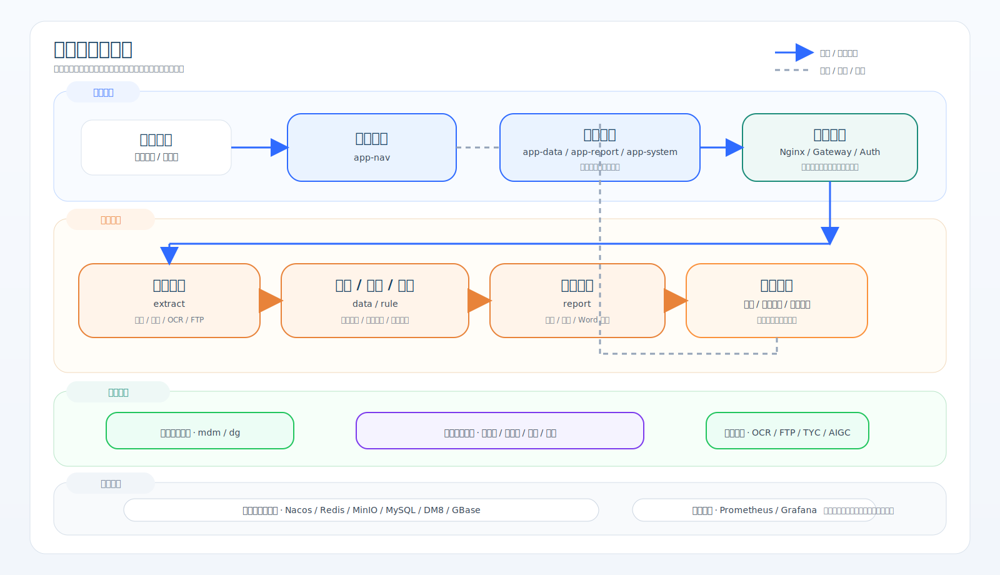
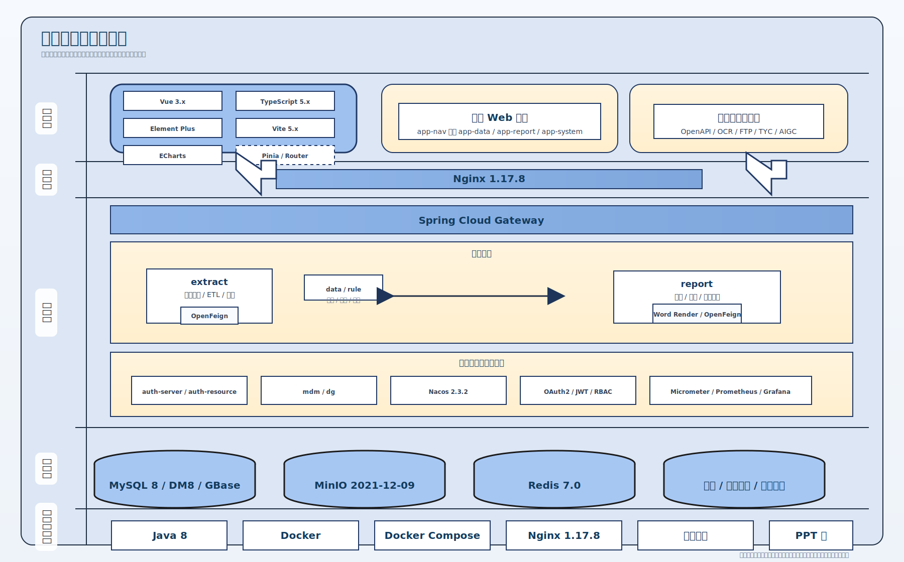
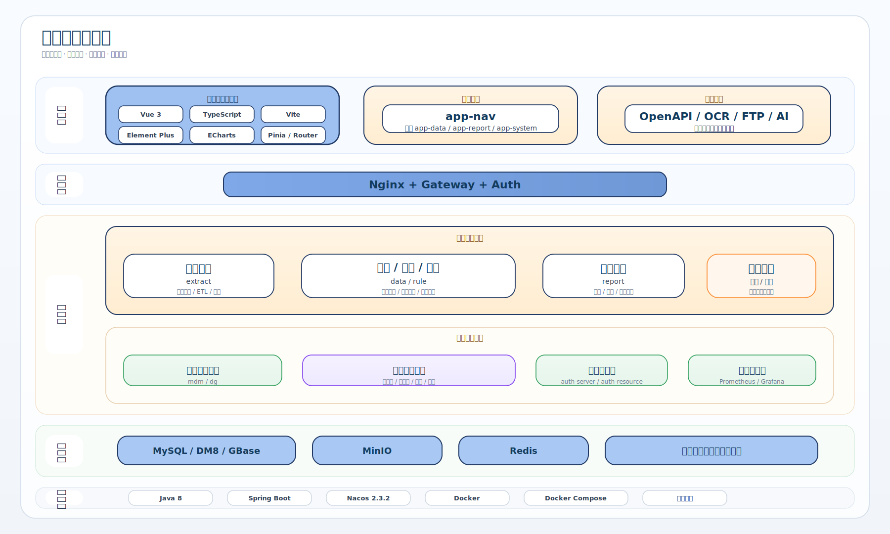

# 产品架构文档

## 1. 汇报定位

本文用于领导汇报场景，从产品能力与技术实现结合的视角，说明当前平台的真实架构形态、核心业务闭环和模块落位情况。

本次口径基于当前实际工程与文档整理，纳入范围如下：

- 前端工程：`c1-app`
- 平台服务：`data-cloud-gateway`、`data-cloud-auth-server`、`data-cloud-auth-resource`、`data-cloud-mdm`
- 业务服务：`dib-agent-service-extract`、`dib-agent-service-data`、`dib-agent-service-rule`、`dib-agent-service-report`、`dib-agent-data-dg`
- 第三方基础设施：`Nginx`、`Nacos`、`Redis`、`MinIO`、`MySQL`、`DM8`、`GBase`、`Prometheus`、`Grafana`、`OCR`、`FTP`、`TYC`、`AIGC`

本次不纳入汇报范围的内容：

- `app-system-v2`
- `data-cloud-eureka-server`
- `dib-agent-service-components`

## 2. 图示约定

- 整体按“自上而下分层”展示
- 布局遵循“上层入口、中层主链、下层支撑、底座托底”
- 核心业务链在中层按处理阶段从左到右排布
- 实线：主链 / 调用关系
- 虚线：挂载 / 承载 / 入口

说明：本图采用汇报型固定排布，不再展开细粒度依赖图，而是突出主链与关键支撑层次。

补充：本图以汇报表达为目标，仅保留主链路与关键支撑关系，不展开所有服务间细粒度调用。

## 3. 图 1 产品技术架构图

推荐汇报版采用固定排布 SVG，适合直接截图或放入 PPT 页面：

## 4. 架构说明

### 4.1 总体定位

当前平台已经形成“统一前端入口 + 微服务能力分层 + 资料到报告闭环处理”的产品技术架构。

- 产品入口统一由 `app-nav` 承载，`app-data`、`app-report`、`app-system` 作为挂载其上的业务应用
- 后端形成“平台支撑服务 + 业务能力服务”的组合模式
- 业务核心已经具备从资料输入、数据提取治理、指标规则框架计算，到报告生成与成果交付的完整链路

### 4.2 核心业务闭环

平台当前可归纳为一条清晰的业务处理主链：

1. 资料接入与提取：从文件、清单、外部资料中提取结构化数据，由 `extract` 服务承载
2. 主数据与治理：沉淀项目、组织、字典、附件及治理数据底座，由 `mdm` 与 `dg` 承载
3. 指标 / 规则 / 框架：基于提取结果与治理数据进行指标计算、规则计算和框架测算，由 `data` 与 `rule` 承载
4. 报告生成：结合治理表与指标、规则、框架结果生成报告，由 `report` 承载
5. 成果交付：对外输出报告成果，同时沉淀指标结果、规则结果等可复用计算产物

图示口径上，本次仅突出“提取 -> 计算 -> 报告 -> 交付”主链，治理、资源、外部能力与技术底座以下层托底方式展示，不在图中展开全部依赖明细。

### 4.3 前端产品形态

前端目前不是完全独立割裂的多个系统，而是“一个平台入口 + 多个业务应用”的组织方式。

- `app-nav` 是平台级统一门户，负责导航与统一入口承载
- `app-data` 侧重数据资源、模型主题、指标规则、数据浏览与治理类能力
- `app-report` 侧重模板、变量、文档、项目台账、报告工作台与报告生成类能力
- `app-system` 侧重系统管理、用户权限、接口、字典、参数等后台管理能力

### 4.4 平台支撑能力

从产品支撑角度看，平台已形成两类稳定公共能力：

- 统一接入与鉴权：由 `Nginx + gateway + auth` 组成，支撑统一入口、API 转发、认证与权限控制
- 数据资源管理：由 `data` 服务中的数据源、元数据、主题、看板等能力组成，支撑后续指标、规则、报告的复用

### 4.5 技术底座与外部集成

- 服务治理与存储底座已覆盖 `Nacos`、`Redis`、`MinIO`、`MySQL`、`DM8`、`GBase`
- 外部能力集成已覆盖 `OCR`、`FTP`、`TYC`、`AIGC`
- 运维监控已覆盖 `Prometheus`、`Grafana`

这意味着当前平台既具备资料处理与业务计算能力，也具备较完整的中间件、存储和外部集成基础。

## 5. 表 1 模块与产品能力映射

| 层级 | 产品能力 | 实际模块 / 服务 |
|---|---|---|
| 产品入口层 | 统一门户 | `app-nav` |
| 产品入口层 | 业务应用 | `app-data`、`app-report`、`app-system` |
| 核心业务层 | 资料接入与提取 | `dib-agent-service-extract` |
| 核心业务层 | 主数据与治理 | `data-cloud-mdm`、`dib-agent-data-dg` |
| 核心业务层 | 指标 / 规则 / 框架 | `dib-agent-service-data`、`dib-agent-service-rule` |
| 核心业务层 | 报告生成 | `dib-agent-service-report` |
| 平台支撑层 | 统一接入与鉴权 | `data-cloud-gateway`、`data-cloud-auth-server`、`data-cloud-auth-resource` |
| 平台支撑层 | 数据资源管理 | `data` 服务中的数据源、元数据、主题、数据看板等能力 |
| 技术底座层 | 服务治理与存储 | `Nacos`、`Redis`、`MinIO`、`MySQL`、`DM8`、`GBase` |
| 技术底座层 | 外部能力与监控 | `OCR`、`FTP`、`TYC`、`AIGC`、`Prometheus`、`Grafana` |

说明：`frame` 能力当前在工程实现上主要由 `dib-agent-service-rule` 承载，因此在本图中与规则能力统一并入“指标 / 规则 / 框架”节点。

## 6. 国产化与信创兼容口径

从当前真实情况看，平台已经具备较明确的国产化兼容基础：

- 数据库层已经存在 `DM8`、`GBase` 的适配与落地口径，不再局限于单一 `MySQL`
- 平台主体采用 `Java + Spring Boot + Nginx + Nacos` 技术路线，具备继续向信创软硬件环境迁移的通用基础
- 文件、缓存、对象存储、服务治理、监控等外围组件边界较清晰，便于按环境逐项做兼容验证

建议汇报时将“已具备国产数据库兼容实践”作为当前事实口径，将“全栈信创环境验证”表述为后续持续完善方向，避免过度承诺。

## 7. 演进建议

- 建议将平台统一对外口径收敛为“资料提取、数据治理、指标规则框架、报告生成”四段式主线，降低模块命名分散带来的理解成本
- 建议在后续汇报材料中继续补一张“业务场景 -> 产品能力 -> 服务模块”的对应图，进一步加强领导视角下的可读性
- 建议把 `data` 服务中的“数据资源管理能力”和“计算能力”在汇报口径上分开表述，便于体现平台型能力沉淀
- 建议形成一份独立的“国产化兼容矩阵”，按数据库、中间件、对象存储、外部接口四类逐项标注已验证与待验证范围

## 8. 附图：分层技术架构图（SVG）

以下附图参考你提供的 PPT 截图结构重绘，保留“视图层、代理层、服务层、存储层、基础设施层”的横向分层方式，并已替换为当前系统真实口径：

## 9. 附图：分层技术架构图（领导汇报版 SVG）

以下版本进一步压缩文案，并对配色、留白、层级感做了统一，适合直接作为正式汇报页中的主图：

