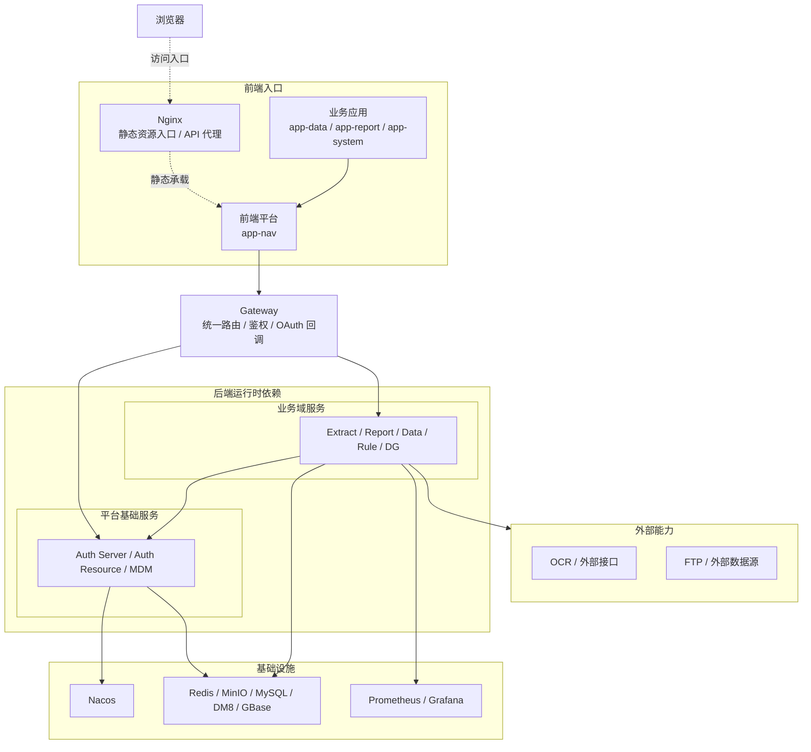
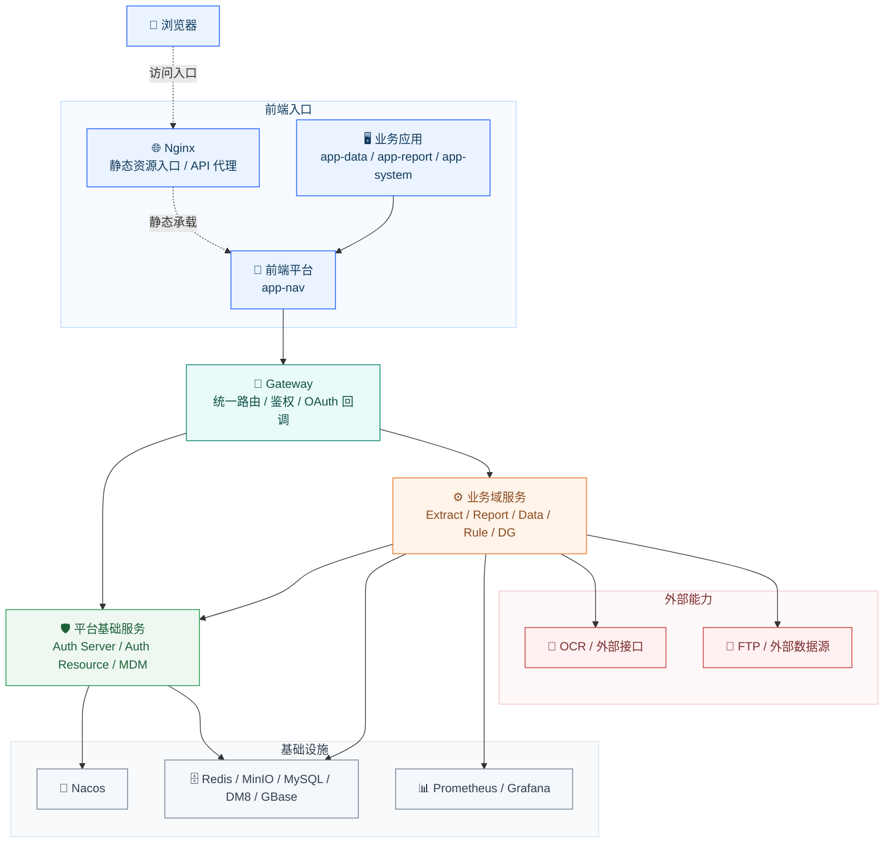
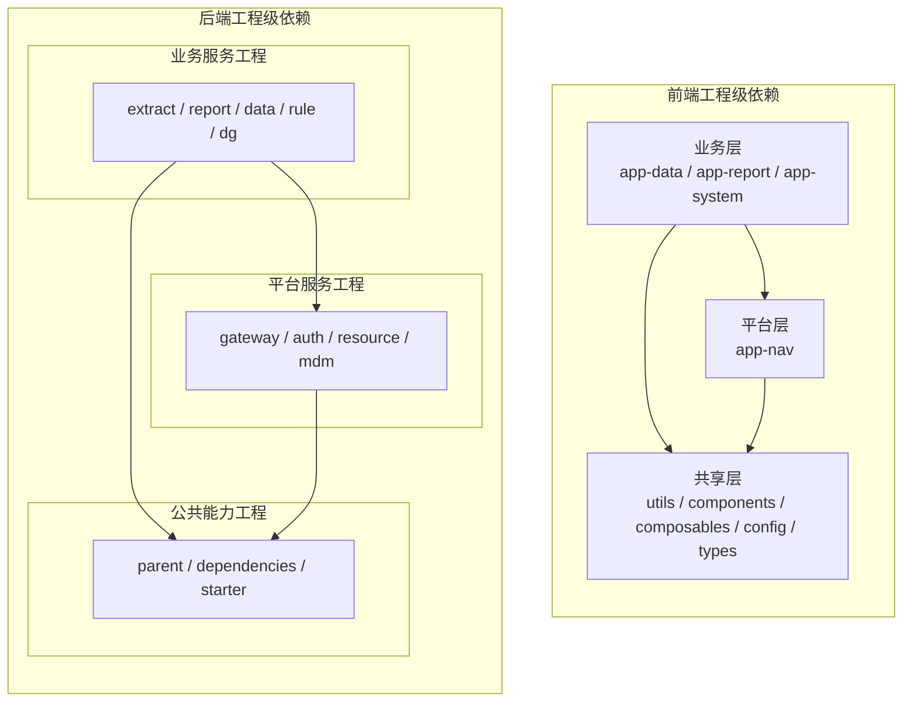
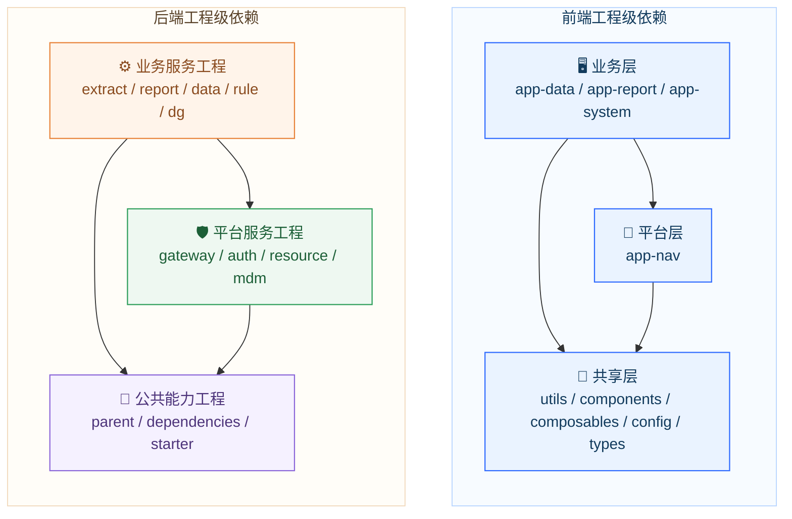

# 关键组件依赖关系图

## 1. 汇报范围

本文从两个层面说明平台关键组件之间的依赖关系：

- 运行时依赖关系：系统运行时，请求、服务和基础设施之间如何协同
- 工程级依赖关系：代码工程、模块、starter、共享包之间如何组织和复用

本文聚焦当前仍在实际运行和持续维护的平台与业务工程。

图示约定：

- 实线：依赖 / 调用 / 产出
- 虚线：挂载 / 承载 / 入口

## 2. 运行时依赖总览

汇报版图（样式增强）：

## 3. 运行时依赖解读

### 3.1 前端入口

- 用户通过浏览器访问平台
- `Nginx` 承载前端静态资源，并将 `/api/*` 代理到 `Gateway`
- `app-nav` 是前端平台壳层，`app-data`、`app-report`、`app-system` 依赖其承接统一入口
- `Gateway` 是统一 API 入口

### 3.2 平台服务

- `Auth Server` 负责认证、令牌签发、登录与 OAuth2 流程
- `Auth Resource` 负责权限资源与权限数据治理
- `MDM` 负责主数据与附件能力，是业务域服务的重要上游

### 3.3 业务服务

已确认的主要服务间调用关系如下：

**表 1 业务服务上游依赖**

| 服务 | 当前可见上游依赖 |
|---|---|
| `Extract` | `MDM` |
| `Report` | `MDM`、`Extract`、`Data` |
| `Data` | `MDM`、`Extract`、`Report` |
| `Rule` | `MDM`、`Data` |
| `DG` | `MDM` |

说明：

- 上述关系主要来自各服务 `EnableFeignClients` 与 Feign 模块配置
- `DG` 当前更偏内部治理类能力，当前统一入口暴露程度低于其他业务服务
- 按当前业务口径，`frame` 属于框架计算能力，工程实现上主要由 `rule` 服务承载；`report` 最终使用的是治理数据表及各类计算产物，不等同于必须直接 Feign 调用全部上游服务

### 3.4 基础设施依赖

- 所有服务通过 `Nacos` 完成注册发现
- 核心服务通过 `Redis` 实现缓存、会话与异步消息相关能力
- `MDM` 使用 `MinIO` 支撑附件/对象存储能力
- 各服务通过关系型数据库保存业务与平台数据
- 各服务通过 `Actuator + Micrometer` 输出指标到 `Prometheus / Grafana`

## 4. 工程级依赖总览

说明：以下箭头统一表示“依赖方向”，即业务应用/业务服务指向其所依赖的平台层或公共层。

汇报版图（样式增强）：

## 5. 工程级依赖解读

### 5.1 前端工程依赖

前端工程依赖呈现“平台应用 + 业务应用 + 共享包”结构。

**表 2 前端模块依赖**

| 模块 | 主要依赖 |
|---|---|
| `app-nav` | `shared-utils`、`shared-components`、`shared-config` |
| `app-data` | `app-nav`、`shared-utils`、`shared-components`、`shared-composables`、`shared-config` |
| `app-report` | `app-nav`、`shared-utils`、`shared-components`、`shared-composables`、`shared-config` |
| `app-system` | 汇报口径按统一新栈对待，纳入共享能力体系 |
| `shared-components` | `shared-utils`、`shared-composables`、`shared-types` |

结论：

- `app-nav` 是前端平台、壳层与基础入口
- `shared-*` 包是前端统一能力沉淀区
- `app-data`、`app-report` 对共享能力复用度最高

### 5.2 后端工程依赖

后端工程依赖呈现“父工程 / 依赖管理 / starter / 平台服务 / 业务服务”结构。

**表 3 后端工程分层依赖**

| 层级 | 代表工程 | 作用 |
|---|---|---|
| 父工程层 | `dib-agent-parent` | 汇总模块、统一构建规则 |
| 依赖管理层 | `data-cloud-dependencies` | 统一版本与依赖 BOM |
| 公共能力层 | `data-cloud-* starter` | 缓存、数据源、Web、文件、任务、AI 等通用能力 |
| 平台服务层 | `auth-server`、`auth-resource`、`mdm`、`gateway` | 平台底座能力 |
| 业务服务层 | `extract`、`report`、`data`、`rule`、`dg` | 面向业务域的独立能力服务 |

### 5.3 服务内部模块结构

平台服务和业务服务普遍遵循以下模块结构：

- `core`：核心业务逻辑与领域能力
- `feign`：对外服务调用接口或 SDK
- `web`：Web 启动、Controller、应用配置与暴露层

这一模式带来的价值：

- 服务边界更清晰
- 调用契约可复用
- 便于未来继续抽取公共能力

## 6. 关键依赖清单

### 6.1 平台层关键依赖

**表 4 平台层关键依赖**

| 组件 | 关键依赖 |
|---|---|
| `Gateway` | `Auth Server`、`Auth Resource`、`MDM`、业务服务、`Nacos` |
| `Auth Server` | `Redis`、数据库 |
| `Auth Resource` | `Redis`、数据库、`Nacos` |
| `MDM` | `MinIO`、数据库、`Nacos` |

### 6.2 业务层关键依赖

**表 5 业务层关键依赖**

| 组件 | 关键依赖 |
|---|---|
| `Extract` | `MDM`、`Redis`、数据库、外部 OCR / FTP |
| `Report` | `MDM`、`Extract`、`Data`、数据库 |
| `Data` | `MDM`、`Extract`、`Report`、数据库 |
| `Rule` | `MDM`、`Data`、数据库 |
| `DG` | `MDM`、数据库 |

### 6.3 横向基础能力依赖

**表 6 横向基础能力依赖**

| 类别 | 被依赖方式 |
|---|---|
| `Nacos` | 注册发现与配置基础设施 |
| `Redis` | 缓存、会话、异步任务相关能力 |
| `MinIO` | 文件和附件类对象存储 |
| `Prometheus / Grafana` | 指标采集与监控展示 |
| `dib-agent-parent / starter` | 统一工程基线与通用能力复用 |

## 7. 管理价值

当前依赖关系设计整体体现出以下管理价值：

- 统一入口，降低系统接入复杂度
- 平台底座与业务服务解耦，利于按业务域扩展
- 公共能力模块化沉淀，利于多项目复用
- 基础设施统一化，利于标准化部署和运维
- 兼容国产数据库，利于适配信创项目环境

## 8. 优化建议

- 对服务间调用链路进一步标准化，减少双向耦合
- 对 `DG` 等内部治理类服务形成统一的对外接入和治理口径
- 对前端共享包依赖进行版本化治理，提升可维护性
- 对后端公共 starter 和业务服务之间的职责边界继续收敛
- 对国产数据库适配形成更系统的兼容矩阵与验证报告
