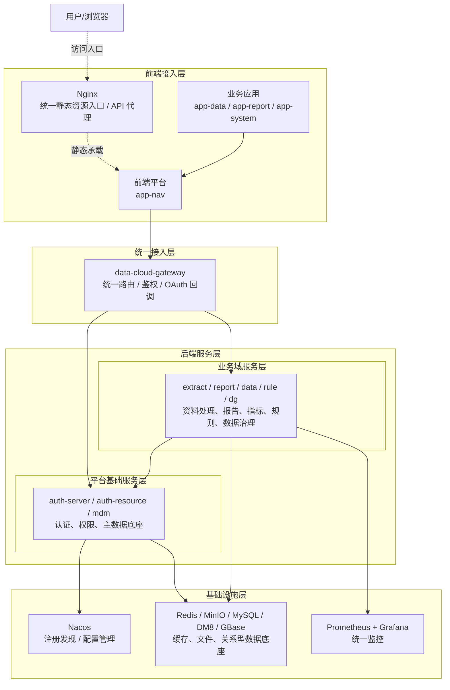
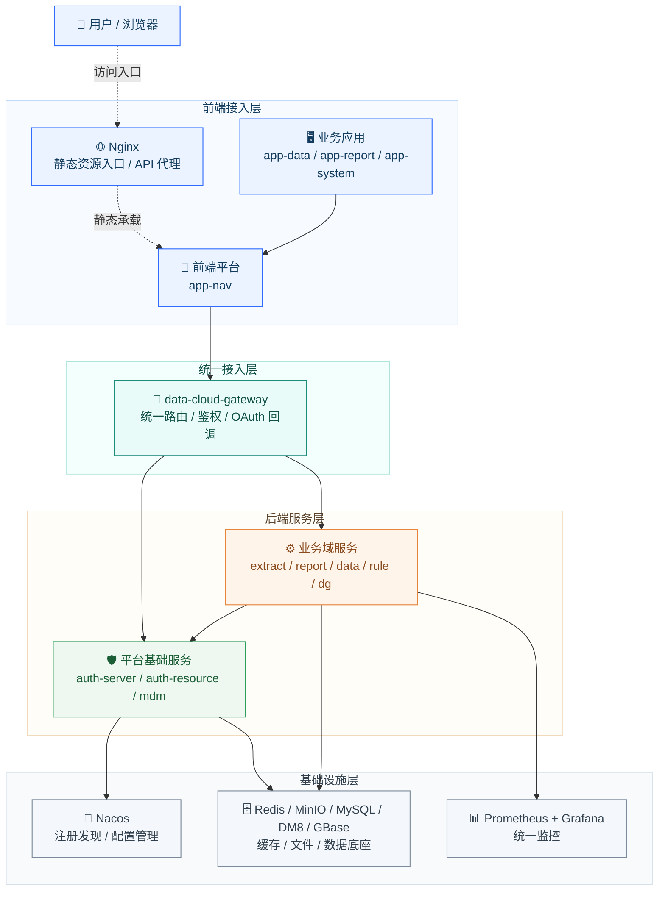
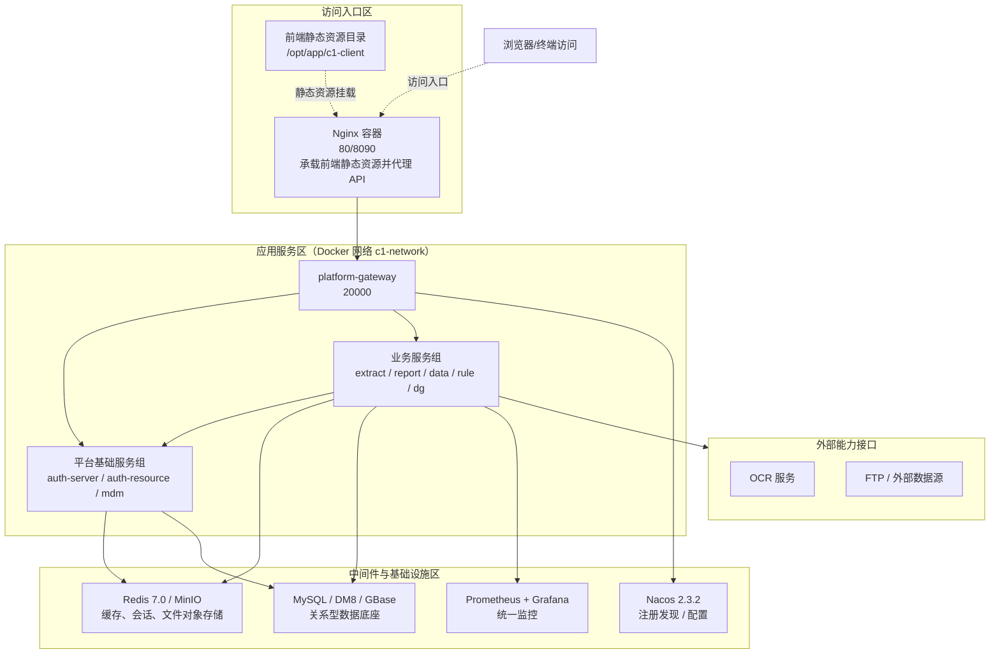
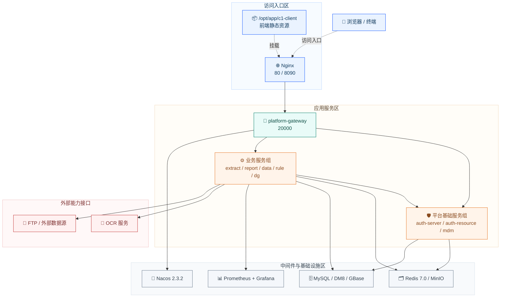
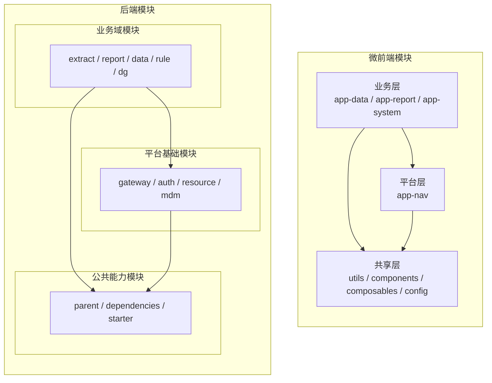
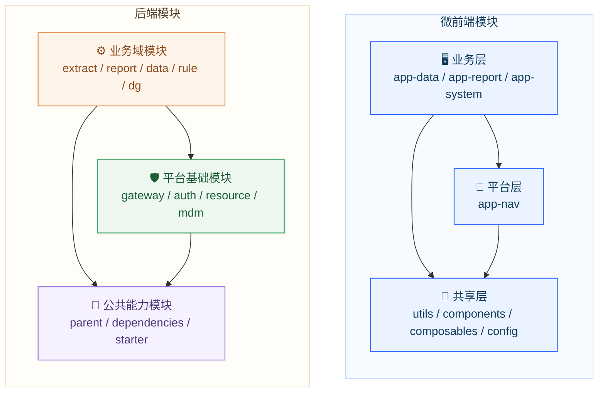
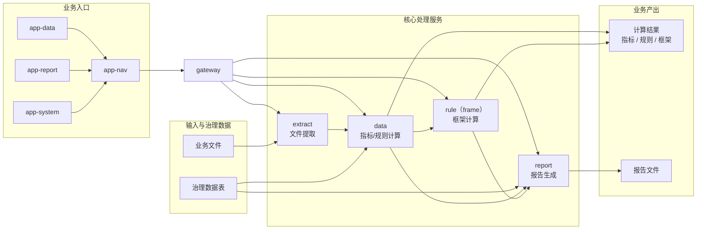
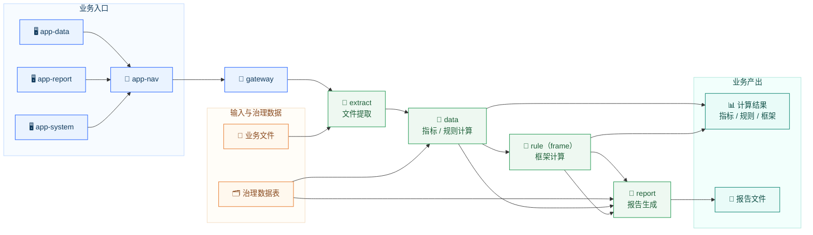

# 技术平台底座架构图

## 1. 汇报范围

本文用于领导汇报场景下说明当前技术平台底座的真实架构情况，重点覆盖以下范围：

- 前端工程：`c1-app`
- 平台基础服务：`data-cloud-auth-server`、`data-cloud-gateway`、`data-cloud-auth-resource`、`data-cloud-mdm`
- 业务域服务：`dib-agent-service-extract`、`dib-agent-service-report`、`dib-agent-service-data`、`dib-agent-service-rule`、`dib-agent-data-dg`
- 公共能力工程：`dib-agent-parent`
- 第三方基础设施：`Nginx`、`Nacos`、`Redis`、`MinIO`、关系型数据库、`Prometheus`、`Grafana`

本文聚焦当前仍在实际运行和持续维护的平台底座与业务域工程。

## 2. 总体判断

当前平台整体采用“前端微前端化 + 后端微服务化 + 公共能力平台化”的技术底座模式：

- 前端侧以 `Nginx` 统一承载静态资源，由 `app-nav` 作为前端平台/壳层承载导航与公共入口，`app-data`、`app-report`、`app-system` 作为依赖其运行的业务应用
- 接入侧由 `data-cloud-gateway` 统一承担 API 路由转发、统一鉴权、OAuth 回调与网关层安全控制
- 后端服务侧按照“平台基础服务在上、业务域服务在下”的结构分层
- 基础设施侧通过 `Nacos + Redis + MinIO + MySQL/DM8/GBase + Prometheus/Grafana` 支撑治理、缓存、文件、数据与监控
- 公共工程侧通过 `dib-agent-parent` 和 starter 体系沉淀通用底座能力

图示约定：

- 实线：依赖 / 调用 / 产出
- 虚线：挂载 / 承载 / 入口

## 3. 总体架构总览

汇报版图（样式增强）：

## 4. 部署架构视图

汇报版图（样式增强）：

## 5. 模块结构视图

说明：以下箭头统一表示“依赖方向”，即业务层依赖平台层，平台层依赖公共能力层。

汇报版图（样式增强）：

## 6. 核心业务处理链路

汇报版图（样式增强）：

说明：

- `extract` 服务负责从业务文件中提取结构化数据，形成后续计算输入
- `data` 服务基于提取数据和治理数据表进行指标计算与规则计算
- `frame` 当前在工程实现上由 `rule` 服务承载，依据 `data` 服务输出的规则结果完成框架计算
- `report` 服务综合治理数据表、指标结果、规则结果和框架结果生成报告

## 7. 分层职责说明

### 7.1 前端接入层

- `Nginx` 统一承载前端静态资源，并承担前后端分离场景下的 API 反向代理
- `c1-app` 以前端平台 + 业务应用的方式组织功能，`app-nav` 作为统一导航、壳层与公共入口平台，`app-data`、`app-report`、`app-system` 在其之上承载各业务子域
- 通过 `shared-utils`、`shared-components`、`shared-composables`、`shared-config` 复用跨应用能力，降低重复开发成本

### 7.2 网关接入层

- `data-cloud-gateway` 是统一接入入口
- 对外负责 API 路由、安全控制、认证过滤、统一入口治理
- 对认证场景负责 `/api-oauth` 回调与令牌交换

### 7.3 公共能力层

- `dib-agent-parent` 统一管理业务服务的父工程与版本基线
- `data-cloud-dependencies` 统一 Spring、数据库驱动、ORM、工具库等依赖版本
- `starter` 体系沉淀缓存、数据源、文件、Web、任务、AI 等通用基础能力

### 7.4 平台基础服务层

- `data-cloud-auth-server`：统一认证、登录、令牌签发、OAuth2 流程
- `data-cloud-auth-resource`：统一用户、角色、模块、接口权限、密级等权限资源管理
- `data-cloud-mdm`：统一组织、项目、字典、附件等主数据能力

### 7.5 业务域服务层

- `extract`：资料提取、ETL、清单管理、文档定位
- `report`：报告生成、模板管理、变量计算、文档渲染
- `data`：指标计算、元数据、数据资源管理
- `rule`：规则框架、业务规则、AI 规则计算
- `dg`：外部数据同步与数据治理

说明：

- `dib-agent-data-dg` 当前在部署层已独立存在，但在统一对外网关入口中未见与 `extract/report/data/rule` 同级的对外路由暴露，汇报时建议表述为“内部治理类服务”

## 8. 国产化兼容情况

当前技术底座已具备较明确的国产化兼容能力基础：

- 数据库层已不仅限于 `MySQL`
- `auth-server` 明确具备 `MySQL + DM8` 兼容能力
- `auth-resource`、`mdm` 工程中已纳入 `DM8` 驱动与 `GBase` 驱动
- 公共依赖工程中已纳入 `anyline-data-jdbc-gbase`、`Dm8JdbcDriver18` 等兼容依赖
- 部分项目部署文档已出现 `DM8 / GBase` 的实际接入说明，说明平台已在不同项目环境中落地国产数据库适配

建议汇报口径：

- 平台当前以关系型数据库为核心数据底座，主流部署支持 `MySQL`
- 在国产化场景下，已具备向 `DM8 / GBase` 迁移与适配的技术基础，部分项目已完成相关接入

## 9. 架构特点与关注点

### 9.1 主要特点

- 分层清晰，平台能力与业务能力边界相对明确
- 统一接入、统一鉴权、统一主数据，底座复用度高
- 公共 starter 沉淀较完整，业务服务扩展效率较高
- 已具备信创数据库兼容基础
- 部署、监控、中间件链路相对完整

### 9.2 当前关注点

- 前端仍存在历史栈与新栈并存的演进痕迹，本次汇报未展开旧栈差异
- 后端 Spring Boot 版本口径存在 `2.5.x` 与业务版本号 `2.7.x` 并存的现象，后续建议进一步收敛
- `DG` 服务当前更偏内部治理能力，对外入口治理口径需要继续统一

## 10. 演进建议

- 继续收敛前端应用技术基线，统一到同一代 Vue 3 + Vite 体系
- 继续收敛后端父工程与依赖管理版本，降低平台长期维护复杂度
- 将内部治理类服务的对外暴露策略、网关接入策略形成统一标准
- 对 `Nacos`、监控、日志、对象存储、数据库适配形成更明确的平台级标准模板
- 在信创场景下继续固化 `MySQL -> DM8 / GBase` 的迁移规范与验证清单
