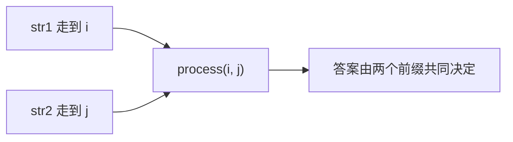
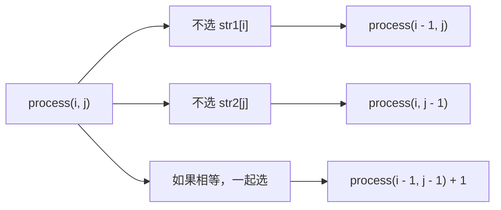
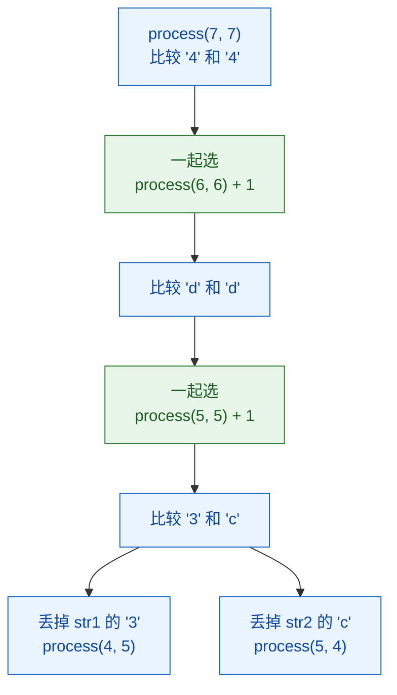

# 14-尝试模型3-多样本位置对应-最长公共子序列

[返回章节](README.md) | [返回分类](../../README.md) | [返回总目录](../../README.md)

- 状态：已标记完成
- 所属分类：基础巩固
- 所属章节：13 暴力递归到动态规划2-尝试模型
- 原始条目：多样本位置对应-最长公共子序列

## 题目
给定两个字符串 `str1` 和 `str2`，每个字符串都可以删掉若干字符，也可以一个都不删。

要求删完以后：

- 剩下字符的相对顺序不能变
- 两边最终得到的字符串要完全一样

问：两边最多能保留下多长的公共子序列。

这里说的是“子序列”，不是“子串”。
子序列不要求连续，只要求原有顺序不被打乱。

## 一句话结论
这题的关键不是盯着某一个字符串往前推，而是同时盯住两个字符串当前走到哪里。

所以它的递归状态天然要写成 `process(i, j)`：

- `i` 表示 `str1` 当前看到的位置
- `j` 表示 `str2` 当前看到的位置

如果末尾字符相等，就可以考虑把这一对一起选进答案；如果不相等，就分别尝试丢掉左边或右边的末尾字符。

## 理论 / 应用价值
- 这是“多样本位置对应”模型最经典的一题。
- 它训练的不是背公式，而是学会把“两个序列的当前位置”一起当成状态。
- 这一类思路后面会自然迁移到编辑距离、字符串比对、文本 diff 等问题。

## 核心知识点
- 状态定义：`process(i, j)` 表示 `str1[0..i]` 和 `str2[0..j]` 的最长公共子序列长度。
- 末尾字符相等时，可以走“两个都要”的分支。
- 末尾字符不相等时，至少要有一边丢掉当前字符。
- 先把递归模型想清楚，下一章再把它翻译成二维 `dp` 表。

## 图解
### 为什么状态一定要带两个位置


只看 `i` 不够，因为你还不知道 `str2` 走到了哪里。  
只看 `j` 也不够，因为你也不知道 `str1` 当前还能配上什么。

### 当前末尾字符怎么参与决策


这张图的重点不是“分支多”，而是要先抓住一句话：

`process(i, j)` 只关心两段前缀的答案，当前这两个末尾字符，要么有人被舍弃，要么在相等时一起被纳入答案。

## 解题思路
### 1. 先把状态说清楚
定义：

```text
process(i, j)
```

表示：

```text
str1[0..i] 和 str2[0..j]
这两段前缀的最长公共子序列长度
```

这一定义非常重要，因为后面的所有分支，都是围绕“这两个前缀的最后一个字符怎么处理”展开的。

### 2. 再看 base case
当某一边只剩一个字符时，就不能再继续无脑往左递归了。

比如：

- `i == 0` 时，要看 `str1[0]` 能不能在 `str2[0..j]` 里找到
- `j == 0` 时，要看 `str2[0]` 能不能在 `str1[0..i]` 里找到

本质上就是：

一边只剩一个字符时，问题会退化成“这个字符有没有在另一边前缀里出现过”。

### 3. 一般位置怎么分支
对于 `process(i, j)`，只需要盯住当前末尾这两个字符：

1. 不用 `str1[i]`，看 `process(i - 1, j)`
2. 不用 `str2[j]`，看 `process(i, j - 1)`
3. 如果 `str1[i] == str2[j]`，再看 `process(i - 1, j - 1) + 1`

最后取三者最大值。

## 典型例子
还是用这个更有代表性的例子：

```text
str1 = "a1b2c3d4"
str2 = "1ab23cd4"
```

它的好处是：

- 有些位置相等
- 有些位置不相等
- 不是一眼就能顺着对齐过去

正好能把递归分支的结构看清楚。

### 从最后一位开始看
- `str1[7] = '4'`
- `str2[7] = '4'`

这两个字符相等，所以“两个都要”的分支一定值得考虑：

```text
process(7, 7)
-> process(6, 6) + 1
```

再往前一位：

- `str1[6] = 'd'`
- `str2[6] = 'd'`

还是相等，于是继续一起保留。

但再往前：

- `str1[5] = '3'`
- `str2[5] = 'c'`

这时不相等，就必须分支：

```text
process(5, 5)
= max(
    process(4, 5),
    process(5, 4)
)
```

也就是说：

- 要么先丢掉 `str1` 这边的 `'3'`
- 要么先丢掉 `str2` 这边的 `'c'`

LCS 的递归本质，就是不断重复这个判断。

### 递归树只看一小段


这张图想表达的只有一件事：

相等时，递归会自然向左上角收缩；不相等时，递归会向“左”或“上”分叉。

## 为什么这个递归是对的
对 `process(i, j)` 来说，末尾字符的处理方式只有这几种：

- 不用 `str1[i]`
- 不用 `str2[j]`
- 如果相等，就让这一对字符一起参与答案

这已经把所有可能性都覆盖了，所以递归定义是完整的。

## 代码 / 伪代码
```java
int lcs(char[] str1, char[] str2, int i, int j) {
    if (i == 0 && j == 0) {
        return str1[0] == str2[0] ? 1 : 0;
    }
    if (i == 0) {
        if (str1[0] == str2[j]) {
            return 1;
        }
        return lcs(str1, str2, 0, j - 1);
    }
    if (j == 0) {
        if (str1[i] == str2[0]) {
            return 1;
        }
        return lcs(str1, str2, i - 1, 0);
    }

    int p1 = lcs(str1, str2, i - 1, j);
    int p2 = lcs(str1, str2, i, j - 1);
    int p3 = 0;
    if (str1[i] == str2[j]) {
        p3 = lcs(str1, str2, i - 1, j - 1) + 1;
    }
    return Math.max(p1, Math.max(p2, p3));
}
```

第一次看这段代码时，重点只要抓住下面这条主线：

```text
当前两个末尾字符相等
-> 可以一起要

当前两个末尾字符不相等
-> 就分别尝试丢掉一边
```

## 易错点
- 子序列不是子串，不要求连续。
- 状态不是一个位置，而是两个位置。
- 不相等时不是“随便减一边”就行，而是左右两边都要尝试。
- 相等时不能漏掉“左上角 + 1”这条分支。

## 记忆点
- LCS 是“多样本位置对应”模型的代表题。
- 递归状态写成 `process(i, j)`。
- 相等时一起选，不相等时左右分别尝试。
- 递归到动态规划的演进，见下一篇：[16-改动态规划-最长公共子序列](../14-暴力递归到动态规划3-暴力递归改动态规划/16-改动态规划-最长公共子序列.md)
