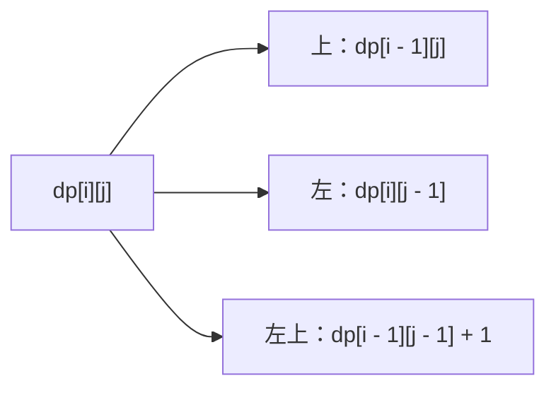

# 16-改动态规划-最长公共子序列

[返回章节](README.md) | [返回分类](../../README.md) | [返回总目录](../../README.md)

- 状态：已标记完成
- 所属分类：基础巩固
- 所属章节：14 暴力递归到动态规划2-暴力递归改动态规划
- 原始条目：最长公共子序列-从递归到动态规划

## 题目
给定两个字符串 `str1` 和 `str2`，每个字符串都可以删掉若干字符，也可以一个都不删。

要求删完以后：

- 剩下字符的相对顺序不能变
- 两边最终得到的字符串完全相同

问：两边最多能保留下多长的公共子序列。

这里说的是“子序列”，不是“子串”。

## 一句话结论
递归版已经把状态说清楚了：

```text
process(i, j)
= str1[0..i] 和 str2[0..j] 的最长公共子序列长度
```

改成动态规划时，本质上只是把这个递归状态翻译成表格坐标，让每个状态只算一次。

## 理论 / 应用价值
- 这是“递归状态翻译成二维 DP 表”的标准代表题。
- 它非常适合第一次学动态规划的人，因为递归结构清楚，DP 表的来龙去脉也很直观。
- 学会这一题以后，很多双序列 DP 的理解门槛都会明显下降。

## 从递归到 DP：先想清楚在搬什么
递归版里，我们已经定义了：

```text
process(i, j)
```

也就是说，答案只由两个位置决定：

- `i`
- `j`

而且递归里会反复算到同一个状态。  
比如 `process(i - 1, j)` 和 `process(i, j - 1)` 继续展开时，会再次遇到很多相同的小状态。

这就说明：

- 状态已经定义清楚了
- 还存在大量重复计算

所以它非常适合改成 DP。

## dp 表怎么定义
为了让边界更自然，DP 一般不直接写“下标走到哪”，而写“前几个字符”：

```text
dp[i][j]
= str1 前 i 个字符 和 str2 前 j 个字符
   的最长公共子序列长度
```

这里的好处是：

- `i = 0` 表示 `str1` 取空串
- `j = 0` 表示 `str2` 取空串

这样一来，空串边界就能直接落到第 `0` 行和第 `0` 列上。

## 为什么先填第 0 行和第 0 列
因为只要有一边是空串，最长公共子序列长度就一定是 `0`。

所以：

- `dp[0][j] = 0`
- `dp[i][0] = 0`

这一步不是额外技巧，而是在把递归里的边界条件落成表格里的边界。

## 填表顺序
看递推关系之前，先看“当前格依赖谁”。

对于 `dp[i][j]`，后面会发现它只依赖：

- 上边 `dp[i - 1][j]`
- 左边 `dp[i][j - 1]`
- 左上角 `dp[i - 1][j - 1]`

所以只要按行或按列推进，让这三个位置先算出来就行。

最自然的写法就是：

1. 先填第 `0` 行和第 `0` 列
2. 再从上到下逐行填表
3. 每一行里从左到右填


## 核心递推规则
设当前格是 `dp[i][j]`，它比较的其实是：

- `str1[i - 1]`
- `str2[j - 1]`

因为 `dp[i][j]` 表示的是“前 `i` 个字符”和“前 `j` 个字符”。

递推可以压成一句话：

```text
先看左和上，取最大值；
如果当前两个字符相等，再额外看左上 + 1。
```

也就是：

```java
dp[i][j] = Math.max(dp[i - 1][j], dp[i][j - 1]);
if (str1[i - 1] == str2[j - 1]) {
    dp[i][j] = Math.max(dp[i][j], dp[i - 1][j - 1] + 1);
}
```

### 为什么是这条规则
- 不相等时，当前这两个字符不可能同时出现在同一个 LCS 里，所以只能看“丢左边末尾”或“丢右边末尾”，也就是取左和上的最大值。
- 相等时，除了左和上这两条老路以外，还多了一条“把这一对字符接到答案后面”的路，也就是左上角 `+ 1`。

## 图解
### 一个格子的来源


真正使用时要补一句判断：

- 当前字符不相等，只看左和上
- 当前字符相等，再把左上 `+ 1` 也拿来比较

### 从递归状态到表格坐标


## 典型例子
继续用这个代表性更强的例子：

```text
str1 = "a1b2c3d4"
str2 = "1ab23cd4"
```

### 完整 dp 表
```text
      -  1  a  b  2  3  c  d  4
   -  0  0  0  0  0  0  0  0  0
   a  0  0  1  1  1  1  1  1  1
   1  0  1  1  1  1  1  1  1  1
   b  0  1  1  2  2  2  2  2  2
   2  0  1  1  2  3  3  3  3  3
   c  0  1  1  2  3  3  4  4  4
   3  0  1  1  2  3  4  4  4  4
   d  0  1  1  2  3  4  4  5  5
   4  0  1  1  2  3  4  4  5  6
```

右下角 `dp[8][8] = 6`，说明这两个字符串的最长公共子序列长度是 `6`。

### 这个表是怎么填出来的
#### 先看一个“不相等”的格子
看 `dp[5][4]`：

- `str1` 前 5 个字符是 `a1b2c`
- `str2` 前 4 个字符是 `1ab2`
- 当前比较的是 `'c'` 和 `'2'`

它们不相等，所以只看左和上：

```text
dp[5][4] = max(dp[4][4], dp[5][3])
         = max(3, 2)
         = 3
```

#### 再看一个“相等”的格子
看 `dp[8][8]`：

- `str1[7] = '4'`
- `str2[7] = '4'`

它们相等，于是除了左和上，还能看左上 `+ 1`：

```text
dp[8][8]
= max(dp[7][8], dp[8][7], dp[7][7] + 1)
= max(5, 5, 5 + 1)
= 6
```

这正对应了递归里那条“如果当前字符相等，就看左上角 `+ 1`”的分支。

## 代码 / 伪代码
```java
int lcsDp(char[] str1, char[] str2) {
    int n = str1.length;
    int m = str2.length;
    int[][] dp = new int[n + 1][m + 1];

    for (int i = 1; i <= n; i++) {
        for (int j = 1; j <= m; j++) {
            dp[i][j] = Math.max(dp[i - 1][j], dp[i][j - 1]);
            if (str1[i - 1] == str2[j - 1]) {
                dp[i][j] = Math.max(dp[i][j], dp[i - 1][j - 1] + 1);
            }
        }
    }

    return dp[n][m];
}
```

## 递归与动态规划对比
### 思路区别
- 递归：从大问题往小问题拆，边算边展开。
- DP：先把所有小状态按顺序填好，最后直接拿右下角答案。

### 复杂度对比
- 递归解法：时间复杂度可以粗略理解为 `O(2^(N + M))`，空间复杂度约 `O(N + M)`。
- DP 解法：时间复杂度 `O(N * M)`，空间复杂度 `O(N * M)`。

这里：

- `N` 是 `str1` 的长度
- `M` 是 `str2` 的长度

## 易错点
- `dp[i][j]` 表示的是“前 `i` 个字符”和“前 `j` 个字符”，所以当前字符要写成 `str1[i - 1]`、`str2[j - 1]`。
- 不相等时只看左和上，不要误写成左上角 `+ 1`。
- 相等时不是直接等于左上角 `+ 1`，而是把它也放进比较里。

## 记忆点
- 先把递归状态翻译成表格坐标。
- 第 `0` 行和第 `0` 列表示空串边界。
- 先看左和上，取最大值；相等时再看左上 `+ 1`。
- 右下角就是最终答案。
