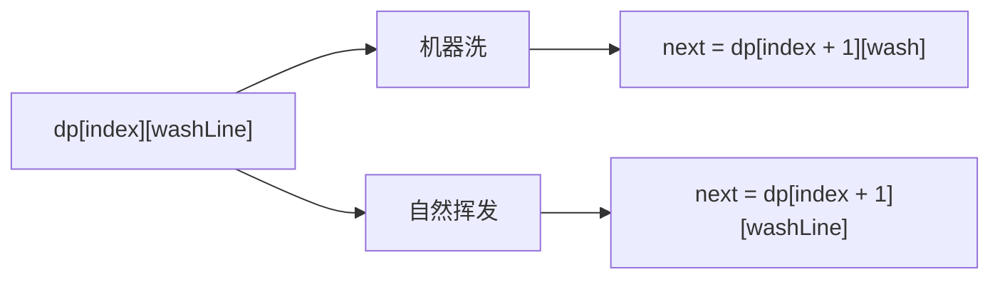
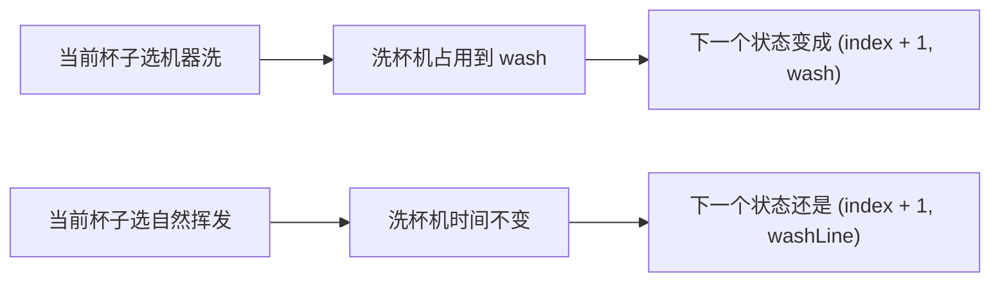

# 16-改动态规划-咖啡杯清洗问题

[返回章节](README.md) | [返回分类](../../README.md) | [返回总目录](../../README.md)

- 状态：已标记完成
- 所属分类：基础巩固
- 所属章节：14 暴力递归到动态规划3-暴力递归改动态规划
- 原始条目：咖啡杯清洗问题-从递归到动态规划

## 题目
给定一个数组 `arr`，其中 `arr[i]` 表示第 `i` 个人喝完咖啡、把杯子放到待处理区的时间。

每只杯子有两种变干净的方式：

- 用洗杯机洗：一次只能洗一只，洗一只需要 `a` 时间
- 自然挥发：每只杯子自己挥发干净，耗时 `b`，彼此互不影响

问：怎样安排每只杯子是“机器洗”还是“自然挥发”，才能让所有杯子都干净的时间尽量早。

补充前提：

- `arr` 默认按时间从小到大处理
- 如果原始输入只是无序时间集合，要先排序，再进入这道题

## 一句话结论
递归版的核心状态已经很清楚：

```text
process(index, washLine)
```

改成动态规划时，本质上就是把这个递归状态铺成一张二维表：

```text
dp[index][washLine]
```

难点不在“公式难写”，而在于：

- 第二维 `washLine` 的范围怎么定
- 表该按什么顺序填
- 以及每个格子里为什么是“方案内取 `max`，方案间取 `min`”

这题很适合配一张小型 `dp` 表，因为只看转移式，初学时很容易不知道表里到底装的是什么。

## 理论 / 应用价值
- 这题很适合练“状态已经对了，下一步怎么改成 DP”。
- 它和很多经典二维 DP 不一样，第二维不是字符串下标、也不是背包容量，而是“业务资源的可用时间”。
- 学会这一题之后，会更容易理解“有些 DP 的第二维不是题目直接给你的，而是你自己从业务限制里抽出来的”。

## 为什么它能改成 DP
递归版里，如果两个状态满足：

- 后面要处理的杯子编号一样
- 洗杯机最早可用时间一样

那么后续最优答案就一定一样。

也就是说：

```text
process(index, washLine)
```

这个状态会被重复算到很多次，所以可以直接缓存，进一步就能整理成 DP 表。

## 先看一张更完整的 dp 表
这次换一个稍微更有代表性的例子，让整张表更像真正做题时会看到的样子：

```text
arr = [1, 2, 4]
a = 2
b = 5
```

### 第一步：先算出 `limit`
按照“所有杯子都走机器洗”这个最晚情况来估上界：

```text
limit = 0
处理 1 -> limit = max(0, 1) + 2 = 3
处理 2 -> limit = max(3, 2) + 2 = 5
处理 4 -> limit = max(5, 4) + 2 = 7
```

所以这里第二维只需要开到：

```text
washLine = 0..7
```

### 第二步：看表的含义
```text
dp[index][washLine]
= 从第 index 只杯子开始处理，
   当洗杯机最早可用时间是 washLine 时，
   后续所有杯子都变干净的最早完成时间
```

### 第三步：看完整表
```text
                washLine
index        0  1  2  3  4  5  6  7
--------------------------------------
2(最后一只)   6  6  6  6  6  7  8  9
1            6  6  6  7  7  7  8  9
0            6  6  6  7  7  7  8  9
```

填表方向可以先这样看：

```text
先填最下面一行：
2(最后一只)   6  6  6  6  6  7  8  9

再用第 2 行，推第 1 行：
1            6  6  6  7  7  7  8  9

再用第 1 行，推第 0 行：
0            6  6  6  7  7  7  8  9
```

这张表怎么读：

- `dp[2][0] = 6`
  表示只剩最后一只杯子时，洗杯机现在空着，最早 6 时刻全部结束
- `dp[1][3] = 7`
  表示从第 1 只杯子开始处理，洗杯机要到 3 时刻才空出来，最早 7 时刻全部结束
- `dp[0][0] = 6`
  这就是整道题的答案

### 第四步：先看最后一行是怎么来的
先看 `dp[2][4]`。这时只剩最后一只杯子，当前杯子出现时间是 `4`。

机器洗：

```text
wash = max(4, 4) + 2 = 6
```

自然挥发：

```text
dry = 4 + 5 = 9
```

所以：

```text
dp[2][4] = min(6, 9) = 6
```

最后一行整行都能这样直接算出来，所以它就是填表起点。

### 第五步：再看普通格子怎么由下一行推上来
再看 `dp[1][3]`。这时处理第 1 只杯子，当前杯子出现时间是 `2`，洗杯机最早 3 时刻可用。

当前杯子机器洗：

```text
wash = max(2, 3) + 2 = 5
p1 = max(5, dp[2][5]) = max(5, 7) = 7
```

当前杯子自然挥发：

```text
dry = 2 + 5 = 7
p2 = max(7, dp[2][3]) = max(7, 6) = 7
```

所以：

```text
dp[1][3] = min(7, 7) = 7
```

### 第六步：再看答案格 `dp[0][0]`
处理第 0 只杯子，当前杯子出现时间是 `1`，洗杯机当前就可用。

```text
机器洗：
wash = max(1, 0) + 2 = 3
p1 = max(3, dp[1][3]) = max(3, 7) = 7

自然挥发：
dry = 1 + 5 = 6
p2 = max(6, dp[1][0]) = max(6, 6) = 6

所以：
dp[0][0] = min(7, 6) = 6
```

这张完整表的价值就在这里：

- 你能看到表里存的真的是“最终结束时间”
- 你能看到为什么一定是“先最后一行，再一行一行往前填”
- 你能看到 `washLine` 变大时，答案通常不会更好
- 你能直接定位答案就在左上角 `dp[0][0]`

## dp 表怎么定义
直接沿用递归版的状态含义：

```text
dp[index][washLine]
```

表示：

- 从第 `index` 只杯子开始处理
- 当前洗杯机最早可用时间是 `washLine`
- 后续所有杯子都变干净的最早完成时间

这和递归版的 `process(index, washLine)` 是一一对应的。

## `washLine` 的上界怎么定
这是这题最关键的一步。

如果第二维不设上界，表就没法开。

一个安全的上界是：

假设所有杯子都选择机器洗，那么洗杯机最晚会忙到什么时候，这个时间就可以作为 `washLine` 的上界。

写成代码就是：

```java
int limit = 0;
for (int time : arr) {
    limit = Math.max(limit, time) + a;
}
```

这个 `limit` 的含义是：

- 就算每只杯子都去排队机器洗
- 洗杯机最晚也只会忙到这个时刻

所以第二维只需要开到 `0..limit`。

## 填表顺序
递归关系里：

```text
dp[index][washLine]
依赖 dp[index + 1][...]
```

所以 `index` 必须从后往前填。

而每一行里的 `washLine`，从小到大枚举就可以。


你可以把它想成：

- 先把“只剩最后一只杯子时”的答案全部填出来
- 再去填“只剩最后两只杯子时”的答案
- 再一层层往前推

## 转移怎么写
### 1. 最后一行
当 `index == n - 1` 时，只剩最后一只杯子：

```text
wash = max(arr[index], washLine) + a
dry  = arr[index] + b

dp[index][washLine] = min(wash, dry)
```

这就是递归版 base case 直接搬到表里。

### 2. 普通位置
对于任意 `dp[index][washLine]`，还是两种选择。

#### 机器洗
```text
wash = max(arr[index], washLine) + a
p1 = max(wash, dp[index + 1][wash])
```

解释一下：

- `wash` 是当前杯子机器洗完的时间
- `dp[index + 1][wash]` 是后面所有杯子在新状态下的最优结束时间
- 一条完整方案什么时候结束，要等这两部分里更晚的那个，所以取 `max`

#### 自然挥发
```text
dry = arr[index] + b
p2 = max(dry, dp[index + 1][washLine])
```

这里后续状态还是 `washLine`，因为自然挥发不会占用洗杯机。

#### 当前格答案
```text
dp[index][washLine] = min(p1, p2)
```

因为：

- `p1` 是“当前杯子机器洗”这条完整方案的结束时间
- `p2` 是“当前杯子自然挥发”这条完整方案的结束时间

我们要的是更早结束的那条，所以取 `min`。

## 怎么理解“方案内取 max，方案间取 min”
这一句是整题最关键的阅读门槛，单独拎出来会更清楚。

### 1. 一条方案内部，为什么取 `max`
假设当前杯子选择机器洗：

- 当前杯子会在 `wash` 时刻干净
- 后续杯子整体会在 `dp[index + 1][wash]` 时刻全部干净

整条方案真正结束的时间，不是两者相加，而是：

```text
max(当前杯子完成时间, 后续杯子整体完成时间)
```

因为必须等两部分都完成，整条方案才算结束。

### 2. 两条方案之间，为什么取 `min`
当前杯子只有两种决策：

- 机器洗，得到一条完整方案结束时间 `p1`
- 自然挥发，得到另一条完整方案结束时间 `p2`

题目要的是“所有方案里，最早结束的那一种”，所以最后取：

```text
min(p1, p2)
```

可以把每个格子理解成一句话：

```text
先分别算出两条完整方案各自什么时候结束，
每条方案内部取 max，
两条方案之间再取 min。
```

## 图解
### 当前格的两条来源


### 为什么机器洗会改下一状态


## 代码 / 伪代码
```java
int minTimeDp(int[] arr, int a, int b) {
    int n = arr.length;
    int limit = 0;
    for (int time : arr) {
        limit = Math.max(limit, time) + a;
    }

    int[][] dp = new int[n][limit + 1];

    for (int washLine = 0; washLine <= limit; washLine++) {
        int wash = Math.max(arr[n - 1], washLine) + a;
        int dry = arr[n - 1] + b;
        dp[n - 1][washLine] = Math.min(wash, dry);
    }

    for (int index = n - 2; index >= 0; index--) {
        for (int washLine = 0; washLine <= limit; washLine++) {
            int wash = Math.max(arr[index], washLine) + a;
            int p1 = Integer.MAX_VALUE;
            if (wash <= limit) {
                p1 = Math.max(wash, dp[index + 1][wash]);
            }

            int dry = arr[index] + b;
            int p2 = Math.max(dry, dp[index + 1][washLine]);

            dp[index][washLine] = Math.min(p1, p2);
        }
    }

    return dp[0][0];
}
```

## 代码思路说明
第一次看这段代码时，建议按“表有多大 -> 先填哪 -> 每格怎么算”这个顺序读。

### 第一步：先看表的大小怎么来
```java
int[][] dp = new int[n][limit + 1];
```

这里两维分别对应：

- 第几只杯子开始处理
- 洗杯机最早可用时间是多少

### 第二步：先填最后一行
```java
for (int washLine = 0; washLine <= limit; washLine++) {
    ...
}
```

这一整行表示：

```text
只剩最后一只杯子时，
在不同 washLine 下的最优答案
```

### 第三步：再从后往前填
```java
for (int index = n - 2; index >= 0; index--) {
    for (int washLine = 0; washLine <= limit; washLine++) {
        ...
    }
}
```

因为当前格依赖下一行，所以必须倒着填。

### 第四步：每个格子都只做同一套判断
- 假设当前杯子机器洗，算出完整方案结束时间 `p1`
- 假设当前杯子自然挥发，算出完整方案结束时间 `p2`
- 当前格填 `min(p1, p2)`

所以 DP 并没有换题，它只是把递归里“反复算的小状态”提前存进表里了。

## 递归与动态规划对比
### 思路区别
- 递归：沿着“机器洗 / 自然挥发”两条路不断展开。
- DP：把所有 `(index, washLine)` 状态提前铺成表，每个状态只算一次。

### 复杂度理解
- 递归版：最直观的上界可以看成一棵二叉决策树，每只杯子都有“机器洗 / 自然挥发”两种选择，所以时间复杂度是指数级，通常写作 `O(2^N)`。
- DP 版：状态数量是 `N * limit` 量级，所以时间复杂度约 `O(N * limit)`，空间复杂度约 `O(N * limit)`。

这里：

- `N` 是杯子数量
- `limit` 是洗杯机最晚可能占用到的时间上界

如果原始 `arr` 还没有排好序，还要先做一次排序：

- 排序代价是 `O(N log N)`
- 但和递归的指数级相比，这部分通常不是主要矛盾

所以更完整地说：

- 纯递归求最优解：`O(2^N)`，空间复杂度约 `O(N)`（递归栈）
- 动态规划：`O(N * limit)`，空间复杂度 `O(N * limit)`
- 如果输入无序，两种写法前面都还要加一个排序 `O(N log N)`

## 易错点
- `washLine` 表示的是洗杯机可用时间，不是当前杯子的出现时间。
- 当前方案的最终完成时间要取 `max`，不是把时间相加。
- `limit` 一定要先想清楚，不然第二维开不出来。
- `wash <= limit` 这层判断不要漏，不然会越界。
- DP 没有换题，只是把递归状态改成了表格坐标。

## 记忆点
- 先有 `process(index, washLine)`，后有 `dp[index][washLine]`。
- 第二维的关键是先求出 `washLine` 上界。
- 先看一张小表，最容易理解这题的 DP 到底在存什么。
- 机器洗会改下一状态，自然挥发不会。
- 这题的 DP 难点不在转移，而在状态范围。
