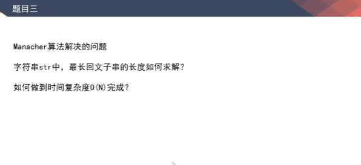

# 题目3，Manacher算法-最长回文子串的长度

[返回章节](README.md) | [返回分类](../README.md) | [返回总目录](../../README.md)

- 状态：待补充
- 所属分类：基础提升
- 所属章节：03 KMP、Manacher算法
- 原始条目：☐ 题目3，Manacher算法-最长回文子串的长度

## 笔记

经典解法，及其改进，加任意特殊字符在虚轴上；

Manacher算法

先掌握4个概念：

回文直径、回文半径

回文半径数组（最关键的）

扩展的最右边界

扩展到最右边界时的中心点

abcdedcbakabcdedcft

i 没有被 R 包住，直接暴力右扩；

i 被 R 包住的情况，分3种：

i 的对称点 i1 的回文半径，在以 k 为中心的回文半径内 - 不用扩

i 的对称点 i1 的回文半径，超出了以 k 为中心的回文半径 - 不用扩

i 的对称点 i1 的回文半径，刚好压线在 L 上... - 加速扩
