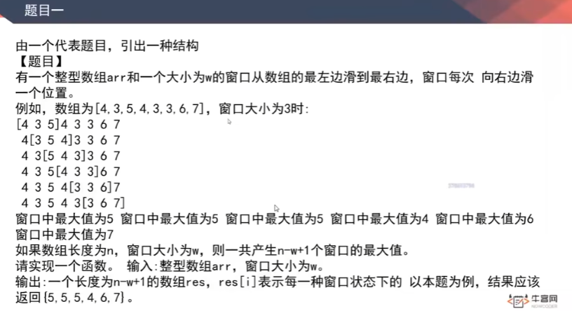

# 滑动窗口最大值

[返回章节](README.md) | [返回分类](../README.md) | [返回总目录](../../README.md)

- 状态：待补充
- 所属分类：基础提升
- 所属章节：03 KMP、Manacher算法
- 原始条目：☐ 滑动窗口最大值

## 笔记

65435

65435

如何理解？双端队列维持的是：

如果依次过期，成为最大值的顺序；

R 右移，更晚过期的，值更大，把前面小的值直接删除
