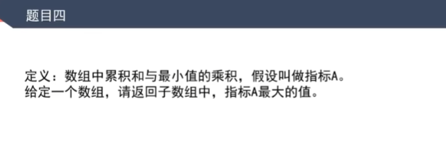

# 题目，下题有个前提是正数数组

[返回章节](README.md) | [返回分类](../README.md) | [返回总目录](../../README.md)

- 状态：待补充
- 所属分类：基础提升
- 所属章节：03 KMP、Manacher算法
- 原始条目：☐ 题目，下题有个前提是正数数组

## 笔记

套用单调栈的思路：

每个位置 A，都找左、右两侧比它小的第一个数，就是它不能扩到的位置L、R；

L、R中间就以 A 为最小值的区间；

todo，下一步怎么求累加和？
