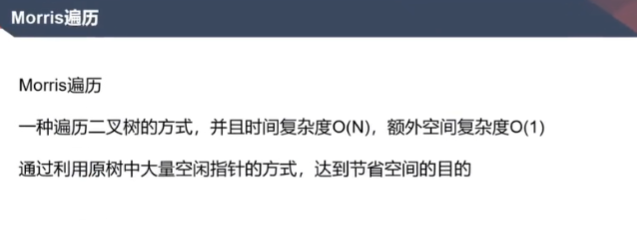
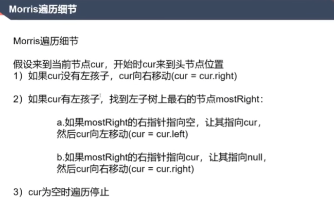

# Morris遍历

[返回章节](README.md) | [返回分类](../README.md) | [返回总目录](../../README.md)

- 状态：待补充
- 所属分类：基础提升
- 所属章节：04 滑动窗口、单调栈结构等
- 原始条目：☐ Morris遍历

## 笔记
面试中用到的二叉树遍历的进阶解法。

如何理解其本质：

树的递归，一个节点会被访问3次；

Morris遍历是保存了1个线索，有左子树，会再次返回到这个节点；

即使要多次找左子树有边界，但时间复杂度仍为O(N)，因为这个路径节点不重复；

Morris遍历，可以改为先序、中序、后序遍历；

应用：判断一棵树是不是搜索二叉树，中序遍历是升序，空间复杂度是O(1)。
