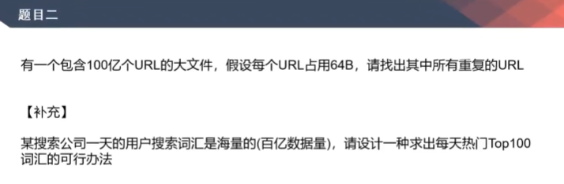

# 大数据题目2，利用堆、外排序解决多个处理单元结果的合并

[返回章节](README.md) | [返回分类](../README.md) | [返回总目录](../../README.md)

- 状态：待补充
- 所属分类：基础提升
- 所属章节：05 二叉树的Morris遍历
- 原始条目：☐ 大数据题目2，利用堆、外排序解决多个处理单元结果的合并

## 笔记

方法1，布隆过滤器

方法2，哈希函数分流（万能的解决方案）

补充题目，【总大根堆】从【分大根堆】取堆顶元素
