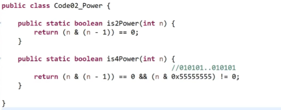

# 位运算题目5

[返回章节](README.md) | [返回分类](../README.md) | [返回总目录](../../README.md)

- 状态：待补充
- 所属分类：基础提升
- 所属章节：05 二叉树的Morris遍历
- 原始条目：☐ 位运算题目5

## 笔记

判断是否是2的幂：

方法1，最右侧的1，与原数相等；

方法2，X & ( X - 1 )= 0

判断是否是4的幂：

先确定是否是1个1；

再与运算 ......1010101；

如果结果不是0，则是，否则不是。

