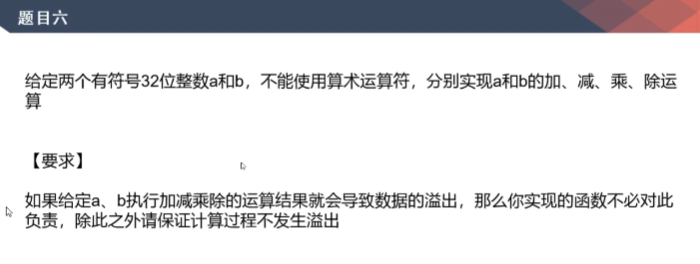
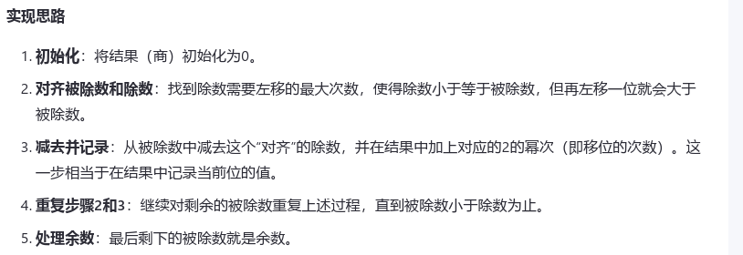
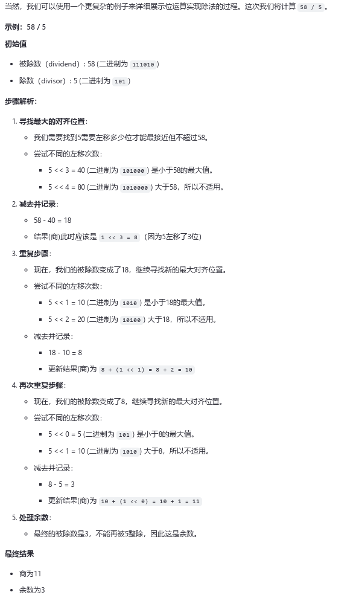

# 位运算题目6，实现加、减、乘、除

[返回章节](README.md) | [返回分类](../README.md) | [返回总目录](../../README.md)

- 状态：待补充
- 所属分类：基础提升
- 所属章节：05 二叉树的Morris遍历
- 原始条目：☐ 位运算题目6，实现加、减、乘、除

## 笔记

加法：

A 和 B 异或，就是无进位相加，得到 C；

A 和 B 求与，就能得到进位信息，再左移一位，得到 D；

原始数相加，等效于 C + D；

C 和 D 反复执行前两步，直到没有进位信息，就得到最终的和。

减法：

A - B，转为 A + (- B) ；

其中 B 的相反数，等于 B 取反，再加1，即 （~B + 1）。

乘法

A * B，A左移1位，B无符号数右移1位，累加结果。

除法

位运算实现除法通常依赖于移位操作来快速逼近商的结果；

（实际代码中，被除数右移，更安全，避免左移导致符号位变成负数...）

