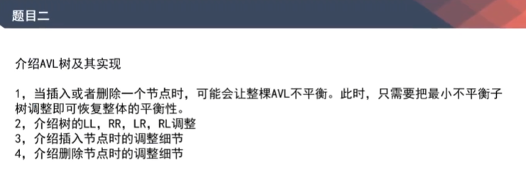

# AVL树

[返回章节](README.md) | [返回分类](../README.md) | [返回总目录](../../README.md)

- 状态：待补充
- 所属分类：基础提升
- 所属章节：07 暴力递归
- 原始条目：☐ AVL树

## 笔记

左旋，头节点倒向左边；右旋，头节点倒向右边；

LL，右旋；

RR，左旋；

LR，先左旋，再右旋；

RL，先右旋，再左旋；
