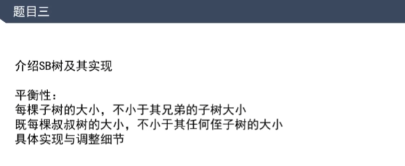
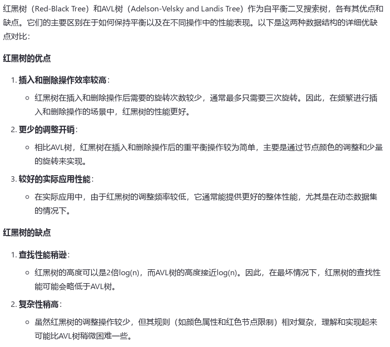
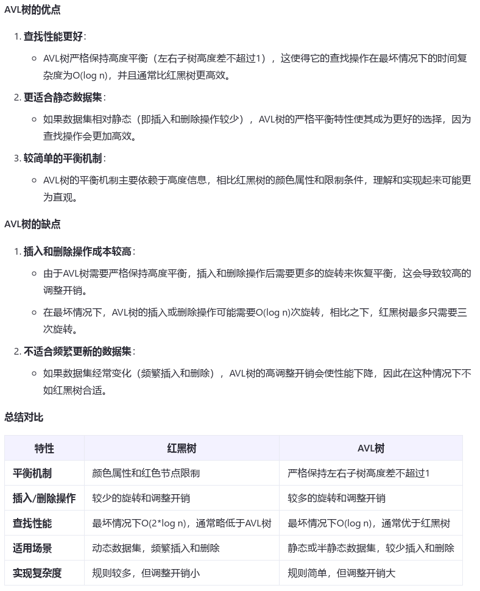

# Size Balanced Tree、红黑树

[返回章节](README.md) | [返回分类](../README.md) | [返回总目录](../../README.md)

- 状态：待补充
- 所属分类：基础提升
- 所属章节：07 暴力递归
- 原始条目：☐ Size Balanced Tree、红黑树

## 笔记

红黑树 & SBT，可以认为与AVL树主要区别就是平衡标准不同

