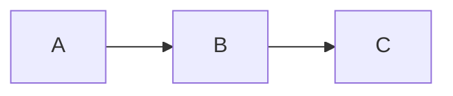

# 笔记模板

后续补全题目时，统一按下面结构整理：

```md
# 题目标题

[返回章节](README.md) | [返回分类](../../README.md) | [返回总目录](../../README.md)

- 状态：已标记完成
- 所属分类：基础巩固
- 所属章节：章节名
- 原始条目：原始条目名

## 题目
先把题目本身讲清楚。
- 输入是什么
- 输出什么
- 关键限制 / 规则 / 边界是什么
- 如果原文只有标题或图片，也要补成完整题意

## 一句话结论
用 2~3 句话先说明这题在讲什么、核心方法是什么。

## 理论 / 应用价值
- 这题背后的理论位置是什么
- 它在整套知识体系里解决什么问题
- 实际做题或工程里为什么值得学

如果这题本身就是某个算法模板、数据结构模板、理论模型，也可以在这里先讲：
- 它和前后知识点的关系
- 它相比其他方法解决了什么痛点
- 它最适合处理什么类型的问题

## 核心知识点
- 知识点 1
- 知识点 2
- 知识点 3

## 图片转写 / 题意还原
如果原文只有配图，先把图里的公式、流程、表格、示意图转成 Markdown；
如果原文只有题目名，也要补出“这题原本在讲什么、要求解决什么、关键词是什么”，不要只写占位语。

题意说明尽量直接补成完整题目描述，至少覆盖输入、输出、关键限制 / 规则 / 边界。

## 图解
如果这题适合用结构图、流程图、指针变化图、分区示意图来理解，就补一份图解。

图解优先使用 `mermaid`，`mermaid` 默认优先采用左右布局，也就是优先写成：



只有在上下结构更自然，或者左右布局明显不清楚时，再考虑其他布局。
如果原题自带图片，优先把原图的核心结构转成 `mermaid` 图或 Markdown 步骤图，而不是只保留图片链接。

## 解题思路
按“为什么这么做 -> 怎么做 -> 为什么对”展开。

## 复杂度
- 时间复杂度：
- 空间复杂度：

## 典型例子
给一个足够有代表性的例子，把过程走一遍。

## 易错点
- 容易误判的边界
- 容易混淆的概念

## 代码 / 伪代码
如果仓库里有对应实现，就贴简化版伪代码或说明实现位置；
如果没有代码，也至少给出可执行的思路框架。

## 记忆点
用 2~4 条短句总结这题最值得记住的关键词、判断条件或套路。
```

补充约定：
- 每次开始新题前，先更新 `题目清单.md` 中的完成数、待补充数、当前已完成到、当前下一题，以及对应条目的勾选状态。
- 题目说明优先放在最前面，不要把题目放到中间或后面，避免读者前面一段看不懂在讲什么。
- 优先把图片内容转成文字，而不是只保留 ``。
- 笔记正文要尽量易懂、流畅、减少跳跃感，避免“结论、例子、图示、代码”彼此割裂。
- 如果是第一次接触该知识点的读者，优先先建立理解框架，再逐步推进到细节和代码。
- 笔记正文的开头，优先先补“理论 / 应用价值 / 为什么值得学”，再进入过程和实现；但题目本身仍然要放在最前面。
- 如果原笔记缺少完整题目说明，需要根据题目标题、上下文章节、配图、仓库代码等信息补出最基本的题意说明，不能停留在占位描述。
- 如果继续做“补薄题意说明”的清理轮次，优先把仍然只写了概要、但没有完整输入 / 输出 / 约束描述的笔记再补一轮，直到读者脱离上下文也能看懂题目在问什么。
- 如果题目适合画图理解，优先补 `图解`，尤其是链表、树、堆、递归、指针变化这类题。
- 如果使用图解，优先使用 `mermaid`；如果没有特殊原因，优先采用左右布局。
- 保留原有导航和元信息，方便继续按目录浏览。
- 如果引用仓库里的代码或其他资料，统一使用相对路径，避免写成绝对路径。
- 如果题目本身更偏概念总结，可以弱化“代码 / 伪代码”，强化“结论 + 例子 + 易错点”。
- `记忆点` 属于推荐节，不是强制节；如果题目本身已经非常短，也可以省略。
- 标题统一写成 `记忆点`，不再写成其他变体。
- 模板只约束题目笔记正文；不再要求自动补充、维护或更新章节 `README.md`。

补充建议：
- 如果题目是算法模板题，`理论 / 应用价值` 可以重点写“它解决什么问题、为什么需要它、和相邻算法有什么区别”。
- 如果题目是业务题或例题，`理论 / 应用价值` 可以重点写“这题训练什么能力、为什么是典型题、学完后能迁移到哪些题型”。
- 如果题目图示价值很高，宁可把图解写完整一些，也不要只留一小段抽象文字。
