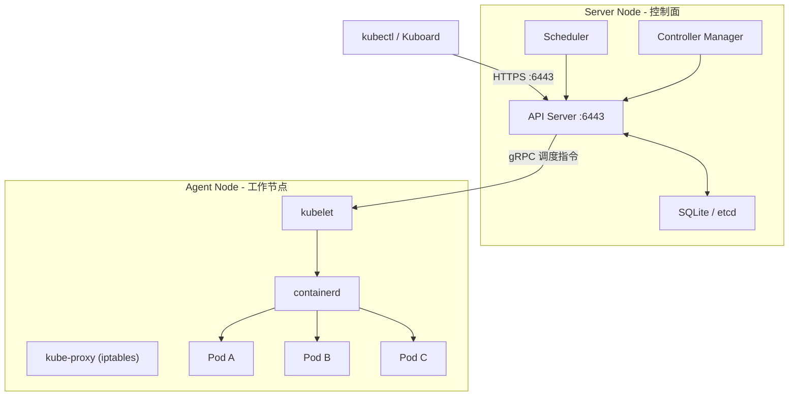

# K3s 集群安装脚本说明

本目录包含 `install.sh`，用于在裸 Linux 服务器上安装 K3s 集群。

---

## 快速使用

```bash
# 1. 在 Server 节点（控制面）执行
bash install.sh server

# 2. 记录脚本输出的 Agent 加入命令，在每台 Worker 节点执行
bash install.sh agent --server-ip 10.0.6.100 --token K10xxxxx

# 3. 卸载（Server 或 Agent 均可执行）
bash install.sh --uninstall
```

---

## 脚本执行流程详解

### 公共前置检查（所有模式共用）

#### `check_root` — 权限检查

```bash
if [[ $EUID -ne 0 ]]; then ...
```

**原理**：K3s 安装需要写入 `/etc/rancher/`、`/var/lib/rancher/` 等系统目录，以及注册 systemd 服务，必须以 root 身份执行。`$EUID` 是 bash 内建变量，表示有效用户 ID，root 为 0。

#### `check_os` — 操作系统识别

```bash
. /etc/os-release
```

**原理**：`/etc/os-release` 是 Linux 标准文件（systemd 规范），包含 `ID`、`VERSION_ID`、`PRETTY_NAME` 等字段。通过 `source` 加载后可直接使用这些变量。K3s 官方安装脚本会根据此信息选择合适的安装方式。

---

### Server 安装流程 (`bash install.sh server`)

Server 节点是集群的**控制面**，运行以下核心组件：

| 组件 | 作用 |
|------|------|
| API Server | 接收 kubectl 命令和 Agent 节点的 gRPC 连接 |
| 数据存储 | 存储集群所有状态数据（Pod、Service、ConfigMap 等） |
| Scheduler | 决定 Pod 调度到哪个 Worker 节点 |
| Controller Manager | 维护集群期望状态（如副本数） |

> **关于数据存储**：K3s 与原生 Kubernetes 的重要区别在于数据存储。K3s 默认使用**嵌入式 SQLite**（单 Server 模式），而非独立的 etcd 集群。只有在启用多 Server 高可用模式（`--cluster-init`）时，才会切换为**嵌入式 etcd**。etcd 被直接内嵌到 K3s 二进制中，无需单独部署。详见文末「K3s 数据存储机制」章节。

#### 步骤 1：配置私有镜像仓库

```bash
configure_registry
# → 写入 /etc/rancher/k3s/registries.yaml
```

**做了什么**：创建 `registries.yaml` 文件，内容如下：

```yaml
mirrors:
  "10.0.6.183:8088":
    endpoint:
      - "http://10.0.6.183:8088"
```

**原理**：K3s 使用 containerd 作为容器运行时（而非 Docker）。containerd 不读取 Docker 的 `/etc/docker/daemon.json`，而是读取自己的 `registries.yaml` 来解析镜像仓库地址。

这里配置的是 **mirror 模式**：当 Pod 需要拉取 `10.0.6.183:8088/c1/xxx` 镜像时，containerd 会直接访问 `http://10.0.6.183:8088`（HTTP 协议），而不是默认的 HTTPS。这是因为内部仓库通常没有 TLS 证书。

> **注意**：此文件必须在 K3s 启动**之前**写入，因为 containerd 只在启动时读取一次。

#### 步骤 2：下载并执行 K3s 官方安装脚本

```bash
export INSTALL_K3S_URL="${K3S_BINARY_URL}"

curl -sfL "${K3S_INSTALL_URL}" | INSTALL_K3S_EXEC="server \
    --disable traefik \
    --write-kubeconfig-mode 644 \
    --node-label role=dib-server \
    --tls-san $(hostname -I | awk '{print $1}') \
    --tls-san $(hostname)" \
sh -s -
```

**原理拆解**：

1. **`curl ... | sh -s -`**：从 Rancher 国内镜像站下载约 20KB 的引导脚本，通过管道传给 `sh` 执行。引导脚本会检测系统架构（amd64/arm64），下载对应版本的 K3s 二进制文件。

2. **`INSTALL_K3S_URL`**：指定 K3s 二进制文件的下载地址（而非官方 GitHub），使用国内镜像加速。固定版本 `v1.30.4+k3s1` 避免不同环境安装不同版本。

3. **`INSTALL_K3S_EXEC="server ..."`**：传递给 K3s 的启动参数：

   | 参数 | 作用 | 为什么需要 |
   |------|------|-----------|
   | `--disable traefik` | 禁用内置的 Traefik Ingress Controller | DIB 使用 NodePort 暴露服务，不需要 Ingress，避免端口冲突 |
   | `--write-kubeconfig-mode 644` | kubeconfig 文件权限设为 644（默认 600） | 允许非 root 用户（如 kuboard）读取 kubeconfig 连接集群 |
   | `--node-label role=dib-server` | 给节点打标签 `role=dib-server` | 后续可用 `nodeSelector` 将特定 Pod 调度到 Server 节点 |
   | `--tls-san <IP>` | 在 API Server 的 TLS 证书中添加 SAN（Subject Alternative Name） | 允许通过 IP 地址（而非仅 localhost）安全访问 API Server，Agent 节点和 Kuboard 都需要 |
   | `--tls-san $(hostname)` | 同时添加主机名为 SAN | 允许通过主机名访问 API Server |

4. **国内镜像源**：
   - 安装脚本：`https://rancher-mirror.rancher.cn/k3s/k3s-install.sh`
   - 二进制文件：`https://rancher-mirror.rancher.cn/k3s/v1.30.4+k3s1/k3s`

#### 步骤 3：配置 kubectl 访问

```bash
mkdir -p ~/.kube
cp /etc/rancher/k3s/k3s.yaml ~/.kube/config
chmod 600 ~/.kube/config
ln -sf /usr/local/bin/kubectl /usr/bin/kubectl
```

**原理**：

- K3s 安装后自动生成 kubeconfig 文件在 `/etc/rancher/k3s/k3s.yaml`，其中包含 API Server 地址和认证证书。
- 复制到 `~/.kube/config` 是 kubectl 的默认查找路径，这样直接执行 `kubectl` 命令无需每次指定 `--kubeconfig` 参数。
- `chmod 600` 是 kubectl 的安全要求——如果 kubeconfig 权限过于开放，kubectl 会拒绝使用。
- 创建软链接是因为 K3s 将 kubectl 安装在 `/usr/local/bin/`，但某些环境（如 Kuboard）可能只在 `/usr/bin/` 中查找。

#### 步骤 4：等待节点就绪

```bash
wait_for_ready
# → 循环执行 kubectl get nodes，最多等待 60 秒
```

**原理**：K3s 安装完成后，API Server 和 kubelet 需要几秒钟初始化。此函数通过轮询 `kubectl get nodes` 检查节点状态是否变为 `Ready`。每 2 秒检查一次，最多重试 30 次（60 秒）。

节点状态变化过程：`NotReady` → `Ready`。如果 60 秒内未就绪，说明安装可能有问题，脚本退出并提示查看日志。

#### 步骤 5：输出 Agent 加入信息

```bash
local server_ip=$(hostname -I | awk '{print $1}')
local token=$(cat /var/lib/rancher/k3s/server/node-token)
```

**原理**：

- **Server IP**：`hostname -I` 返回所有 IP 地址，`awk '{print $1}'` 取第一个（通常是主网卡的内网 IP）。
- **Node Token**：K3s 在 `/var/lib/rancher/k3s/server/node-token` 自动生成一个一次性令牌。Agent 节点加入集群时必须提供此 Token，Server 用它来验证 Agent 的身份。这是 K3s 的集群安全机制。

脚本将这两项信息拼接成完整的 Agent 安装命令输出到终端，用户只需复制粘贴到 Worker 节点执行。

---

### Agent 安装流程 (`bash install.sh agent --server-ip IP --token TOKEN`)

Agent 节点是集群的**工作节点**，只运行：

| 组件 | 作用 |
|------|------|
| kubelet | 管理本节点上的容器（拉取镜像、启停 Pod） |
| kube-proxy | 维护网络规则，实现 Service 的负载均衡 |

Agent 不运行 API Server 和 etcd，所有指令从 Server 获取。

#### 步骤 1：解析参数

```bash
--server-ip)  server_ip="$2" ;;
--token)      token="$2" ;;
```

**原理**：Agent 需要两个必要信息才能加入集群：
- **Server IP**：告诉 Agent 去哪里找控制面（API Server 地址）
- **Token**：用于身份验证，Server 通过比对 Token 决定是否接受此 Agent

缺少任一参数都会终止安装并输出用法提示。

#### 步骤 2：配置私有镜像仓库

与 Server 相同，调用 `configure_registry`。每个节点都有自己的 containerd，都需要独立配置。

#### 步骤 3：下载并执行 K3s 安装脚本

```bash
curl -sfL "${K3S_INSTALL_URL}" | K3S_URL="https://${server_ip}:6443" \
    K3S_TOKEN="${token}" \
    INSTALL_K3S_EXEC="agent \
    --node-label role=dib-worker" \
sh -s -
```

**与 Server 安装的区别**：

| 区别点 | Server | Agent |
|--------|--------|-------|
| `INSTALL_K3S_EXEC` | `server` | `agent` |
| `K3S_URL` | 不需要 | `https://<Server_IP>:6443`（API Server 地址） |
| `K3S_TOKEN` | 不需要 | Token（身份验证） |
| `--node-label` | `role=dib-server` | `role=dib-worker` |
| `--disable traefik` | 需要 | 不需要（Agent 不运行 Ingress） |
| `--tls-san` | 需要 | 不需要 |

**原理**：Agent 模式的 K3s 以「客户端」身份运行，通过 gRPC 长连接与 Server 的 API Server 通信。Agent 启动后向 Server 注册自己，Server 的 Scheduler 随后可以将 Pod 调度到此 Agent。

`--node-label role=dib-worker` 给工作节点打标签，后续可用 `nodeAffinity` 将特定服务调度到工作节点（例如将高内存的 extract 服务限定到专用 Worker）。

#### 步骤 4：验证加入成功

```bash
if systemctl is-active --quiet k3s-agent; then
```

**原理**：K3s Agent 安装后会注册为 systemd 服务 `k3s-agent`（Server 则是 `k3s`）。通过检查 systemd 服务状态确认 Agent 进程正常运行。

> 注意：Agent 节点没有 kubectl，无法直接查看集群状态。需要在 Server 节点执行 `kubectl get nodes` 确认 Agent 已加入。

---

### 卸载流程 (`bash install.sh --uninstall`)

```bash
# 判断是 Server 还是 Agent，调用对应的卸载脚本
if [[ -f /usr/local/bin/k3s-uninstall.sh ]]; then
    /usr/local/bin/k3s-uninstall.sh        # Server 卸载
elif [[ -f /usr/local/bin/k3s-agent-uninstall.sh ]]; then
    /usr/local/bin/k3s-agent-uninstall.sh  # Agent 卸载
fi

# 清理残留数据
rm -rf /etc/rancher/k3s      # 配置文件（registries.yaml、kubeconfig）
rm -rf /var/lib/rancher/k3s  # 运行时数据（etcd、容器镜像、node-token）
rm -f ~/.kube/config          # kubectl 配置
```

**原理**：K3s 安装时会自动生成卸载脚本（`k3s-uninstall.sh` / `k3s-agent-uninstall.sh`），该脚本负责：
1. 停止 systemd 服务
2. 删除 K3s 二进制文件
3. 清理 iptables 规则
4. 删除网络接口（flannel/cni 创建的）

脚本执行后还需要手动清理数据目录，否则重新安装时可能读到旧数据导致异常。

---

## K3s 架构原理图



**通信流程**：
1. 用户执行 `kubectl apply -f xxx.yaml` → kubectl 通过 HTTPS 调用 API Server
2. API Server 将期望状态写入数据存储（SQLite 或 etcd）
3. Scheduler 发现新 Pod 未分配节点 → 选择合适节点
4. Agent 的 kubelet 收到分配指令 → 调用 containerd 拉取镜像并启动容器
5. kubelet 持续通过 gRPC 向 API Server 上报 Pod 状态

---

## 关键目录说明

| 目录 | 内容 | 说明 |
|------|------|------|
| `/etc/rancher/k3s/registries.yaml` | 镜像仓库配置 | 告诉 containerd 去哪里拉取镜像 |
| `/etc/rancher/k3s/k3s.yaml` | kubeconfig | 连接 API Server 的凭据（仅 Server 有） |
| `/var/lib/rancher/k3s/server/` | 控制面数据 | SQLite/etcd 数据库、TLS 证书、node-token |
| `/var/lib/rancher/k3s/agent/` | 工作节点数据 | 容器镜像层、kubelet 状态 |
| `/usr/local/bin/k3s` | K3s 二进制 | 多用途二进制文件（server/agent/kubectl） |
| `~/.kube/config` | kubectl 默认配置 | 从 k3s.yaml 复制而来 |

---

## 故障排查

| 现象 | 排查命令 | 可能原因 |
|------|---------|---------|
| Server 安装后节点不是 Ready | `journalctl -u k3s --no-pager` | 端口被占用、内存不足、防火墙阻断 |
| Agent 无法加入集群 | `journalctl -u k3s-agent --no-pager` | Token 错误、网络不通、6443 端口未开放 |
| 镜像拉取失败 | `cat /etc/rancher/k3s/registries.yaml` | registries.yaml 配置错误或未在安装前写入 |
| kubectl 报权限错误 | `ls -la ~/.kube/config` | kubeconfig 权限不是 600 |
| 重新安装后异常 | `rm -rf /var/lib/rancher/k3s` | 旧数据库残留，需彻底清理后重装 |

---

## K3s 数据存储机制

K3s 与原生 Kubernetes 在数据存储上有显著区别。原生 K8s 必须使用独立的 etcd 集群，而 K3s 提供了更灵活的选择：

### 两种存储模式

| 特性 | SQLite（默认） | 嵌入式 etcd |
|------|---------------|-------------|
| **触发条件** | 单 Server，不加额外参数 | Server 安装时加 `--cluster-init` |
| **数据位置** | `/var/lib/rancher/k3s/server/db/state.db` | `/var/lib/rancher/k3s/server/db/etcd/` |
| **Server 数量** | 仅 1 个 | 支持 1 个或多个（推荐 3 个实现高可用） |
| **性能** | 轻量，资源占用极少 | 较重，etcd 自身需要约 512MB 内存 |
| **高可用** | 不支持（Server 宕机即停服） | 支持（多数派机制，允许部分节点故障） |
| **备份** | 直接复制 `state.db` 文件 | 需使用 `k3s etcd-snapshot` 命令 |
| **适用场景** | 开发/测试、单节点生产 | 多节点生产环境 |

### 当前方案的选择

本部署方案使用**单 Server + SQLite** 模式，原因：
- DIB 微服务体系的注册中心（Nacos）已在 K3s 内部署，K3s Server 本身不需要高可用
- SQLite 资源占用更少，将内存留给业务服务（尤其是 extract 等内存密集型服务）
- 简化运维，无需管理 etcd 集群的健康状态

### 如何升级为高可用模式

如果后续需要多 Server 高可用，只需在**第一台 Server** 安装命令中加 `--cluster-init`：

```bash
curl -sfL "${K3S_INSTALL_URL}" | INSTALL_K3S_EXEC="server \
    --cluster-init \                    # ← 新增：启用嵌入式 etcd
    --disable traefik \
    --write-kubeconfig-mode 644 \
    ..." \
sh -s -
```

然后在其他 Server 节点加入时指定 `--server` 和 `--token`：

```bash
curl -sfL "${K3S_INSTALL_URL}" | K3S_TOKEN="${token}" \
    INSTALL_K3S_EXEC="server \
    --server https://<第一台Server_IP>:6443 \
    ..." \
sh -s -
```

> 注意：从 SQLite 迁移到 etcd 需要**全新安装**，无法原地升级。已有的 ConfigMap、Deployment 等资源需要重新 apply。
