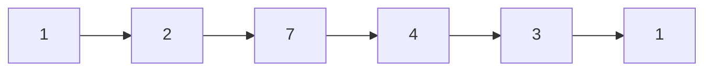

# p031 Next Permutation 解析笔记

- Top100 序号：16
- 题目英文名：Next Permutation
- 题目中文名：下一个排列
- 题目链接：https://leetcode.cn/problems/next-permutation/
- 题型：数组 / 双指针 / 贪心
- 难度：Medium
- 推荐优先级：🔴 高

---

## 1. 题目一句话总结

给定一个整数数组，要求你原地把它改造成“字典序刚好比当前更大一点”的那个排列；如果已经没有更大的排列了，就改成最小排列。

这题的核心不是暴力枚举，而是理解“下一个排列”在字典序上的结构规律。

---

## 2. 题目理解

### 2.1 题目要求

数组表示一个排列，我们要在 **原地** 修改它，使它变成：

- 比当前排列大
- 并且是所有更大排列里最小的那个

如果当前已经是最大排列，例如 `[3,2,1]`，那就返回最小排列 `[1,2,3]`。

### 2.2 关键约束

- 必须原地修改
- 不能额外复制所有排列
- 要求时间复杂度尽量低

---

## 3. 朴素思路

### 3.1 最直接的做法

先生成所有排列，排序后找到当前排列的下一个。

### 3.2 为什么不够好

- 全排列复杂度是 `O(n!)`
- 明显不满足面试和工程要求

### 3.3 关键观察

如果想让排列“刚好变大一点”，应该尽量：

1. 让高位尽量少变
2. 只在必须变的时候，改动最靠右的可提升位置
3. 低位改完以后要变成最小顺序

这就是这题的贪心本质。

---

## 4. 核心算法思路

### 4.1 算法名称

- 贪心
- 双指针
- 逆序区间处理

### 4.2 为什么想到这个算法

我们要求的是“下一个”排列，而不是“任意一个更大排列”。

这意味着：

- 应该从右往左找变化点
- 因为越靠右的位置变化，对整体字典序影响越小

### 4.3 关键步骤

1. 从右往左，找到第一个满足 `nums[i] < nums[i + 1]` 的位置 `i`
2. 如果找不到，说明整个数组是降序，直接整体反转
3. 如果找到了，再从右往左找第一个比 `nums[i]` 大的数 `nums[j]`
4. 交换 `nums[i]` 和 `nums[j]`
5. 将 `i + 1` 到末尾这一段反转，使其变成最小升序

---

## 5. 图解

### 5.1 示例

```text
nums = [1, 2, 7, 4, 3, 1]
```

从右往左看：

```text
7 4 3 1   这一段是下降的
```

继续往左找，发现：

```text
2 < 7
```

所以 `2` 是“最靠右的还能变大”的位置。

### 5.2 为什么交换后还要反转后缀

交换前：

```text
[1, 2, 7, 4, 3, 1]
    ^
```

从右边找第一个比 `2` 大的最靠右元素，是 `3`：

```text
[1, 3, 7, 4, 2, 1]
```

这时后缀还是降序：

```text
7, 4, 2, 1
```

为了让整体“只大一点点”，后缀必须变成最小：

```text
[1, 3, 1, 2, 4, 7]
```

### 5.3 Mermaid 图解



图解要点：

- 从右往左找“第一个上升点”
- 交换后，把右侧后缀变成最小

---

## 6. Python 题解

### 6.1 标准版本

```python
class Solution:
    def nextPermutation(self, nums: list[int]) -> None:
        n = len(nums)
        i = n - 2

        while i >= 0 and nums[i] >= nums[i + 1]:
            i -= 1

        if i >= 0:
            j = n - 1
            while nums[j] <= nums[i]:
                j -= 1
            nums[i], nums[j] = nums[j], nums[i]

        left, right = i + 1, n - 1
        while left < right:
            nums[left], nums[right] = nums[right], nums[left]
            left += 1
            right -= 1
```

### 6.2 带详细注释版本

```python
class Solution:
    def nextPermutation(self, nums: list[int]) -> None:
        n = len(nums)

        # 第一步：从右往左找第一个“下降转上升”的位置
        # 也就是找到第一个 nums[i] < nums[i + 1]
        i = n - 2
        while i >= 0 and nums[i] >= nums[i + 1]:
            i -= 1

        # 如果找到了，说明还有更大的排列
        if i >= 0:
            # 第二步：从右往左找第一个比 nums[i] 大的数
            # 因为右侧本身是降序，所以从右往左找到的第一个，
            # 就是“刚刚好大一点”的那个数
            j = n - 1
            while nums[j] <= nums[i]:
                j -= 1

            # 第三步：交换这两个位置
            nums[i], nums[j] = nums[j], nums[i]

        # 第四步：把 i 右边的后缀反转
        # 因为原后缀是降序，反转后就变成升序，也就是最小排列
        left, right = i + 1, n - 1
        while left < right:
            nums[left], nums[right] = nums[right], nums[left]
            left += 1
            right -= 1
```

---

## 7. 代码逐段讲解

### 7.1 找拐点

`i` 表示最靠右的、还能让排列变大的位置。

如果整个数组一直是降序，例如：

```text
[5,4,3,2,1]
```

那说明已经是最大排列，没有更大的了。

### 7.2 找替换值

右侧后缀本来是降序，所以从右往左找到第一个比 `nums[i]` 大的数，就是最合适的交换对象。

### 7.3 反转后缀

交换后，右侧仍然是降序或接近降序。

为了得到“紧邻的下一个排列”，必须让后缀尽可能小，所以直接反转成升序。

---

## 8. 复杂度分析

- 时间复杂度：`O(n)`
- 空间复杂度：`O(1)`

原因：

- 最多从右往左扫几次
- 再做一次区间反转
- 全部都是原地操作

---

## 9. 易错点

1. 找拐点时，循环条件容易写反。
2. 交换之后忘了反转后缀。
3. 误以为后缀要排序，其实反转就够了，因为它原本就是降序。
4. 没处理“整个数组已经是最大排列”的情况。

---

## 10. 面试时怎么讲

可以这样说：

> 这题要求的是字典序下一个排列，所以关键是尽量少改高位。  
> 我会从右往左找第一个还能变大的位置 `i`。  
> 然后再从右边找一个刚好比它大的数交换。  
> 最后把右侧后缀变成最小，也就是反转成升序。  
> 这样就能保证得到“刚刚比当前更大”的那个排列。  

---

## 11. 实际应用场景

### 11.1 对应什么现实问题

这题本质上是在做：

- “下一个候选方案”
- “下一个字典序状态”
- “当前方案的紧邻后继”

### 11.2 实际项目里的类似场景

- 排班系统里生成下一个候选顺序
- 测试用例系统里枚举下一个排列状态
- 搜索或推荐系统里生成下一个组合候选
- 求解器里从当前组合推进到下一个可比较状态

### 11.3 它解决了什么问题

在不枚举所有结果的前提下，快速得到当前排列的下一个合法状态。

---

## 12. 小 Demo 演示

### 12.1 Demo 目标

模拟“任务执行顺序”的下一个候选方案。

### 12.2 Demo 代码

```python
def next_permutation(nums: list[int]) -> list[int]:
    nums = nums[:]
    n = len(nums)
    i = n - 2

    while i >= 0 and nums[i] >= nums[i + 1]:
        i -= 1

    if i >= 0:
        j = n - 1
        while nums[j] <= nums[i]:
            j -= 1
        nums[i], nums[j] = nums[j], nums[i]

    left, right = i + 1, n - 1
    while left < right:
        nums[left], nums[right] = nums[right], nums[left]
        left += 1
        right -= 1

    return nums


task_order = [1, 2, 7, 4, 3, 1]
print("当前顺序:", task_order)
print("下一个候选顺序:", next_permutation(task_order))
```

### 12.3 Demo 输出说明

- `当前顺序` 表示当前的任务执行排列
- `下一个候选顺序` 表示字典序刚好更大的下一种安排

---

## 13. 扩展题

- `p046` `Permutations`
- `p047` `Permutations II`
- `p060` `Permutation Sequence`

这些题可以一起学习，形成“排列专题”。

---

## 14. 一句话复盘

这题最重要的不是记步骤，而是理解：

> 想得到“下一个排列”，就要在最靠右的可提升位置做最小幅度的提升。  
