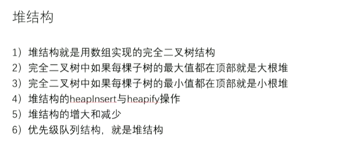

# 构建堆 & 大/小根堆，就是完全二叉树，从左往右变满

[返回章节](README.md) | [返回分类](../README.md) | [返回总目录](../../README.md)

- 状态：已标记完成
- 所属分类：基础巩固
- 所属章节：04 堆、比较器
- 原始条目：☒ 构建堆 & 大/小根堆，就是完全二叉树，从左往右变满

## 笔记
（建堆的过程是从最后一个非叶子节点开始，向上逐一调用 heapify 函数。）

