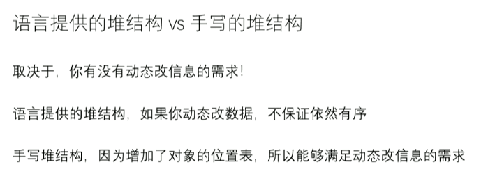
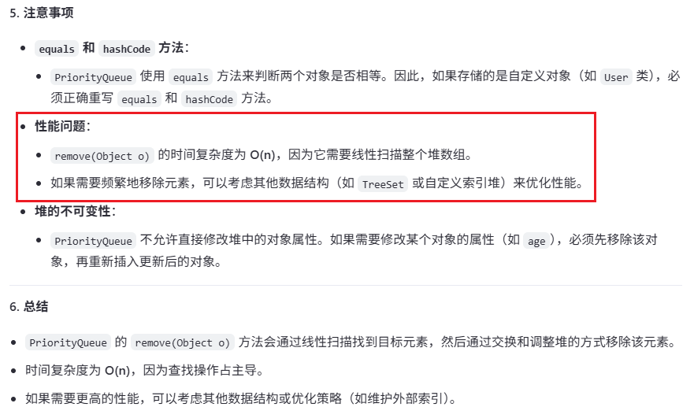

# 自定义堆，动态修改的堆排序，关键方法 resign

[返回章节](README.md) | [返回分类](../README.md) | [返回总目录](../../README.md)

- 状态：已标记完成
- 所属分类：基础巩固
- 所属章节：04 堆、比较器
- 原始条目：☒ 自定义堆，动态修改的堆排序，关键方法 resign

## 笔记
（备注：Java的优先级队列就是使用小根堆实现的，每次取堆顶元素）

