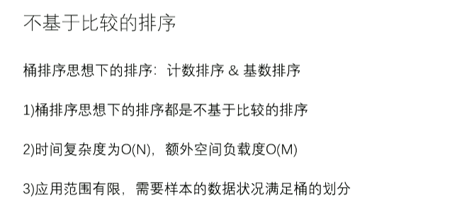
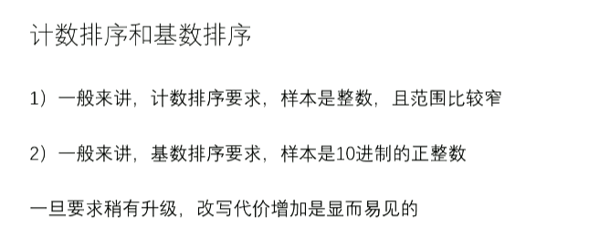
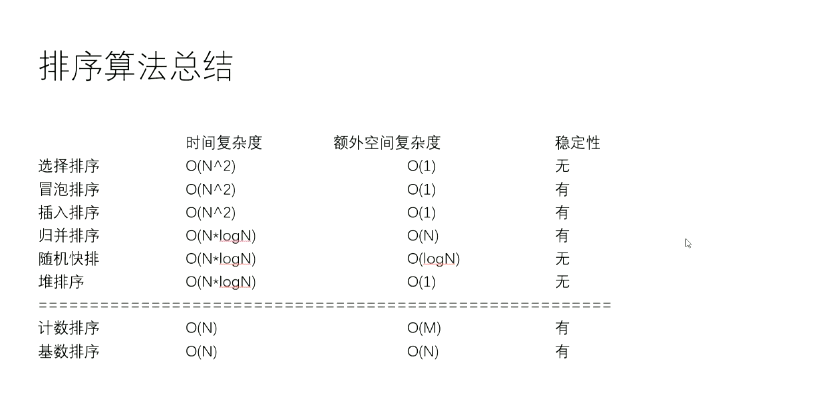
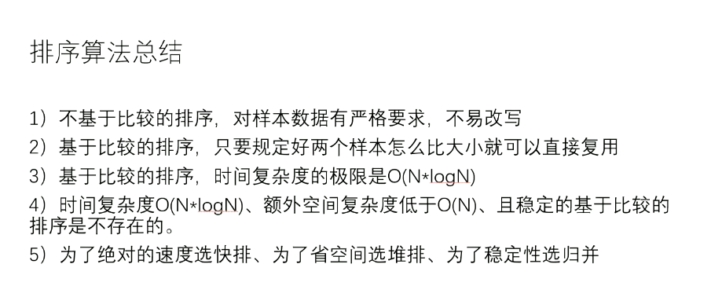
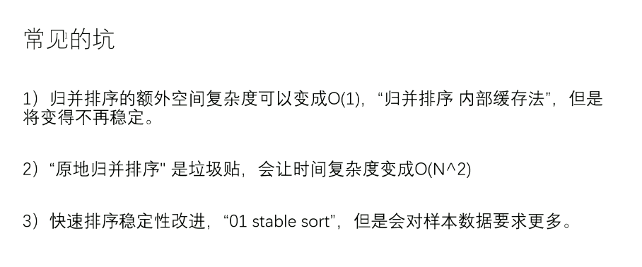

# 05 前缀树、桶排序、排序总结

[返回分类](../README.md) | [返回总目录](../../README.md)

- 所属分类：基础巩固
- 条目数量：4

## 条目目录
- [前缀树（trie tree）](01-前缀树-trie-tree.md)
- [不基于比较的排序【桶排序】：计数排序、基数排序](02-不基于比较的排序-桶排序--计数排序-基数排序.md)
- [计数排序，对原数据区间有强要求](03-计数排序-对原数据区间有强要求.md)
- [基数排序，前提：非负，且满足10进制，O(N*logNmax)](04-基数排序-前提-非负-且满足10进制-O-N-logNmax.md)

## 章节笔记
### 不基于比较的排序

### 排序算法的稳定性

### 排序算法总结

### 常见的坑

1、如果不稳定，不如用堆排序

2、如果堆样本数据有要求，不如桶排序

只有 0/1 两种情况的问题，就是标准的 partition

### 工程上对排序的改进

1、稳定性的考虑

2、充分利用各种排序的优势
