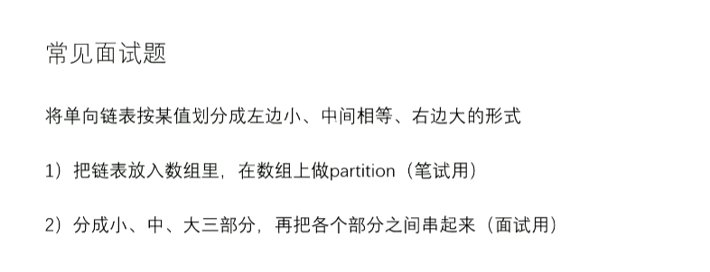

# 单向链表分区，实现空间复杂度为O(1)的链表排序

[返回章节](README.md) | [返回分类](../README.md) | [返回总目录](../../README.md)

- 状态：已标记完成
- 所属分类：基础巩固
- 所属章节：06 链表相关面试题
- 原始条目：☒ 单向链表分区，实现空间复杂度为O(1)的链表排序

## 笔记
版本1【笔试】，借助数组，先快排分区，额外空间N

版本2【面试】，分多个链表，然后串起来

