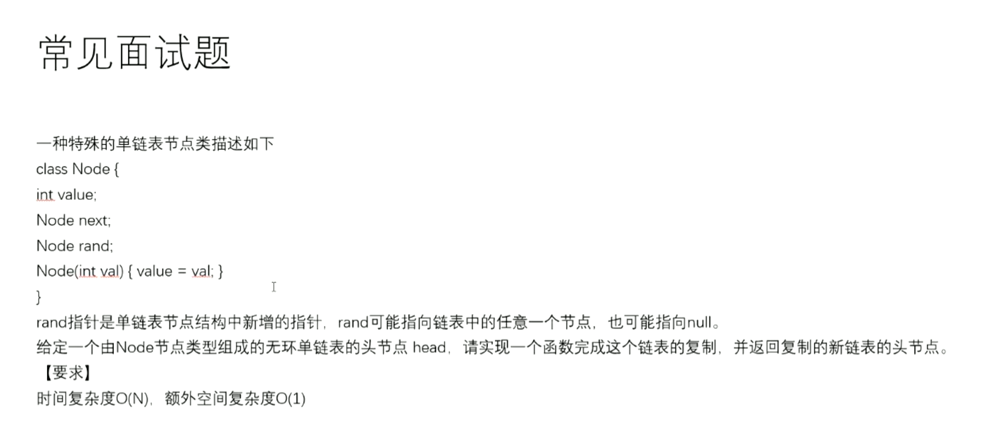

# 克隆Random链表

[返回章节](README.md) | [返回分类](../README.md) | [返回总目录](../../README.md)

- 状态：已标记完成
- 所属分类：基础巩固
- 所属章节：06 链表相关面试题
- 原始条目：☒ 克隆Random链表

## 笔记
版本1，利用哈希表

版本2，拷贝节点直接插入到原链表，等效形成了一个哈希表映射，再分离2个链表

