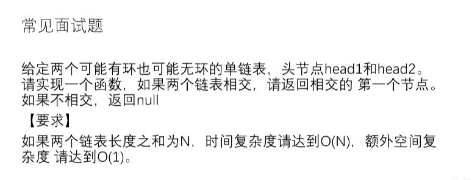

# 两个单向链表第一个相交节点

[返回章节](README.md) | [返回分类](../README.md) | [返回总目录](../../README.md)

- 状态：已标记完成
- 所属分类：基础巩固
- 所属章节：06 链表相关面试题
- 原始条目：☒ 两个单向链表第一个相交节点

## 笔记
情况1，两个无环链表相交

情况2，两个有环链表相交

（注意：不存在，一个有环、一个无环的链表可以相交）

