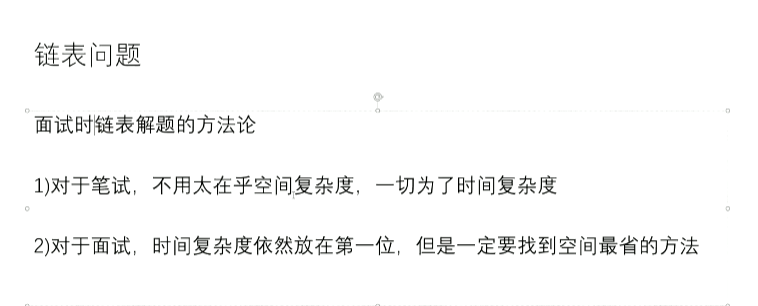

# 06 链表相关面试题

[返回分类](../README.md) | [返回总目录](../../README.md)

- 所属分类：基础巩固
- 条目数量：10

## 条目目录
- [快慢指针](01-快慢指针.md)
- [回文链表，并用快慢指针改进](02-回文链表-并用快慢指针改进.md)
- [版本1【笔试】，利用栈，额外空间N](03-版本1-笔试--利用栈-额外空间N.md)
- [版本2【面试】，利用栈，额外空间N/2](04-版本2-面试--利用栈-额外空间N-2.md)
- [版本3【面试】，链表右半部分反转](05-版本3-面试--链表右半部分反转.md)
- [单向链表分区，实现空间复杂度为O(1)的链表排序](06-单向链表分区-实现空间复杂度为O-1-的链表排序.md)
- [克隆Random链表](07-克隆Random链表.md)
- [单向链表有环](08-单向链表有环.md)
- [两个单向链表第一个相交节点](09-两个单向链表第一个相交节点.md)
- [不使用头节点，删除链表任意一个节点](10-不使用头节点-删除链表任意一个节点.md)

## 章节笔记

