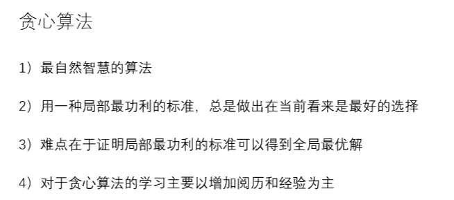
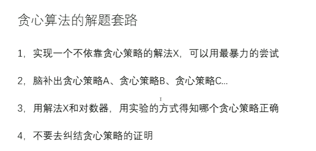
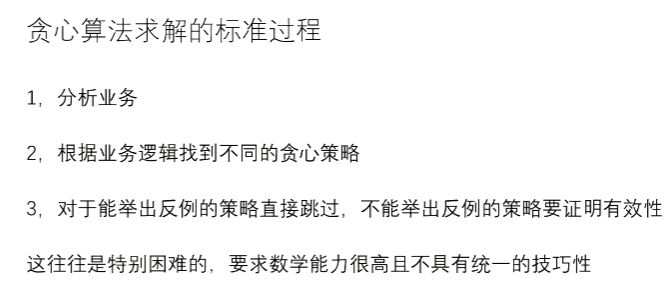

# 10 并查集结构和图相关的算法

[返回分类](../README.md) | [返回总目录](../../README.md)

- 所属分类：基础巩固
- 条目数量：3

## 条目目录
- [会议安排问题](01-会议安排问题.md)
- [转为小根堆，就是哈夫曼树](02-转为小根堆-就是哈夫曼树.md)
- [并查集](03-并查集.md)

## 章节笔记
（实际内容为：贪心算法 & 并查集）

