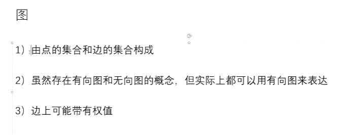
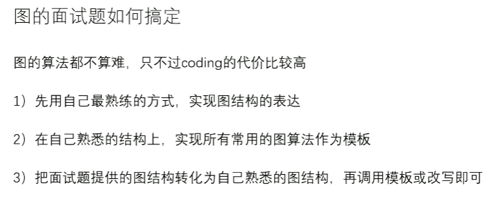
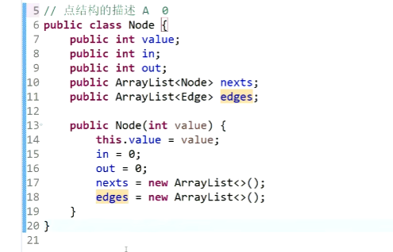
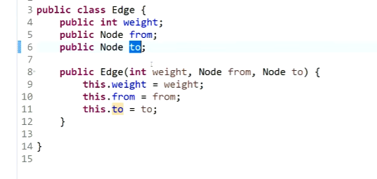
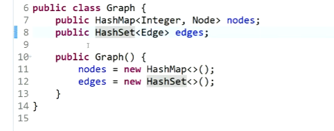

# 图的定义

[返回章节](README.md) | [返回分类](../README.md) | [返回总目录](../../README.md)

- 状态：待补充
- 所属分类：基础巩固
- 所属章节：11 暴力递归
- 原始条目：☐ 图的定义

## 笔记

图结构的表达方式：

邻接表法

邻接矩阵法

除此之外，还有其他众多的方式

（tips：将各种不同图的表示形式转为自己熟悉的结构，再coding）

