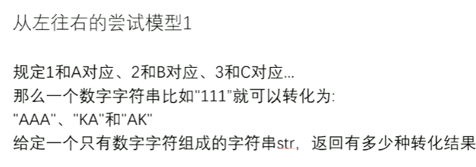

# 从左往右的尝试模型1，Facebook面试原题（此题可以理解为分支限界）

[返回章节](README.md) | [返回分类](../README.md) | [返回总目录](../../README.md)

- 状态：待补充
- 所属分类：基础巩固
- 所属章节：13 暴力递归到动态规划1
- 原始条目：☐ 从左往右的尝试模型1，Facebook面试原题（此题可以理解为分支限界）

## 笔记

