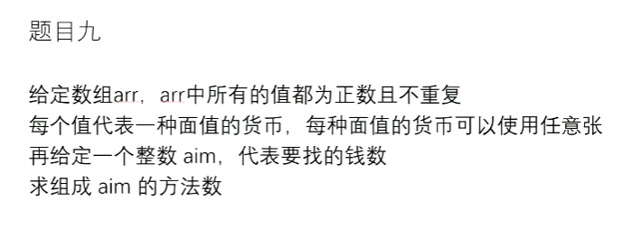

# 币值问题，可使用经典动态规划优化

[返回章节](README.md) | [返回分类](../README.md) | [返回总目录](../../README.md)

- 状态：待补充
- 所属分类：基础巩固
- 所属章节：15 暴力递归到动态规划3
- 原始条目：☐ 币值问题，可使用经典动态规划优化

## 笔记
有一个正数数组，比如：[1，2，5，10，20，50，100]，都是正数货币面值，且无重复值。aim=1000，能用多少种方式组成这个额度。

