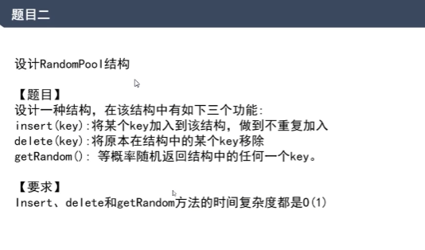

# 题目2，根据哈希表设计数据结构

[返回章节](README.md) | [返回分类](../README.md) | [返回总目录](../../README.md)

- 状态：待补充
- 所属分类：基础提升
- 所属章节：01 哈希函数与哈希表
- 原始条目：☐ 题目2，根据哈希表设计数据结构

## 笔记

注意，删除操作，保持数组连续，最后一条覆盖被删除的数据，然后删除最后一条。
