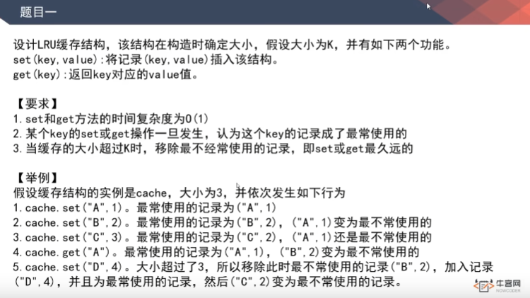

# 题目1，LRU

[返回章节](README.md) | [返回分类](../README.md) | [返回总目录](../README.md)

- 状态：待补充
- 所属分类：中级提升
- 所属章节：01 【todo-58min】中级提升1
- 原始条目：☐ 题目1，LRU

## 笔记
（LRU是中等难度，而LFU是超高难度的题）

解法：借助 哈希表 & 双向链表。

如果使用系统的LinkedArrayList、LinkedHashSet，时间复杂度不满足要求...
