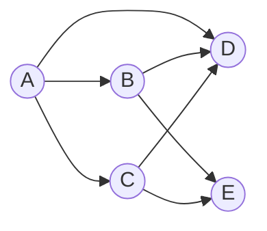

# 图的广度优先遍历-BFS

[返回章节](README.md) | [返回分类](../README.md) | [返回总目录](../../README.md)

- 状态：已标记完成
- 所属分类：基础巩固
- 所属章节：11 图相关的算法
- 原始条目：☒ 图的广度优先遍历

## 一句话结论
图的 `BFS` 本质上就是：

```text
从起点出发
按“离起点越来越远”的层次，一圈一圈向外扩
```

实现工具是：

- 一个队列
- 一个 `visited` 集合

队列负责“按层推进”，`visited` 负责“防止图里有环时死循环”。

## 先记结论
第一次看图的 `BFS`，先记住这 4 句话：

```text
1. BFS 用队列
2. 谁先入队，谁先出队
3. 每次弹出一个点，就把它没访问过的邻居加入队列
4. 图里一定要有 visited
```

如果只记一句话，可以记成：

```text
BFS = 一层一层向外扩
```

## 题意说明
这篇不是某一道题，而是在讲图上的广度优先遍历模板。  
它主要解决的是：

```text
从某个起点开始
如何把图按层次顺序访问出去
```

所以这篇的重点不是某个业务题，而是：

- `BFS` 的访问顺序
- 队列为什么能保证这种顺序
- 图里为什么必须防环

## 先把图长什么样看清楚
先看一个更像“图”的例子：



如果写成边的集合，就是：

```text
A -> B
A -> C
A -> D
B -> D
B -> E
C -> D
C -> E
```

如果从 `A` 开始做 `BFS`，它的访问顺序会是：

```text
A, B, C, D, E
```

这里要注意：

```text
BFS 保证的是“按层扩展”
不保证同一层内部只有一种唯一顺序
```

所以：

- 在这篇笔记当前的邻接点处理顺序里，`A` 的邻居按 `B、C、D` 入队
- 那遍历结果就是 `A, B, C, D, E`

但如果邻接点存放顺序不同，例如 `A` 先看到 `B、D、C`，那结果也可能是：

```text
A, B, D, C, E
```

这并不违背 `BFS`。

真正不变的是：

```text
先把离 A 最近的一层看完
再去看更远的一层
```

## 用分层图方式看 BFS
如果按“离起点的最短边数”来分层，这张图可以整理成：

```text
第 0 层：A

第 1 层：B，C，D

第 2 层：E
```

这就是 `BFS` 最重要的视觉特征：

```text
不是一条线走到底
而是一层一层往外推
```

## 队列是怎么推动这个过程的
还是上面这张图，从 `A` 开始。

### 初始

```text
队列: [A]
visited: {A}
```

### 第 1 轮
弹出 `A`，把它的邻居 `B、C、D` 入队：

```text
弹出: A
加入: B, C, D

队列: [B, C, D]
visited: {A, B, C, D}
```

### 第 2 轮
弹出 `B`，检查它的邻居 `D、E`：

```text
弹出: B
加入: E

说明: D 已访问过，不重复入队

队列: [C, D, E]
visited: {A, B, C, D, E}
```

### 第 3 轮
弹出 `C`，检查它的邻居 `D、E`：

```text
弹出: C
加入: 无

说明: D、E 都已经访问过

队列: [D, E]
visited: {A, B, C, D, E}
```

### 第 4 轮

```text
弹出: D
加入: 无

队列: [E]
```

### 第 5 轮

```text
弹出: E
加入: 无

队列: []
```

队列为空，遍历结束。

所以整个访问顺序就是：

```text
A -> B -> C -> D -> E
```

## 如果图里有环，会发生什么
图和树最大的区别之一是：

```text
图里可能绕回来
```

例如：

```text
A -> B
B -> C
C -> A
```

这是一个环。

如果没有 `visited`，那遍历时可能会变成：

```text
A -> B -> C -> A -> B -> C -> ...
```

也就是无限循环。

所以图的 `BFS` 里，`visited` 不是可选项，而是必备项。

## 为什么要在“入队时”标记
推荐做法是：

```text
一个点刚准备入队
立刻就加入 visited
```

而不是等出队时再标记。

原因是如果你等出队再标记，同一个点可能会被多个前驱重复加入队列。

例如：

```text
A -> B
A -> C
B -> D
C -> D
```

如果从 `A` 开始：

- `B` 会尝试把 `D` 入队
- `C` 也会尝试把 `D` 入队

如果没有在第一次入队时就标记，`D` 可能进队两次。

所以更稳的规则是：

```text
入队就标记
```

## BFS 和二叉树按层遍历的关系
如果你之前已经学过二叉树的按层遍历，那理解图上的 `BFS` 会轻松很多。

因为它们的核心骨架几乎一样：

```text
都是用队列
都是一层一层往外扩
```

### 二叉树按层遍历
在二叉树里，一个节点弹出后，通常做的是：

- 把左孩子入队
- 把右孩子入队

所以二叉树按层遍历的感觉是：

```text
从根开始
一层层看完所有节点
```

### 图上的 BFS
在图里，一个节点弹出后，做的是：

- 把所有没访问过的邻接点入队

所以图上的 `BFS` 可以理解成：

```text
把“二叉树的左右孩子”
换成“图里的所有邻居”
```

### 它们最大的区别
真正的区别不在队列，而在于图可能有环。

二叉树里通常不会有这种情况：

```text
A 的孩子再绕回 A
```

但图里完全可能发生：

```text
A -> B -> C -> A
```

所以图上的 `BFS` 比二叉树按层遍历多出来一个关键点：

```text
必须用 visited 防止重复访问
```

你可以把两者关系记成：

```text
图的 BFS
= 二叉树按层遍历
+ visited 防环
```

## 典型用途
在无权图里，`BFS` 经常顺手就能解决：

- 最少步数
- 最短边数路径
- 层级扩散
- 从起点分层搜索

这里的“顺手”其实不是说它万能，而是说：

```text
很多题目表面问法不同
但本质都在问“离起点第几层能到”
```

而 `BFS` 的推进方式，恰好就是一层一层往外扩。

所以只要题目带有下面这些味道，就可以先想一眼 `BFS`：

- 从起点到终点最少走几步
- 最快多久能传播到所有点
- 第一次到达某个位置是什么时候
- 距离起点第 `k` 圈有哪些点
- 在无权图里找最短路

把它们翻译一下，本质其实都在问：

```text
某个点最早会在第几层被访问到
```

### 为什么无权图里它这么好用
关键就在于：

```text
BFS 第一次到达某个点时
走的一定是“边数最少”的那条路
```

原因并不复杂：

- `BFS` 先处理距离起点 `1` 条边的所有点
- 再处理距离起点 `2` 条边的所有点
- 再处理距离起点 `3` 条边的所有点

所以当某个点第一次被访问到时，它一定是被“最浅的那一层”访问到的。

这就意味着，在无权图里：

```text
最少步数
= 最少经过的边数
= BFS 第一次到达该点时的层数
```

这也是为什么一看到“无权图最短路”，很多时候第一反应就是 `BFS`。

你可以把这件事理解成：

```text
BFS 不是在“乱搜”
而是在按距离从近到远，做有顺序的搜索
```

近的点一定先被看见，远的点一定后被看见。
因此，只要题目关心的是“最早到达”“最少步数”“第几层碰到”，`BFS` 往往都很合适。

### 1. 最少步数
最常见的问法是：

```text
从起点走到终点，最少要走几步？
```

如果图是无权的，那么“走一步”通常就等于“过一条边”。

例如：

```text
A -> B
A -> C
B -> D
C -> E
D -> F
E -> F
```

从 `A` 到 `F`：

- `A -> B -> D -> F`
- `A -> C -> E -> F`

都只走了 `3` 条边。

这时 `BFS` 一层一层扩出去，第一次到 `F` 的那一层，就是答案 `3`。

### 2. 最短边数路径
有时题目问的不是“多少步”，而是：

```text
从起点到终点，经过边数最少的路径是什么？
```

这和“最少步数”本质一样，只是多了一步：

- `BFS` 求出最小层数
- 再额外记录每个点是从谁走过来的

最后从终点倒推回起点，就能还原整条路径。

也就是说：

```text
BFS 不仅能求最短边数
还可以顺手还原一条最短路径
```

### 3. 层级扩散
这类题非常像“波纹传播”：

- 消息传播
- 病毒扩散
- 火焰蔓延
- 社交网络里的第几层朋友

它们的共同点是：

```text
某个源头先影响离自己最近的一圈
再影响更远的一圈
```

而这正好就是 `BFS` 的层次推进过程。

例如：

```text
第 0 分钟：起点感染
第 1 分钟：所有相邻点感染
第 2 分钟：相邻点的相邻点感染
```

这种题几乎就是在把 `BFS` 的层数翻译成“时间”。

### 4. 从起点分层搜索
有些题并不要求你找到终点，而是要求你：

- 找出距离起点第 `k` 层的所有点
- 统计多少个点在第 `k` 层
- 判断某个点属于第几层

这种题也天然适合 `BFS`，因为：

```text
BFS 本来就是按层访问
```

例如社交网络里常见的问法：

```text
谁是我的第 1 层好友？
谁是我的第 2 层好友？
```

这其实就是标准的分层搜索。

### 什么时候不能直接拿 BFS 当最短路
这里也顺手提醒一下：

```text
BFS 适合无权图
或者“每条边代价都一样”的图
```

如果边带不同权值，比如：

```text
A -> B (1)
A -> C (100)
```

那这时“边数最少”就不等于“总代价最小”了。  
这类题就不能直接用普通 `BFS`，而要考虑 `Dijkstra` 等最短路算法。

所以这部分最该记住的是：

```text
无权图最短路，优先想 BFS
带权图最短路，再考虑 Dijkstra
```

## 代码 / 伪代码
课程里最常用的模板如下：

```java
void bfs(Node start) {
    Queue<Node> queue = new LinkedList<>();
    Set<Node> visited = new HashSet<>();

    queue.add(start);
    visited.add(start);

    while (!queue.isEmpty()) {
        Node cur = queue.poll();

        for (Node next : cur.nexts) {
            if (!visited.contains(next)) {
                visited.add(next); // 入队时就标记
                queue.add(next);
            }
        }
    }
}
```

如果把这段代码压成一句流程话术，就是：

```text
弹出一个点
把它所有没访问过的邻居按顺序塞进队列
然后继续弹下一个
```

## 易错点
- 图的 `BFS` 一定要有 `visited`，否则有环就会反复入队。
- 标记访问最好在“入队时”做，而不是“出队时”做。
- `BFS` 顺序会受邻接点存放顺序影响，但“按层扩展”这个性质不会变。
- 如果图不连通，从一个起点出发的 `BFS` 只能遍历到它所在连通块。

## 记忆点
- `BFS` 用队列。
- `BFS` 不是走深，而是按层扩。
- 图里必须防环。
- 入队就标记。
