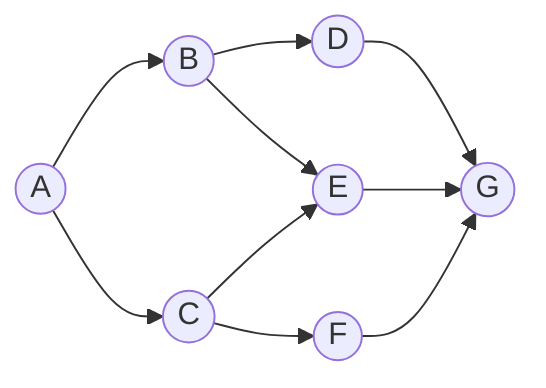

# 图的深度优先遍历

[返回章节](README.md) | [返回分类](../README.md) | [返回总目录](../../README.md)

- 状态：已标记完成
- 所属分类：基础巩固
- 所属章节：11 图相关的算法
- 原始条目：☒ 图的深度优先遍历

## 一句话结论
图的 `DFS` 本质上就是：

```text
先沿着一条路尽量往深处走
走不动了，再回退，再换一条路继续走
```

实现上可以用递归，也可以显式用栈模拟。  
图里因为可能有环，所以和树不同，必须配合 `visited` 防止重复访问。

## 先记结论
第一次看图的 `DFS`，先记住这 4 句话：

```text
1. DFS 用栈，或者用递归
2. 能往深处走，就先往深处走
3. 走不动了，就回退
4. 图里一定要有 visited 防环
```

如果只记一句话，可以记成：

```text
DFS = 一条路先扎到底，再回头找岔路
```

## 图片转写 / 题意还原
原始章节配图把 DFS 总结为：

1. 利用栈实现
2. 从源节点开始把节点按照深度放入栈，然后弹出
3. 每弹出一个点，把该节点下一个没有进过栈的邻接点放入栈
4. 直到栈变空

把题目补完整后，它讲的是：

- 给定图中的一个起始节点 `start`
- 按照“能继续往深处走就先往深处走”的顺序遍历整张图
- 每个节点只访问一次
- 输出访问顺序，或者把遍历框架作为后续搜索的基础模板

这里和树的 DFS 不同，图里默认可能有环，所以必须显式防止重复访问。

## 题意说明
这篇不是某一道具体题，而是在讲图上的深度优先遍历模板。

它主要解决的是：

```text
从某个起点出发
如何按“先走深，再回退”的顺序把图访问出去
```

所以这里的重点不是某个业务题，而是：

- `DFS` 的访问顺序是什么感觉
- 为什么它会表现成“先钻进去，再回来”
- 非递归写法里，栈到底在保存什么
- 图里为什么必须防环

## 先把图长什么样看清楚
先看一个简单例子：



如果写成边的集合，就是：

```text
A -> B
A -> C
B -> D
B -> E
C -> E
C -> F
D -> G
E -> G
F -> G
```

如果从 `A` 开始做 `DFS`，并且按下面的邻接顺序看邻居：

```text
A: B, C
B: D, E
C: E, F
D: G
E: G
F: G
```

那么访问过程会更像：

```text
A
-> B
-> D
-> G
G 走不动，回到 D
D 走不动，回到 B
再去 E，但 E 的后面 G 已经访问过
E 走不动，回到 B
B 走不动，回到 A
再去 C
先看 E，但 E 已经访问过
再去 F
F 的后面 G 也已经访问过
```

所以这一趟的访问顺序就是：

```text
A -> B -> D -> G -> E -> C -> F
```

它最鲜明的感觉不是“按层扩”，而是：

```text
先顺着一条路钻进去
钻不动了再退回来
```

## 用一个过程图看懂 DFS
还是上面这张图，从 `A` 开始。

### 初始

```text
栈: [A]
visited: {A}
```

### 第 1 步
弹出 `A`，发现第一个没访问过的邻居是 `B`。

这时不要直接把 `B` 压进去就结束，而是要先把 `A` 放回去，表示：

```text
我以后还要回来，继续看 A 的其他邻居
```

所以栈变成：

```text
栈: [A, B]
visited: {A, B}
```

### 第 2 步
弹出 `B`，发现它的第一个没访问过的邻居是 `D`。

同样，先把 `B` 放回去，再压入 `D`：

```text
栈: [A, B, D]
visited: {A, B, D}
```

### 第 3 步
弹出 `D`，找到新邻居 `G`。

继续同样的动作：

```text
栈: [A, B, D, G]
visited: {A, B, D, G}
```

### 第 4 步
弹出 `G`，它已经没有新的邻居了。

这时什么都不压，表示这条路到底了：

```text
栈: [A, B, D]
```

### 第 5 步
再弹出 `D`，它也没有新的邻居了：

```text
栈: [A, B]
```

### 第 6 步
再弹出 `B`，这时继续检查，会发现 `E` 还没有访问过。

于是先把 `B` 放回去，再把 `E` 压进去：

```text
栈: [A, B, E]
visited: {A, B, D, E, G}
```

### 第 7 步
弹出 `E`，但它唯一能去的 `G` 已经访问过了，所以这条路也结束：

```text
栈: [A, B]
```

### 第 8 步
再弹出 `B`，它的邻居都处理完了：

```text
栈: [A]
```

### 第 9 步
弹出 `A`，这次继续检查，发现 `B` 走过了，但 `C` 还没走过。

于是：

```text
栈: [A, C]
visited: {A, B, C, D, E, G}
```

### 第 10 步
弹出 `C`，先看 `E`，但 `E` 已访问；再看 `F`，还没访问。

于是：

```text
栈: [A, C, F]
visited: {A, B, C, D, E, F, G}
```

### 第 11 步
弹出 `F`，它的后继 `G` 已经访问过。

```text
栈: [A, C]
```

### 第 12 步
再弹出 `C`，它的邻居也都处理完了。

```text
栈: [A]
```

### 第 13 步
最后弹出 `A`，全部邻居都处理结束，栈为空，遍历结束。

这就是图上 `DFS` 的核心手感：

```text
栈里保存的不是“层次”
而是“回退现场”
```

## 为什么图里一定要有 visited
图和树最大的不同之一，就是图里可能有环。

例如：

```text
A -> B
B -> C
C -> A
```

如果没有 `visited`，遍历过程可能会变成：

```text
A -> B -> C -> A -> B -> C -> ...
```

也就是无限循环。

所以图上的 `DFS` 里，`visited` 不是可选项，而是必备项。

## 解题思路
### 1. 递归版
进入一个点之后，做两件事：

- 先标记访问
- 再递归所有没访问过的邻居

递归写法更短，也更符合“先走深，再回退”的直觉。

### 2. 栈版
栈版为了保留“回到当前点继续找下一个邻居”的现场，常用写法是：

- 弹出当前点 `cur`
- 遇到第一个未访问邻居 `next`
- 把 `cur` 压回栈
- 再把 `next` 压栈并标记
- `break`，让流程继续向更深处走

这里最容易绕晕的就是为什么要把 `cur` 再压回去。

原因很简单：

```text
因为 cur 可能还有别的邻居没检查
把它压回去，等于把“稍后回来继续看”的现场存起来
```

如果忘了这一步，就会丢掉后续分支。

## DFS 和 BFS 的对比
这两者都能遍历图，但“搜索气质”完全不一样。

### 一眼记忆

```text
BFS：一层一层往外扩
DFS：一条路一口气往里扎
```

### 它们最核心的区别

- `BFS` 用队列，谁先进去谁先出来，所以天然按层推进。
- `DFS` 用栈，或者递归，所以天然会先处理最新压进去的那条路。
- `BFS` 更适合无权图最短路、最少步数、层级扩散。
- `DFS` 更适合路径搜索、回溯、连通块遍历、找所有可能性。

### 用同一张图感受差别
如果还是这张图：

```text
A -> B
A -> C
B -> D
B -> E
C -> E
C -> F
D -> G
E -> G
F -> G
```

从 `A` 出发：

- `BFS` 的感觉是：`A -> B -> C -> D -> E -> F -> G`
- `DFS` 的感觉是：`A -> B -> D -> G -> E -> C -> F`

所以你可以这样理解：

```text
BFS 关心“离起点多远”
DFS 关心“当前这条路还能走多深”
```

### 什么时候优先想到 DFS
如果题目更像下面这些问法，可以先往 `DFS` 方向想：

- 能不能走到某个终点
- 有多少种走法
- 要把所有可能路径都枚举出来
- 要找连通块、岛屿、区域
- 要做回溯、试错、撤销现场

因为这类问题更强调：

```text
先深入一条选择路径
不行再退回来换别的
```

## 复杂度
- 时间复杂度：`O(V + E)`
- 空间复杂度：`O(V)`

## 典型用途
`DFS` 特别适合：

- 枚举所有路径
- 搜索某种可行解
- 连通块 / 岛屿问题
- 回溯和状态树遍历

所以它既是图算法模板，也是回溯类题目的底层骨架。

## 代码 / 伪代码
课程里最常见的非递归模板如下：

```java
void dfs(Node start) {
    Stack<Node> stack = new Stack<>();
    Set<Node> visited = new HashSet<>();

    stack.push(start);
    visited.add(start);

    while (!stack.isEmpty()) {
        Node cur = stack.pop();

        for (Node next : cur.nexts) {
            if (!visited.contains(next)) {
                stack.push(cur);  // 先把现场存回去
                stack.push(next); // 再继续向更深处走
                visited.add(next);
                break;            // 只沿着一条新路继续深入
            }
        }
    }
}
```

把这段代码翻成流程话术，就是：

```text
弹出一个点
找到它第一个没访问过的邻居
把自己压回去
再把邻居压进去
于是遍历继续往更深处走
```

## 易错点
- 图的 `DFS` 也必须有 `visited`，否则有环就会死循环。
- 非递归写法里，`cur` 压回栈这一步不能漏。
- `break` 也不能少，因为这里想要的是“先沿一条路继续深入”。
- `DFS` 的访问顺序同样会受邻接点存放顺序影响。

## 记忆点
- `DFS` 用栈，或者用递归。
- 先走到底，再回退。
- 图里必须防环。
- 栈里保存的是“回退现场”。
- `BFS` 看层数，`DFS` 看深度。
