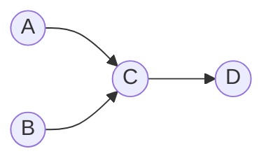
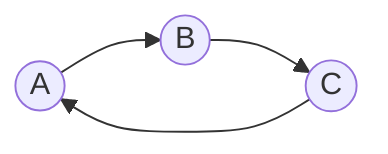

# 图的拓扑排序算法

[返回章节](README.md) | [返回分类](../README.md) | [返回总目录](../../README.md)

- 状态：已标记完成
- 所属分类：基础巩固
- 所属章节：11 图相关的算法
- 原始条目：☒ 图的拓扑排序算法

## 一句话结论
拓扑排序是给**有向无环图（DAG）**中的节点安排一个合法的线性顺序，使得对于图中的每一条有向边 `u -> v`，节点 `u` 在序列中都出现在节点 `v` 之前。

最经典的实现方式是 **Kahn 算法**：基于入度表和队列，不断弹出当前入度为 `0` 的节点。

## 核心知识点
- **适用范围**：只适用于**有向无环图**（Directed Acyclic Graph，简称 DAG）。
- **核心思想**：入度为 `0` 的节点表示没有前置依赖，可以安全地排在当前最前面。
- **操作步骤**：
  1. 删除一个入度为 `0` 的节点
  2. 将它所有邻居的入度减一（相当于删除了它发出的边）
  3. 如果某个邻居的入度变成 `0`，则加入候选队列
- **环检测**：如果最终输出的节点数少于图中总节点数，说明图中存在环，无法完成拓扑排序。

## 题意说明
拓扑排序解决的是**依赖关系排序**问题。

典型场景：
- **课程安排**：必须先修完《高等数学》才能修《机器学习》
- **任务调度**：编译代码时，必须先编译被依赖的模块
- **软件安装**：安装包 A 依赖于包 B，必须先装 B

这类问题的共同特征是：
```text
某些事情必须在另一些事情之前完成
需要找出一个合法的执行顺序
```

## 图解：什么是拓扑排序

### 示例图结构

假设有 4 个任务，依赖关系如下：



边的含义：
- `A -> C`：任务 A 必须在任务 C 之前完成
- `B -> C`：任务 B 必须在任务 C 之前完成
- `C -> D`：任务 C 必须在任务 D 之前完成

### 对应的入度表

| 节点 | 入度 | 含义 |
|------|------|------|
| A | 0 | 没有前置依赖，可以随时开始 |
| B | 0 | 没有前置依赖，可以随时开始 |
| C | 2 | 必须等 A 和 B 都完成后才能开始 |
| D | 1 | 必须等 C 完成后才能开始 |

### 拓扑排序过程

**初始状态**：
- 入度为 0 的节点：`A`, `B`
- 队列：`[A, B]`（顺序可能因实现而异）
- 结果序列：`[]`

---

**第 1 步**：弹出 `A`
- 将 `A` 加入结果序列
- 处理 `A` 的邻居 `C`：`C` 的入度从 2 减到 1
- `C` 的入度不为 0，不入队
- 队列：`[B]`
- 结果序列：`[A]`

---

**第 2 步**：弹出 `B`
- 将 `B` 加入结果序列
- 处理 `B` 的邻居 `C`：`C` 的入度从 1 减到 0
- `C` 的入度变成 0，加入队列
- 队列：`[C]`
- 结果序列：`[A, B]`

---

**第 3 步**：弹出 `C`
- 将 `C` 加入结果序列
- 处理 `C` 的邻居 `D`：`D` 的入度从 1 减到 0
- `D` 的入度变成 0，加入队列
- 队列：`[D]`
- 结果序列：`[A, B, C]`

---

**第 4 步**：弹出 `D`
- 将 `D` 加入结果序列
- `D` 没有邻居，无需处理
- 队列：`[]`（空）
- 结果序列：`[A, B, C, D]`

---

**最终结果**：`A, B, C, D` ✅

注意：如果初始队列中 `B` 在 `A` 前面，结果也可能是 `B, A, C, D`。**拓扑排序的结果通常不唯一**，只要满足所有依赖关系即可。

## 为什么叫"拓扑"排序？

"拓扑"在这里指的是**保持结构的相对顺序**。

想象一下：
- 你把图中的节点拉成一条直线
- 所有的箭头都从左指向右
- 不会出现从右指向左的箭头（否则就是有环）

这种"拉伸"后的线性顺序，就是拓扑序。

## 如何检测图中是否有环？

拓扑排序的一个重要应用是**环检测**。

### 原理

如果图中有环，那么环上的节点入度永远不可能变成 `0`。

例如：



- `A`、`B`、`C` 的入度都是 1
- 没有任何节点的入度是 0
- 队列为空，算法直接结束
- 结果序列长度为 0，但图中有 3 个节点
- **结论**：图中有环 ❌

### 判断方法

```java
if (ans.size() != graph.nodes.size()) {
    // 图中有环，无法完成拓扑排序
    throw new RuntimeException("Graph has a cycle!");
}
```
## 复杂度分析

- **时间复杂度**：`O(V + E)`
  - 初始化入度表：遍历所有节点 `O(V)`
  - BFS 过程：每个节点入队出队一次 `O(V)`，每条边被访问一次 `O(E)`
  
- **空间复杂度**：`O(V)`
  - 入度表：`O(V)`
  - 队列：最多存储 `V` 个节点
  - 结果列表：`O(V)`

其中 `V` 是节点数（Vertices），`E` 是边数（Edges）。

## 典型应用场景

### 1. 课程安排（LeetCode 207/210）

```text
你有 n 门课程，某些课程有先修要求。
例如：修《机器学习》前必须先修《高等数学》和《线性代数》。
问：能否修完所有课程？如果能，返回一个合法的学习顺序。
```

### 2. 任务调度

```text
项目中有多个任务，某些任务依赖其他任务的输出。
例如：编译模块 C 前，必须先编译模块 A 和 B。
求：一个合法的编译顺序。
```

### 3. 软件包依赖管理

```text
安装包 A 依赖于包 B 和 C。
安装包 B 依赖于包 D。
求：一个安全的安装顺序，确保依赖先被安装。
```

### 4. 公式计算顺序

```text
Excel 表格中，单元格 C1 = A1 + B1。
必须先计算 A1 和 B1，才能计算 C1。
求：单元格的计算顺序。
```

## 易错点

1. **必须先检查是否为 DAG**
   - 拓扑排序只适用于有向无环图
   - 如果图中有环，算法会提前终止，结果不完整

2. **拓扑序不唯一**
   - 同一张图可能有多个合法的拓扑序
   - 题目通常只要求返回任意一个合法序即可

3. **不要直接修改原图的入度**
   - 建议拷贝一份入度表（如 `inMap`）
   - 避免多次调用时原图数据被破坏

4. **入度为 0 的节点可能有多个**
   - 初始时可能有多个节点入度为 0
   - 处理过程中也可能同时产生多个新的入度为 0 的节点

5. **空图的处理**
   - 如果图中没有节点，返回空列表
   - 如果图中没有边，所有节点入度都是 0，任意顺序都合法

## 代码实现

### Kahn 算法（基于入度表 + BFS）

这是最常用、最直观的拓扑排序实现：

```java
List<Node> topologicalSort(Graph graph) {
    // 1. 建立入度表（拷贝原始入度，避免修改原图）
    Map<Node, Integer> inMap = new HashMap<>();
    for (Node node : graph.nodes.values()) {
        inMap.put(node, node.in);
    }
    
    // 2. 将所有入度为 0 的节点加入队列
    Queue<Node> zeroInQueue = new LinkedList<>();
    for (Node node : graph.nodes.values()) {
        if (node.in == 0) {
            zeroInQueue.add(node);
        }
    }
    
    // 3. BFS 处理
    List<Node> result = new ArrayList<>();
    while (!zeroInQueue.isEmpty()) {
        Node cur = zeroInQueue.poll();
        result.add(cur);  // 加入结果序列
        
        // 处理当前节点的所有邻居
        for (Node next : cur.nexts) {
            // 邻居入度减一
            inMap.put(next, inMap.get(next) - 1);
            // 如果入度变成 0，加入队列
            if (inMap.get(next) == 0) {
                zeroInQueue.add(next);
            }
        }
    }
    
    // 4. 环检测：如果结果数量不等于节点总数，说明有环
    if (result.size() != graph.nodes.size()) {
        throw new RuntimeException("Graph has a cycle! Cannot perform topological sort.");
    }
    
    return result;
}
```

### DFS 版拓扑排序（补充）

除了 Kahn 算法，也可以用 DFS 实现：

```java
List<Node> topologicalSortDFS(Graph graph) {
    Set<Node> visited = new HashSet<>();
    Set<Node> onStack = new HashSet<>();  // 用于环检测
    Stack<Node> stack = new Stack<>();    // 存储逆后序
    
    for (Node node : graph.nodes.values()) {
        if (!visited.contains(node)) {
            if (!dfs(node, visited, onStack, stack)) {
                throw new RuntimeException("Graph has a cycle!");
            }
        }
    }
    
    // 栈中从顶到底就是拓扑序
    List<Node> result = new ArrayList<>();
    while (!stack.isEmpty()) {
        result.add(stack.pop());
    }
    return result;
}

boolean dfs(Node node, Set<Node> visited, Set<Node> onStack, Stack<Node> stack) {
    if (onStack.contains(node)) {
        return false;  // 发现环
    }
    if (visited.contains(node)) {
        return true;   // 已处理过
    }
    
    visited.add(node);
    onStack.add(node);
    
    for (Node next : node.nexts) {
        if (!dfs(next, visited, onStack, stack)) {
            return false;
        }
    }
    
    onStack.remove(node);
    stack.push(node);  // 后序位置入栈
    return true;
}
```

**两种方法对比**：
- **Kahn 算法**：更直观，天然支持环检测，适合大多数场景
- **DFS 版**：代码稍复杂，但能更好地理解"后序遍历"与拓扑序的关系

## 记忆点

- **拓扑排序 = 依赖关系排序**
- **只适用于 DAG（有向无环图）**
- **核心操作**：
  ```text
  找入度为 0 的节点 → 加入结果 → 删除它对邻居的影响 → 重复
  ```
- **环检测**：结果节点数 < 总节点数 → 有环
- **Kahn 算法**：入度表 + BFS 队列
- **拓扑序通常不唯一**，只要满足依赖关系即可
