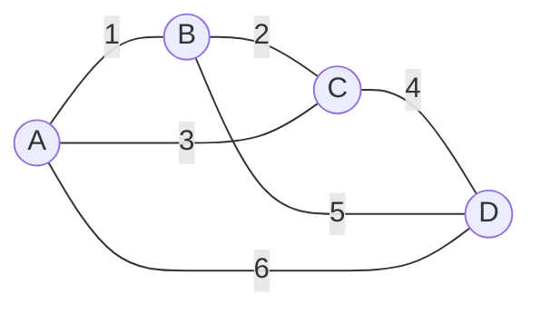
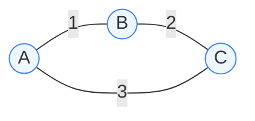
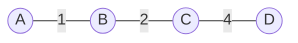

# 最小生成树-Kruskal算法

[返回章节](README.md) | [返回分类](../README.md) | [返回总目录](../../README.md)

- 状态：已标记完成
- 所属分类：基础巩固
- 所属章节：11 图相关的算法
- 原始条目：☒ 最小生成树算法之K算法

## 一句话结论
`Kruskal` 是求最小生成树的经典贪心算法。

它的思路可以直接记成：

```text
先把边按权值从小到大排序
然后从小边开始尝试加入
只要不会形成环，就选它
```

它最核心的搭档是并查集，用来快速判断：

```text
这条边的两个端点
现在是不是已经连在一起了
```

如果已经连在一起，再加这条边就会成环；如果还没连在一起，就可以放心加入。

## 题意说明
这篇不是某一道具体题，而是在讲：

```text
如何在一张带权无向图里
选出一组边
让所有点都连通
同时总权值最小
```

这就是最小生成树问题，简称 `MST`。

这里有 3 个关键词：

- 最小：总权值尽量小
- 生成：要覆盖所有节点
- 树：结果必须连通且无环

所以最终结果一定满足：

- 如果图有 `V` 个节点，生成树一定有 `V-1` 条边
- 选少了会不连通
- 选多了就一定会成环

## 先用一个生活场景理解
假设有 4 个城市，要铺设通信线路。



边上的数字表示成本。

现在的问题不是：

```text
把所有路都修出来
```

而是：

```text
只修一部分路
但要保证 4 个城市最终都能互相到达
而且总成本最低
```

这就是最小生成树。

## Kruskal 到底在做什么
`Kruskal` 是从“边”的角度思考的。

它不关心先从哪个点出发，而是一直做同一件事：

```text
当前最便宜的边，能不能要
```

判断标准也很简单：

- 不成环，就要
- 会成环，就不要

所以你可以把它理解成：

```text
一边按价格从低到高捡边
一边小心别把环捡出来
```

## 算法步骤
### 1. 先排序
把所有边按权值从小到大排序。

### 2. 初始化并查集
一开始每个点自己是一个集合：

```text
{A} {B} {C} {D}
```

这表示它们彼此还没连通。

### 3. 依次尝试每条边
从最小的边开始看：

- 如果边的两个端点不在同一集合，就选中这条边，并合并集合
- 如果边的两个端点已经在同一集合，就丢弃这条边

### 4. 选够 `V-1` 条边就结束
因为生成树只需要 `V-1` 条边，选够以后就不用再看后面的边了。

## 为什么“是否在同一集合”就能判断成环
这个点是 `Kruskal` 的核心。

如果一条边的两个端点已经连通，比如：

```text
A 已经能走到 C
```

这时你再加一条 `A-C`，就等于在原来那条路之外，又额外补了一条回路。

于是就形成环了。

所以判断规则可以直接记成：

```text
同集合：加了会成环
不同集合：加了不会成环
```

这也是并查集特别适合 `Kruskal` 的原因。

## 图解：一步一步跑 Kruskal
### 原图


### 按权值排序后的边

| 顺序 | 边 | 权值 |
|---|---|---|
| 1 | A-B | 1 |
| 2 | B-C | 2 |
| 3 | A-C | 3 |
| 4 | C-D | 4 |
| 5 | B-D | 5 |
| 6 | A-D | 6 |

### 初始状态

- 并查集：`{A} {B} {C} {D}`
- 已选边：`[]`
- 目标：选出 `4 - 1 = 3` 条边

### 第 1 条边：`A-B (1)`

- `A` 和 `B` 不在同一集合
- 说明加这条边不会成环
- 选中

```text
并查集：{A,B} {C} {D}
已选边：A-B
```

### 第 2 条边：`B-C (2)`

- `B` 和 `C` 不在同一集合
- 继续选中

```text
并查集：{A,B,C} {D}
已选边：A-B, B-C
```

### 第 3 条边：`A-C (3)`

- `A` 和 `C` 已经在同一集合
- 说明 `A` 和 `C` 已经连通
- 再加 `A-C` 就会成环
- 丢弃



上图里，`A-B-C` 已经把 `A` 和 `C` 连起来了，再补 `A-C` 就会围成一个三角形环。

### 第 4 条边：`C-D (4)`

- `C` 和 `D` 不在同一集合
- 选中

```text
并查集：{A,B,C,D}
已选边：A-B, B-C, C-D
```

这时已经选满 `3` 条边，算法结束。

### 最终最小生成树



总权值为：

```text
1 + 2 + 4 = 7
```

## 把整个过程浓缩成一句话

```text
从最小边开始尝试
能连就连
成环就丢
直到选满 V-1 条边
```

## 为什么 Kruskal 是对的
直觉上很好理解：

- 我们的目标是总权值最小
- 所以优先尝试便宜的边非常合理
- 但便宜不代表一定能选，因为还要保证结果仍然是一棵树
- 所以就加上“不能成环”这个限制

于是整个策略就变成：

```text
每次都选当前最便宜的合法边
```

这正是 `Kruskal` 的贪心本质。

## 为什么并查集很重要
如果不用并查集，最直接的想法是：

```text
每加一条边
就跑一次 DFS / BFS
看看有没有形成环
```

这样也能做，但会很慢。

并查集更适合这个问题，因为它天然支持两种操作：

- 查询两个点是否已经连通
- 把两个连通块合并起来

而这两件事，正好就是 `Kruskal` 每一步都在做的事。

所以可以这样记：

```text
Kruskal 负责“按小到大选边”
并查集负责“判断会不会成环”
```

## 复杂度
- 时间复杂度：`O(E log E)`
- 空间复杂度：`O(V + E)`

为什么时间复杂度主要是 `O(E log E)`：

- 所有边先排序：`O(E log E)`
- 后面每条边最多做一次并查集判断和合并
- 并查集这部分很快，通常近似看成 `O(E)`

所以真正占大头的是排序。

## Kruskal 适合什么场景
`Kruskal` 通常更适合：

- 稀疏图
- 边集很好拿到的题
- 题目本身就很像“从一堆候选连接里挑若干条最便宜的”

常见应用有：

- 网络铺设
- 道路规划
- 电力线路设计
- 聚类问题中的图建模

## 和 Prim 的区别
这两个算法都能求最小生成树，但视角不一样。

| 维度 | Kruskal | Prim |
|---|---|---|
| 思考角度 | 从边出发 | 从点出发 |
| 核心动作 | 选当前最便宜且合法的边 | 从已解锁区域向外扩展最小边 |
| 常用搭档 | 并查集 | 优先队列 |
| 更常见的感觉 | 挑边 | 扩点 |

你可以先这样记：

```text
Kruskal：全局看边，挑最便宜的边
Prim：从一个点出发，逐步往外扩
```

## 代码模板
```java
Set<Edge> kruskalMST(Graph graph) {
    UnionFind<Node> uf = new UnionFind<>(graph.nodes.values());
    PriorityQueue<Edge> minHeap = new PriorityQueue<>((a, b) -> a.weight - b.weight);
    minHeap.addAll(graph.edges);

    Set<Edge> result = new HashSet<>();

    while (!minHeap.isEmpty()) {
        Edge edge = minHeap.poll();

        if (!uf.isSameSet(edge.from, edge.to)) {
            result.add(edge);
            uf.union(edge.from, edge.to);

            if (result.size() == graph.nodes.size() - 1) {
                break;
            }
        }
    }

    return result;
}
```

这段代码的关键只有 3 行：

```java
if (!uf.isSameSet(edge.from, edge.to)) {
    result.add(edge);
    uf.union(edge.from, edge.to);
}
```

含义就是：

```text
如果两个端点还没连通
就选这条边
并把它们并到一个集合里
```

## 易错点
- `Kruskal` 处理的是带权无向图，不是普通有向图最小生成树。
- 结果边数应该是 `V-1`，不是随便选到图连通就算完。
- 一旦已经选满 `V-1` 条边，就可以提前结束。
- 如果最后边数不够 `V-1`，说明原图不连通，不存在生成树。
- 边权相同的时候，最小生成树可能不唯一，但最小总权值仍然一样。

## 记忆点
- `Kruskal` 是从边出发的贪心。
- 先按边权排序。
- 只选不会成环的边。
- 是否成环，用并查集判断。
- 选满 `V-1` 条边就结束。
