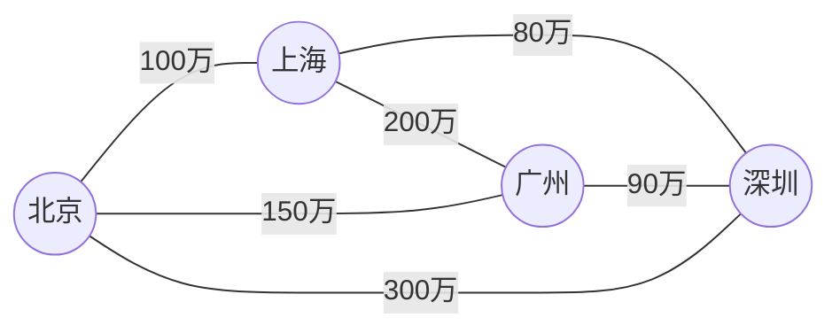
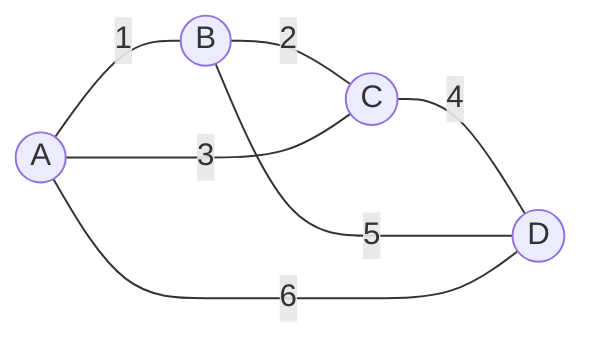
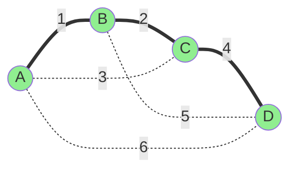

# 最小生成树算法之K算法

[返回章节](README.md) | [返回分类](../README.md) | [返回总目录](../../README.md)

- 状态：已标记完成
- 所属分类：基础巩固
- 所属章节：11 图相关的算法
- 原始条目：☒ 最小生成树算法之K算法

## 一句话结论
Kruskal 算法是一种**基于贪心策略**的最小生成树算法，它从"边"的角度出发：将所有边按权值从小到大排序，依次选择不会形成环的边加入生成树。

它的核心搭档是**并查集**，用于高效判断"加入这条边是否会成环"。

## 应用背景：为什么要学最小生成树？

### 场景 1：铺设网络线路

假设你是一家电信公司的工程师，需要在 5 个城市之间铺设光纤网络：



**问题**：如何用最少的钱让所有城市互通？

- 如果全部铺设：总成本 = 100+150+80+90+200+300 = 920 万 ❌（浪费）
- 如果只铺必要的：总成本 = 100+80+90+150 = 420 万 ✅（最优）

这就是**最小生成树**问题：在保证所有节点连通的前提下，使总边权最小。

---

### 场景 2：其他实际应用

- **电力网络**：如何在多个变电站之间架设电线，成本最低
- **道路规划**：连接多个村庄，修建公路的总长度最短
- **电路板布线**：芯片上多个引脚之间的连线总长度最短
- **聚类分析**：机器学习中用于层次聚类的基础算法

---

### 什么是最小生成树（MST）？

对于一张**带权无向连通图**：
- **生成树**：包含图中所有节点的**无环子图**（即一棵树）
- **最小生成树**：所有生成树中，**边权之和最小**的那棵

关键性质：
- 如果有 `V` 个节点，最小生成树一定有 `V-1` 条边
- 最小生成树可能不唯一（但总权值一定相同）

---

### 为什么叫"最小生成树"？拆解这个名字

这个名字其实包含了三层含义：

#### 1. **"树"（Tree）**
- 结果必须是一棵**树**，而不是任意的子图
- 树的定义：**无环**且**连通**的图
- 这意味着：
  - ✅ 不能有环（否则就不是树了）
  - ✅ 所有节点必须连通（否则就是森林，不是树）
  - ✅ 如果有 `V` 个节点，必须有且仅有 `V-1` 条边

#### 2. **"生成"（Spanning）**
- 这棵树必须**覆盖原图的所有节点**
- 不能只选一部分节点，必须是"生成"自原图的完整节点集
- 英文 "Spanning" 的意思就是"跨越、覆盖全部"

#### 3. **"最小"（Minimum）**
- 在所有可能的生成树中，这条树的**边权之和最小**
- 注意：是"总权值最小"，不是"边数最少"（所有生成树的边数都是 `V-1`）

---

### 形象理解

可以把"最小生成树"理解为：

```
从原图中"提炼"出一棵最经济的树
- 保留所有节点（生成）
- 去掉多余的边，只留 V-1 条（树）
- 让总成本最低（最小）
```

就像从一张复杂的交通网中，找出一个**最省钱但又能到达所有城市**的方案。

## Kruskal 算法的核心思想

Kruskal 算法由 Joseph Kruskal 于 1956 年提出，它的思路非常直观：

```text
贪心策略：每次都选当前最便宜的边，只要它不会形成环
```

### 算法步骤

1. **排序**：将所有边按权值从小到大排序
2. **初始化**：每个节点各自独立成一个集合（用并查集维护）
3. **遍历边**：从最小的边开始，依次检查每条边
   - 如果这条边的两个端点**不在同一集合**（不会成环）→ **选中这条边**，合并两个集合
   - 如果这条边的两个端点**已在同一集合**（会成环）→ **丢弃这条边**
4. **终止条件**：选中了 `V-1` 条边，或所有边都检查完毕

---

### 为什么这样是对的？

**直觉理解**：
- 我们想要总权值最小，所以优先选便宜的边
- 但不能随便选，选了之后不能形成环（否则就不是树了）
- 并查集帮我们快速判断"选这条边会不会成环"

**严谨证明**（交换论证）：
- 假设 Kruskal 选的边集不是最优的
- 那么存在一条更优的边可以替换掉某条 Kruskal 选的边
- 但这与"Kruskal 总是选当前最小的合法边"矛盾
- 因此 Kruskal 的结果一定是最优的 ✅

## 图解：Kruskal 算法执行过程

### 示例图

假设有 4 个城市(节点 A、B、C、D),它们之间的道路及修建成本如下图所示:



**图中每条边上的数字表示修建成本（权值）**

---

**按权值从小到大排序后的边列表**：

| 顺序 | 边 | 权值 |
|---|---|----|
| 1 | A-B | 1  |
| 2 | B-C | 2  |
| 3️ | A-C | 3  |
| 4️ | C-D | 4  |
| 5️ | B-D | 5  |
| 6️ | A-D | 6  |

Kruskal 算法会**按照这个顺序**依次考虑每条边。

---

### 执行过程

**初始状态**：
- 并查集：`{A}, {B}, {C}, {D}`（每个节点独立）
- 已选边：`[]`
- 目标：选中 `4-1=3` 条边

---

**第 1 步**：考虑边 `(A-B, 1)`
- 检查：`A` 和 `B` 是否在同一集合？→ **否** ✅
- 操作：选中这条边，合并 `{A}` 和 `{B}`
- 并查集：`{A, B}, {C}, {D}`
- 已选边：`[(A-B, 1)]`

---

**第 2 步**：考虑边 `(B-C, 2)`
- 检查：`B` 和 `C` 是否在同一集合？→ **否** ✅
- 操作：选中这条边，合并 `{A, B}` 和 `{C}`
- 并查集：`{A, B, C}, {D}`
- 已选边：`[(A-B, 1), (B-C, 2)]`

---

**第 3 步**：考虑边 `(A-C, 3)`
- 检查：`A` 和 `C` 是否在同一集合？→ **是** ❌（会成环）
- 操作：**丢弃**这条边
- 并查集：`{A, B, C}, {D}`（不变）
- 已选边：`[(A-B, 1), (B-C, 2)]`（不变）

> 💡 **为什么成环？** 因为 `A` 和 `C` 已经通过 `A-B-C` 连通了，再加 `A-C` 就会形成三角形环。

---

**第 4 步**：考虑边 `(C-D, 4)`
- 检查：`C` 和 `D` 是否在同一集合？→ **否** ✅
- 操作：选中这条边，合并 `{A, B, C}` 和 `{D}`
- 并查集：`{A, B, C, D}`（所有节点连通！）
- 已选边：`[(A-B, 1), (B-C, 2), (C-D, 4)]`

---

**终止**：已选中 `3` 条边（`= V-1`），算法结束

**最终结果**：
- 最小生成树的边：`(A-B), (B-C), (C-D)`
- 总权值：`1 + 2 + 4 = 7` ✅

---

### 可视化对比

**原图**（6 条边）：


**最小生成树**（3 条边，红色为选中的边）：


虚线表示被丢弃的边，实线表示选中的边。

## 为什么需要并查集？

### 问题：如何快速判断"加入这条边是否会成环"？

**朴素方法**：每次加入一条边后，用 DFS/BFS 检查是否有环
- 时间复杂度：`O(V+E)` 每次检查
- 总复杂度：`O(E * (V+E))` → 太慢！❌

**并查集方法**：
- 如果边 `(u, v)` 的两个端点 `u` 和 `v` **已经在同一集合** → 加入后会成环 ❌
- 如果 `u` 和 `v` **不在同一集合** → 加入后不会成环，可以选中 ✅
- 时间复杂度：`O(α(V))` ≈ `O(1)` 每次检查
- 总复杂度：`O(E log E)`（主要来自排序）✅

### 并查集的作用

```text
并查集维护的是"连通分量"
- 初始时：每个节点独立成一个集合
- 选中一条边 (u, v)：将 u 和 v 所在的集合合并
- 检查一条边 (u, v)：判断 u 和 v 是否在同一集合
```

这正是 Kruskal 算法需要的核心功能！

## 复杂度分析

- **时间复杂度**：`O(E log E)`
  - 排序所有边：`O(E log E)`
  - 并查集操作：每条边最多一次 `find` 和一次 `union`，共 `O(E * α(V))` ≈ `O(E)`
  - 总体：`O(E log E)`（排序占主导）
  
  > 注：因为 `E ≤ V²`，所以 `log E ≤ 2 log V`，也可以写成 `O(E log V)`

- **空间复杂度**：`O(V + E)`
  - 并查集：`O(V)`
  - 存储边：`O(E)`
  - 结果集：`O(V)`（最多 `V-1` 条边）

### 与其他算法对比

| 算法 | 时间复杂度 | 适用场景 |
|------|-----------|---------|
| **Kruskal** | `O(E log E)` | 稀疏图（`E` 较小） |
| **Prim** | `O(E log V)` | 稠密图（`E` 接近 `V²`） |
| **暴力枚举** | `O(2^E)` | 仅适用于极小图 ❌ |

## 典型应用场景

### 1. 网络设计

**问题**：如何在 N 个数据中心之间建立网络连接，使得任意两个数据中心都能通信，且总带宽成本最低？

**解法**：将数据中心看作节点，可能的连接看作带权边，求最小生成树。

---

### 2. 图像分割

**问题**：在计算机视觉中，如何将图像中的像素分成不同的区域？

**解法**：将像素看作节点，相邻像素的相似度作为边权，用 MST 进行层次聚类。

---

### 3. 近似旅行商问题（TSP）

**问题**：旅行商问题是 NP-Hard 的，如何找到一个近似最优解？

**解法**：先求 MST，然后对 MST 做前序遍历，得到一个近似解（误差在 2 倍以内）。

---

### 4. 集群划分

**问题**：给定一堆数据点，如何将它们分成 K 个簇？

**解法**：先求 MST，然后删除权值最大的 `K-1` 条边，剩下的 `K` 个连通分量就是聚类结果。

## 易错点

1. **Kruskal 只适用于无向图**
   - 有向图的最小生成树需要用其他算法（如 Chu-Liu/Edmonds 算法）

2. **不要手动检测环**
   - 有些同学会尝试用 DFS 检测环，效率极低
   - 直接用并查集的 `isSameSet` 即可

3. **提前终止很重要**
   - 一旦选中 `V-1` 条边，就可以退出循环
   - 否则会继续遍历剩余的边，浪费时间

4. **图可能不连通**
   - 如果最终选中的边数 `< V-1`，说明图不连通，不存在生成树
   - 需要根据题目要求返回 `-1` 或其他标识

5. **边权可能相等**
   - 如果多条边权值相同，Kruskal 可能产生不同的 MST
   - 但总权值一定相同，这是 MST 的重要性质

6. **注意节点编号**
   - 题目中的节点编号可能是 1-based，而并查集通常是 0-based
   - 记得做好转换

## 代码实现

### 标准实现（基于并查集 + 优先队列）

```java
Set<Edge> kruskalMST(Graph graph) {
    // 1. 初始化并查集
    UnionFind<Node> uf = new UnionFind<>(graph.nodes.values());
    
    // 2. 将所有边加入最小堆（按权值排序）
    PriorityQueue<Edge> minHeap = new PriorityQueue<>((a, b) -> a.weight - b.weight);
    minHeap.addAll(graph.edges);
    
    // 3. 存储结果
    Set<Edge> result = new HashSet<>();
    
    // 4. 贪心选边
    while (!minHeap.isEmpty()) {
        Edge edge = minHeap.poll();
        
        // 检查是否会成环
        if (!uf.isSameSet(edge.from, edge.to)) {
            result.add(edge);          // 选中这条边
            uf.union(edge.from, edge.to); // 合并两个集合
            
            // 优化：如果已经选了 V-1 条边，可以提前退出
            if (result.size() == graph.nodes.size() - 1) {
                break;
            }
        }
    }
    
    return result;
}
```

### 代码要点解析

1. **为什么用优先队列？**
   - 自动按权值从小到大排序
   - 也可以用 `Arrays.sort()` 对边数组排序，效果一样

2. **为什么检查 `isSameSet`？**
   - 如果两个端点已在同一集合，加入这条边会成环
   - 并查集的 `find` 操作几乎是 `O(1)`，非常高效

3. **为什么要提前退出？**
   - 最小生成树只需要 `V-1` 条边
   - 一旦达到这个数量，后续边都不用再看
   - 这是一个重要的**剪枝优化**

---

### 完整示例（LeetCode 风格）

```java
class Solution {
    public int minimumCost(int n, int[][] connections) {
        // 按权值排序
        Arrays.sort(connections, (a, b) -> a[2] - b[2]);
        
        UnionFind uf = new UnionFind(n);
        int totalCost = 0;
        int edgesUsed = 0;
        
        for (int[] conn : connections) {
            int city1 = conn[0] - 1; // 转为 0-based
            int city2 = conn[1] - 1;
            int cost = conn[2];
            
            if (uf.union(city1, city2)) { // 如果成功合并
                totalCost += cost;
                edgesUsed++;
                
                if (edgesUsed == n - 1) {
                    return totalCost; // 提前退出
                }
            }
        }
        
        // 如果无法连通所有城市
        return edgesUsed == n - 1 ? totalCost : -1;
    }
}
```

## Kruskal vs. Prim：如何选择？

两种算法都能求最小生成树，但适用场景不同：

| 维度 | Kruskal | Prim |
|------|---------|------|
| **核心思想** | 从边出发，贪心选边 | 从点出发，贪心扩展 |
| **数据结构** | 并查集 + 排序 | 优先队列 + 邻接表 |
| **时间复杂度** | `O(E log E)` | `O(E log V)` |
| **适合稀疏图** | ✅ 更好 | ⚠️ 一般 |
| **适合稠密图** | ⚠️ 一般 | ✅ 更好 |
| **代码难度** | 简单 | 中等 |

**选择建议**：
- 如果图比较**稀疏**（`E` 接近 `V`）→ 选 **Kruskal**
- 如果图比较**稠密**（`E` 接近 `V²`）→ 选 **Prim**
- 面试中，Kruskal 更容易手写，推荐优先掌握
