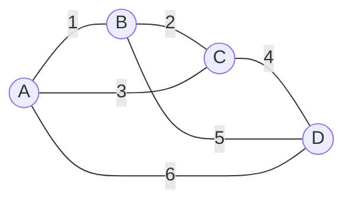
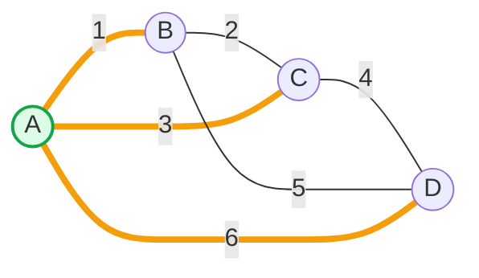
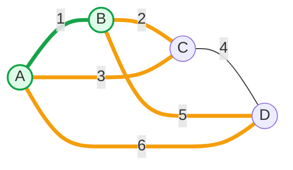
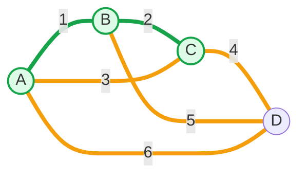
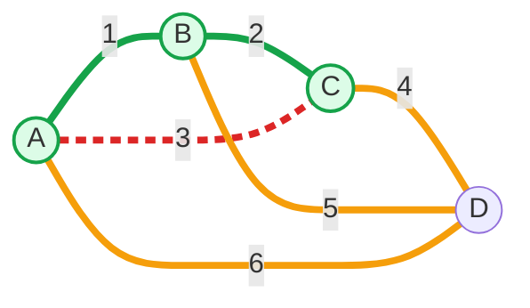
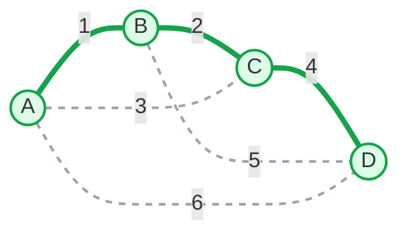

# 最小生成树-Prim算法

[返回章节](README.md) | [返回分类](../README.md) | [返回总目录](../../README.md)

- 状态：已标记完成
- 所属分类：基础巩固
- 所属章节：11 图相关的算法
- 原始条目：☒ 最小生成树算法之P算法

## 一句话结论
`Prim` 也是求最小生成树的经典贪心算法。

它的思路可以直接记成：

```text
先随便挑一个起点
然后每次从“已连通区域”往外
选一条最便宜的边，把一个新点接进来
```

所以和 `Kruskal` 不一样，`Prim` 不是在“全局挑边”，而是在：

```text
从一个起点出发
不断把当前生成树向外扩张
```

## 题意说明
这篇不是某一道具体题，而是在讲：

```text
如何从一个起点出发
一点一点把整张带权无向图接起来
并让总权值最小
```

它解决的仍然是最小生成树问题，只不过思考方式和 `Kruskal` 不一样。

这里仍然要记住最小生成树的 3 个要求：

- 要覆盖所有节点
- 要保持连通
- 不能形成环

## 先抓住 Prim 的手感
`Prim` 的阅读重点，不是“边排好序没”，而是：

```text
当前已经接进来的点有哪些
它们能解锁出哪些边
下一条最便宜的出界边是谁
```

所以你可以把它想成在修路：

```text
我已经修好的区域是一块地盘
每次都从这块地盘的边界上
挑一条最便宜的路，把外面的新城市接进来
```

## 图解：一步一步跑 Prim
下面用和 `Kruskal` 一样的图来跑一遍，这样两篇对照起来更顺。

### 原图



### 从 `A` 开始
起点其实可以随便选，这里只是为了讲解方便，从 `A` 开始。

初始时：

- 已接入节点：`{A}`
- 已选边：`[]`
- 当前可选边：`A-B(1)`、`A-C(3)`、`A-D(6)`



这里约定：

- 绿色节点：已经接入当前生成树的点
- 橙色边：当前已解锁、可参与竞争的边
- 绿色实线：已经正式选中的边

### 第 1 步：选最小边 `A-B (1)`

在当前可选边里，最小的是 `A-B(1)`，而且它能把新点 `B` 接进来，所以选中。

此时：

- 已接入节点：`{A, B}`
- 已选边：`A-B`
- 新解锁的边：`B-C(2)`、`B-D(5)`



### 第 2 步：选最小边 `B-C (2)`

现在所有可选边里，最小的是 `B-C(2)`。

它能把新点 `C` 接进来，所以继续选中。

此时：

- 已接入节点：`{A, B, C}`
- 已选边：`A-B`、`B-C`
- 新解锁的边：`C-D(4)`



### 第 3 步：为什么不能选 `A-C (3)`

此时最小的候选边其实是 `A-C(3)`，但它不能选。

因为：

- `A` 已经在生成树里
- `C` 也已经在生成树里

如果这时再补一条 `A-C`，就会在当前树里形成环。



所以 `Prim` 的判断标准可以记成：

```text
这条边最小还不够
它还必须能把“树外的新点”接进来
```

### 第 4 步：选 `C-D (4)`

跳过 `A-C(3)` 后，下一条能带来新点的最小边是 `C-D(4)`。

选中以后，`D` 被接入，所有点都连上了。



最终最小生成树的边仍然是：

```text
A-B, B-C, C-D
总权值 = 1 + 2 + 4 = 7
```

## Prim 到底在做什么
把上面的过程浓缩一下，`Prim` 一直在重复这件事：

```text
维护一个已经连通的点集
然后在“已访问”和“未访问”之间
找最便宜的那条出界边
```

这条边一旦被选中，就会把一个新点拉进来。

所以 `Prim` 的扩展单位其实不是点，也不是单独排序后的全局边表，而是：

```text
当前生成树边界上
所有能往外走的候选边
```

## 终止条件
`Prim` 的终止条件也最好分成两种情况记：

- 主动结束：已经接入了所有节点，或者已经选满 `V-1` 条边
- 被动结束：堆空了，但还有节点没接进来

为什么第一种可以停：

```text
当 V 个点都已经接进来时
最小生成树就已经构造完成了
```

因为生成树本来就只需要 `V-1` 条边，再多选只会成环。

为什么会出现第二种：

```text
当前已接入区域已经没有边能通向剩余节点
```

这通常说明原图不连通。

这时就不能得到一棵完整的生成树，只能得到生成森林。

## 为什么 Prim 是对的
直觉上很好理解：

- 当前生成树想继续扩出去
- 那么一定要从“树内”连向“树外”
- 在这些合法出界边里，优先选最便宜的，是最自然的贪心选择

所以 `Prim` 的核心不是：

```text
全图最小边是谁
```

而是：

```text
当前边界上最小的合法边是谁
```

## 为什么常用小根堆
因为每一步都要做同一件事：

```text
从当前解锁的候选边里
找出权值最小的那条
```

小根堆正好适合做这件事。

你可以这样理解分工：

- `visited` 负责区分哪些点已经接进生成树
- 小根堆负责维护所有已解锁边里的最小值

## Kruskal 和 Prim 的对比
这两个算法都能求最小生成树，但“做题手感”很不一样。

| 维度 | Kruskal | Prim |
|---|---|---|
| 思考角度 | 从边出发 | 从点出发 |
| 典型动作 | 全局按小到大挑边 | 从已建区域向外扩点 |
| 常用搭档 | 并查集 | 小根堆 + `visited` |
| 关键判断 | 会不会成环 | 能不能带来新点 |
| 读题时的感觉 | 从一堆候选连接里挑边 | 从一个起点不断往外铺开 |

如果只记一句话，可以记成：

```text
Kruskal 是“挑边”
Prim 是“扩点”
```

## 复杂度
- 时间复杂度：`O(E log E)` 或 `O(E log V)`
- 空间复杂度：`O(E)`

通常可以这样理解：

- 边会不断进入堆
- 每次从堆里弹最小边
- 真正的性能关键就在堆操作上

如果用邻接表 + 优先队列，常见写法会写成 `O(E log V)`。

## 代码模板
```java
Set<Edge> primMST(Graph graph) {
    PriorityQueue<Edge> heap = new PriorityQueue<>((a, b) -> a.weight - b.weight);
    Set<Node> visited = new HashSet<>();
    Set<Edge> result = new HashSet<>();

    for (Node node : graph.nodes.values()) {
        if (!visited.contains(node)) {
            visited.add(node);
            for (Edge edge : node.edges) {
                heap.add(edge);
            }

            while (!heap.isEmpty()) {
                Edge edge = heap.poll();
                Node toNode = edge.to;

                if (!visited.contains(toNode)) {
                    visited.add(toNode);
                    result.add(edge);

                    for (Edge nextEdge : toNode.edges) {
                        heap.add(nextEdge);
                    }
                }
            }
        }
    }

    return result;
}
```

这段代码最关键的判断是：

```java
if (!visited.contains(toNode)) {
    visited.add(toNode);
    result.add(edge);
}
```

意思就是：

```text
只有这条边能带来一个新点
它才值得被真正选中
```

## 易错点
- `Prim` 处理的是带权无向图。
- 不是堆里最小边就一定能选，还要看它能不能带来新点。
- 起点可以随便选，但图不连通时，需要按连通分量分别启动。
- 如果题目要求的是完整最小生成树，而最后没有覆盖所有节点，说明原图不连通。

## 记忆点
- `Prim` 是从点出发的贪心。
- 从任意点开始，逐步向外扩。
- 解锁边进入小根堆。
- 每次选当前边界上最便宜的合法边。
- 能带来新点的边才能真正加入答案。
