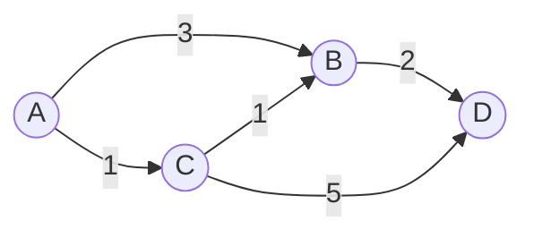
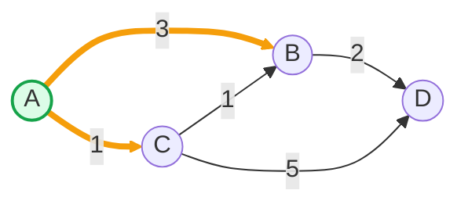
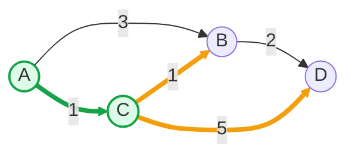
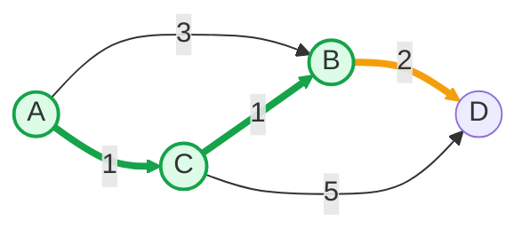
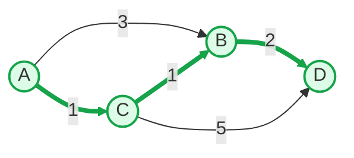

# 单源最短路径-Dijkstra算法

[返回章节](README.md) | [返回分类](../README.md) | [返回总目录](../../README.md)

- 状态：已标记完成
- 所属分类：基础巩固
- 所属章节：11 图相关的算法
- 原始条目：☒ 单源最短路径算法之迪杰斯特拉算法-Dijkstra

## 一句话结论
`Dijkstra` 用来解决：

```text
从一个固定起点出发
到图中其他各点的最短路径长度
```

它有一个非常重要的前提：

```text
边权不能为负
```

它的核心贪心思想可以直接记成：

```text
每次都从“当前还没确定答案的点”里
选出距离起点最近的那个点
把它正式锁定
再用它去更新别的点
```

## 题意说明
这篇不是某一道具体题，而是在讲图上的单源最短路径模板。

它主要解决的是：

```text
给定一个起点 source
如何求出 source 到每个可达节点的最短距离
```

这里有几个关键词要先分清：

- 单源：只有一个起点
- 最短路径：总权值最小，不是经过边数最少
- 非负边权：所有边权都不能小于 `0`

所以 `Dijkstra` 解决的不是“任意图最短路”，而是：

```text
单源最短路
+ 非负边权
+ 输出起点到各点的最短距离
```

## 先抓住 Dijkstra 的手感
第一次学 `Dijkstra`，最容易绕晕的地方通常不是代码，而是：

```text
为什么“当前最小的未锁定点”可以直接定死
```

先别急着证明，先把它想成这样：

```text
起点到各点的距离在不断被更新
谁当前最小，谁就最有可能已经拿到最终答案
```

而因为边权都非负，所以：

```text
后面再绕别的路回来
只会更长，不会更短
```

这就是 `Dijkstra` 整个算法能成立的关键。

## 图解：一步一步跑 Dijkstra
下面用一张简单的有向带权图来跑一遍。

### 原图



我们要求的是：

```text
从 A 出发
到 A、B、C、D 的最短距离
```

### 初始状态

- `distance[A] = 0`
- 其他点都还不知道，视为无穷大
- 已锁定点集合：空

```text
A = 0
B = inf
C = inf
D = inf
```

### 第 1 步：先锁定 `A`

因为起点到自己的距离一定是 `0`，所以它肯定最先被锁定。

然后用 `A` 的出边去更新邻居：

- `A -> B (3)`，所以 `B = 3`
- `A -> C (1)`，所以 `C = 1`



当前距离表：

```text
A = 0   (已锁定)
B = 3
C = 1
D = inf
```

### 第 2 步：锁定当前最小未锁定点 `C`

现在还没锁定的点里：

- `B = 3`
- `C = 1`
- `D = inf`

最小的是 `C`，所以锁定 `C`。

然后用 `C` 去更新邻居：

- `C -> B (1)`，所以 `B = min(3, 1 + 1) = 2`
- `C -> D (5)`，所以 `D = min(inf, 1 + 5) = 6`



当前距离表：

```text
A = 0   (已锁定)
C = 1   (已锁定)
B = 2
D = 6
```

### 第 3 步：锁定当前最小未锁定点 `B`

现在未锁定点里：

- `B = 2`
- `D = 6`

最小的是 `B`，所以锁定 `B`。

然后用 `B` 去更新邻居：

- `B -> D (2)`，所以 `D = min(6, 2 + 2) = 4`



当前距离表：

```text
A = 0   (已锁定)
C = 1   (已锁定)
B = 2   (已锁定)
D = 4
```

### 第 4 步：锁定 `D`

这时只剩下 `D`，直接锁定即可。



最终最短距离就是：

```text
A = 0
C = 1
B = 2
D = 4
```

## 这里最关键的动作：松弛
`Dijkstra` 每一步都在做一个核心动作，叫“松弛”。

如果当前锁定点是 `cur`，它到起点的最短距离已经确定为 `distance[cur]`，  
那么对于每条边 `cur -> to`，我们都尝试：

```text
distance[to] = min(distance[to], distance[cur] + weight)
```

这句话的意思其实很朴素：

```text
看看“先到 cur，再走这条边”
会不会比原来记录的到 to 的距离更短
```

如果更短，就更新。

## 为什么“当前最小未锁定点”可以直接锁定
这是 `Dijkstra` 的核心逻辑。

假设当前未锁定点里，`X` 的距离最小。

如果你想通过别的未锁定点绕一圈再回到 `X`，因为：

- 那个别的点当前距离不会比 `X` 更小
- 后续边权又都非负

所以绕路回来只会让总距离更大，不可能更小。

也就是说：

```text
一旦某个点成为“当前最小未锁定点”
它的最短距离就已经最终确定
```

这就是“锁定”这一步的数学依据。

## 终止条件
`Dijkstra` 的终止条件也可以分成两种情况：

- 主动结束：所有可达点都已经被锁定
- 被动结束：再也找不到新的未锁定可达点

第二种情况通常对应：

```text
图里还有别的点
但它们从 source 根本到不了
```

这时算法也会自然停止，因为距离表里不会再出现新的有限值。

## Dijkstra 到底适合什么题
只要题目满足下面这些味道，就要优先想到 `Dijkstra`：

- 起点固定
- 边有权值
- 问的是最小总代价，不是最少边数
- 边权非负

比如：

- 地图导航最短路
- 网络传输最小时延
- 从一个仓库到各配送点的最低成本

## 和 BFS 的区别
这两个算法都能“从一个起点往外扩”，但解决的问题并不一样。

| 维度 | BFS | Dijkstra |
|---|---|---|
| 适用图 | 无权图 / 等权图 | 非负带权图 |
| 扩展依据 | 按层数扩展 | 按当前最小距离扩展 |
| 解决的问题 | 最少边数 / 最少步数 | 最小总代价 |
| 常用结构 | 队列 | 距离表 + 选最小点 / 小根堆 |

可以这样记：

```text
无权最短路先想 BFS
非负带权最短路先想 Dijkstra
```

## 复杂度
普通写法的复杂度通常记成：

- 时间复杂度：`O(V^2 + E)`
- 空间复杂度：`O(V)`

如果再用小根堆优化，常见可以写成：

- 时间复杂度：`O((V + E) log V)`

所以面试里通常会区分两版：

- 朴素版：靠遍历找当前最小未锁定点
- 堆优化版：靠小根堆更快取最小距离点

## 代码模板
### 1. 朴素版

```java
Map<Node, Integer> dijkstra(Node from) {
    Map<Node, Integer> distanceMap = new HashMap<>();
    distanceMap.put(from, 0);

    Set<Node> selected = new HashSet<>();
    Node minNode = getMinDistanceAndUnselectedNode(distanceMap, selected);

    while (minNode != null) {
        int distance = distanceMap.get(minNode);

        for (Edge edge : minNode.edges) {
            Node to = edge.to;
            if (!distanceMap.containsKey(to)) {
                distanceMap.put(to, distance + edge.weight);
            } else {
                distanceMap.put(to, Math.min(distanceMap.get(to), distance + edge.weight));
            }
        }

        selected.add(minNode);
        minNode = getMinDistanceAndUnselectedNode(distanceMap, selected);
    }

    return distanceMap;
}
```

最核心的部分就是两件事：

- 找当前最小未锁定点
- 用它的出边做松弛

### 2. `getMinDistanceAndUnselectedNode` 在干什么

它其实就是在做这件事：

```text
把 distanceMap 里所有还没锁定的点扫一遍
找出当前距离最小的那个
```

也就是说，朴素版慢就慢在这里。

## 易错点
- 边权只要出现负数，就不能直接用 `Dijkstra`。
- `Dijkstra` 求的是最短距离，不会自动还原整条路径；如果要路径，需要额外记录前驱节点。
- “当前最小未锁定点”一旦锁定，就不要再改它。
- 不可达节点不会出现在最终有效距离里，或者会保留为无穷大。
- 不要把“最少边数”问题误写成 `Dijkstra`，无权图更适合直接用 `BFS`。

## 记忆点
- `Dijkstra` = 单源最短路 + 非负边权。
- 每次锁定当前最小未处理点。
- 锁定后距离就不会再变。
- 核心动作是松弛。
- 无权最短路先想 `BFS`，带权最短路再想 `Dijkstra`。
