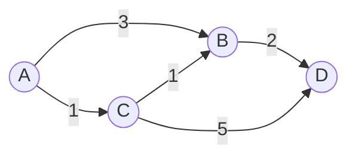

# 单源最短路径-Dijkstra算法-小根堆优化版

[返回章节](README.md) | [返回分类](../README.md) | [返回总目录](../../README.md)

- 状态：已标记完成
- 所属分类：基础巩固
- 所属章节：11 图相关的算法
- 原始条目：☒ 迪杰斯特拉算法改进，更新小根堆

## 一句话结论
这篇讲的不是一种新算法，而是：

```text
把 Dijkstra 里“找当前最小未锁定点”这一步
从手动遍历
改成用支持更新的小根堆来完成
```

所以它的本质仍然是 `Dijkstra`，只是找最小点更快了。

## 先抓住这篇到底在优化什么
如果你已经看过上一节朴素版，可以先记住一句话：

```text
朴素版和堆优化版
松弛逻辑完全一样
唯一真正变快的地方
就是“谁来帮我找到下一个最小未锁定点”
```

朴素版里，这一步是：

```text
每一轮都去 distanceMap 里扫一遍
手动找当前最小未锁定点
```

堆优化版里，这一步变成：

```text
把候选点都放进一个小根堆
每次直接弹出堆顶最小值
```

所以你可以把它理解成：

```text
算法思想没变
只是“找最小值”的工具升级了
```

## 使用前提
和普通 `Dijkstra` 一样，这一版仍然有一个前提：

```text
边权不能为负
```

如果边权出现负数，堆优化版也一样不能直接用。

## 为什么朴素版会慢
朴素版慢，不是慢在松弛，而是慢在这件事：

```text
每锁定一个点
都要线性扫描一遍当前所有候选点
找最小未锁定点
```

节点一多，这个“反复扫表”的代价就会很明显。

所以优化目标很明确：

- 不是优化“更新邻居”这件事
- 而是优化“更快拿到当前最小点”这件事

## 为什么普通优先队列还不够
第一次学这一版，最容易误会的一点是：

```text
既然要找最小值
那直接上一个普通小根堆不就行了？
```

问题在于：  
同一个节点的距离，可能会被多次更新，而且是越变越小。

比如某个节点第一次被发现时距离是 `7`，  
后面又找到一条更短路径，把它更新成 `5`，再后来甚至可能更新成 `4`。

所以我们需要的不是“只会插入和弹出”的普通堆，  
而是一个能区分下面 3 种状态的堆：

- 节点从来没进过堆：加入堆
- 节点已经在堆里：如果新距离更短，就更新它
- 节点已经弹出过：说明已经锁定，后续更新直接忽略

这就是课程里为什么经常写成：

```text
addOrUpdateOrIgnore(node, distance)
```

这个名字虽然长，但意思非常直白：

- `add`：没进过堆，就加入
- `update`：已经在堆里，就尝试更新
- `ignore`：已经锁定过，就忽略

## 需要维护哪些结构
通常会自己维护下面 3 个核心结构：

- `nodes[]`：真正的堆数组
- `heapIndexMap`：记录每个节点当前在堆上的位置
- `distanceMap`：记录每个节点当前最好的距离

它们各自负责的事情可以这样理解：

| 结构 | 作用 |
|---|---|
| `nodes[]` | 维护小根堆本体，保证堆顶最小 |
| `heapIndexMap` | 快速知道一个节点是否在堆里、以及它在第几个位置 |
| `distanceMap` | 保存这个节点当前已知的最短候选距离 |

其中最关键的是 `heapIndexMap`。  
因为如果你不知道一个节点现在是否还在堆里，就没法判断当前操作到底应该是 `add`、`update` 还是 `ignore`。

## 图解：把朴素版的“找最小点”换成堆
还是沿用上一节同样的例子：



我们要求的是：

```text
从 A 出发
到所有点的最短距离
```

这一版最适合盯住两件事：

- 堆里现在装着哪些候选点
- 每次弹出堆顶后，哪些节点被更新了

### 初始状态

```text
distance[A] = 0
小根堆 = [(A, 0)]
结果表 result = {}
```

### 第 1 轮：弹出 `A(0)`
堆顶一定是当前最小候选点，所以先弹出 `A(0)`。

这一步就等价于朴素版里的：

```text
锁定 A
```

然后用 `A` 的出边去更新邻居：

- `A -> B (3)`，把 `B(3)` 放入堆
- `A -> C (1)`，把 `C(1)` 放入堆

此时：

```text
result = {A: 0}
小根堆里有 B(3), C(1)
下一轮会先弹出 C(1)
```

### 第 2 轮：弹出 `C(1)`
`C(1)` 是当前堆顶，所以它会先被弹出并锁定。

然后用 `C` 去更新邻居：

- `C -> B (1)`，原来 `B = 3`，现在发现更短路径 `1 + 1 = 2`，更新为 `B(2)`
- `C -> D (5)`，第一次发现 `D`，加入 `D(6)`

此时：

```text
result = {A: 0, C: 1}
小根堆里有 B(2), D(6)
```

### 第 3 轮：弹出 `B(2)`
此时堆顶是 `B(2)`，弹出并锁定。

然后更新：

- `B -> D (2)`，原来 `D = 6`，现在可更新为 `2 + 2 = 4`

此时：

```text
result = {A: 0, C: 1, B: 2}
小根堆里有 D(4)
```

### 第 4 轮：弹出 `D(4)`
弹出 `D(4)` 后，`D` 也锁定完成。

最终结果：

```text
A = 0
C = 1
B = 2
D = 4
```

如果把整个过程压成一句话，就是：

```text
谁在堆顶
谁就是当前最小未锁定点
弹出来后就去松弛它的邻居
```

## 和朴素版到底差在哪
最容易混乱的地方，是把“算法不同”误以为成“代码长得不同”。  
其实它们的核心流程完全一致：

1. 选出当前距离最小的未锁定点
2. 锁定它
3. 用它的出边去更新别的点
4. 重复直到没有新点可处理

真正的区别只有这一处：

| 版本 | 找最小未锁定点的方式 |
|---|---|
| 朴素版 | 每轮线性扫描 `distanceMap` |
| 堆优化版 | 每轮从小根堆直接弹出堆顶 |

所以，学习这一版时，脑子里不要把它当成新题型。  
更准确的说法是：

```text
这是 Dijkstra 的同一套逻辑
只是把“选最小点”从手工查找
换成了堆维护
```

## 代码骨架
### 1. `addOrUpdateOrIgnore` 在干什么
这个方法几乎就是整套堆优化版最核心的接口。

```java
void addOrUpdateOrIgnore(Node node, int distance) {
    // 情况 1：节点还在堆里
    // 说明它还没锁定，可以尝试更新成更小距离
    if (inHeap(node)) {
        distanceMap.put(node, Math.min(distanceMap.get(node), distance));
        heapInsert(heapIndexMap.get(node));
    }

    // 情况 2：节点从来没进过堆
    // 这是第一次发现它，直接加入堆
    if (!isEntered(node)) {
        nodes[size] = node;
        heapIndexMap.put(node, size);
        distanceMap.put(node, distance);
        heapInsert(size++);
    }

    // 情况 3：节点已经弹出过
    // 说明它已经锁定，直接忽略
}
```

它背后的逻辑其实就是前面那 3 种状态：

- 在堆里：更新
- 没进过：加入
- 已弹出：忽略

### 2. 主流程

```java
Map<Node, Integer> dijkstra2(Node head, int size) {
    NodeHeap nodeHeap = new NodeHeap(size);

    // 起点先入堆，距离为 0
    nodeHeap.addOrUpdateOrIgnore(head, 0);

    // result 存放最终已经锁定的最短距离
    Map<Node, Integer> result = new HashMap<>();

    while (!nodeHeap.isEmpty()) {
        // 每次弹出的都是当前最小未锁定点
        Record record = nodeHeap.pop();
        Node cur = record.node;
        int distance = record.distance;

        // 用当前点去松弛所有邻居
        for (Edge edge : cur.edges) {
            nodeHeap.addOrUpdateOrIgnore(edge.to, distance + edge.weight);
        }

        // 一旦弹出，说明 cur 的最短距离已经最终确定
        result.put(cur, distance);
    }

    return result;
}
```

这段代码最值得盯住的一句是：

```text
节点一旦从堆里弹出
就等价于朴素版里的“被锁定”
```

## 复杂度
- 时间复杂度：`O((V + E) log V)`
- 空间复杂度：`O(V)`

和朴素版相比，它的优势主要体现在：

- 节点多、边也多时，更快找到当前最小点
- 稀疏图里通常更常用
- 工程实现里更接近真正会写的版本

## 易错点
- 这不是简单“把队列换成堆”，关键在于堆必须支持更新。
- 普通优先队列不一定能直接完成“更新已有节点距离”这件事。
- 节点一旦弹出，就已经锁定，后续再收到更新必须忽略。
- `result` 里放的是最终答案，堆里的 `distanceMap` 放的是候选最短距离。
- 边权一旦出现负数，堆优化版同样不能直接使用。

## 记忆点
- 本质仍然是 `Dijkstra`，不是新算法。
- 优化的是“找当前最小未锁定点”这一步。
- 关键接口是 `addOrUpdateOrIgnore`。
- 节点弹出堆顶，就等于最短距离被锁定。
- 仍然只适用于非负权图。
