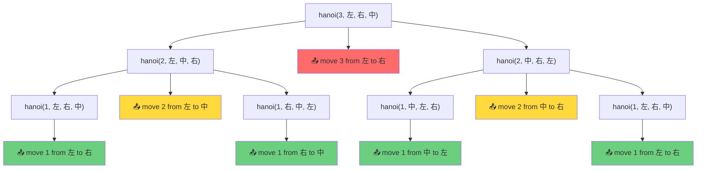

# 暴力递归

[返回章节](README.md) | [返回分类](../README.md) | [返回总目录](../../README.md)

- 状态：已标记完成
- 所属分类：基础巩固
- 所属章节：12 暴力递归到动态规划1-递归尝试
- 原始条目：☒ 暴力递归

## 一句话结论
暴力递归不是乱写递归，而是一种“尝试法”建模思维：

```
先把问题拆成规模更小的同类子问题
再让子问题自己去求答案
最后把子问题答案组合回当前问题
```

它最重要的价值是：**很多动态规划题都要先能写出暴力递归，才能真正看懂状态转移是怎么来的**。

## 理论 / 应用价值
这篇虽然名字叫“暴力递归”，但它讲的不是一种低级写法，而是一种非常核心的建模能力。

### 在知识体系中的位置

```
暴力递归
  ↓ 发现重复子问题
记忆化搜索
  ↓ 去掉递归 overhead
动态规划
```

也就是说，很多 DP 题如果一上来就硬写状态表，反而容易越写越乱；先把暴力递归的“函数含义、尝试过程、停止条件”想清楚，后面的优化才会自然。

### 为什么值得学

这篇最值得学的不是某个固定模板，而是下面这件事：

```
面对一个复杂问题
如何把它改写成“更小规模的同类问题”
```

如果这一步不会，后面的递归、记忆化搜索、动态规划都会很虚。

### 解决的痛点

- **避免盲目写 DP**：先有递归思路，再有状态定义
- **理清决策过程**：明确每一层有哪些尝试分支
- **发现优化空间**：通过递归树看到重复子问题

### 最适合的场景

- 问题可以分解为同类子问题
- 存在明确的 base case
- 需要枚举所有可能的选择路径

## 核心知识点
- **子问题拆分**：原问题要能拆成同类子问题
- **Base Case**：必须有明确的停止条件
- **答案整合**：必须能说明如何由子问题答案得到当前答案
- **无缓存**：默认不记录子问题的解，可能存在大量重复计算

## 图片转写 / 题意还原
原图内容为暴力递归的四个核心特征：

1. **把问题转化为规模缩小了的同类问题的子问题**
   - 关键：必须是“同类”问题，只是规模更小
   
2. **有明确的不需要继续递归的条件 `base case`**
   - 关键：递归必须有出口，否则会无限递归
   
3. **有当得到了子问题结果之后的决策过程**
   - 关键：当前层如何利用子问题答案做出选择
   
4. **不记录每一个子问题的解**
   - 关键：这是“暴力”的来源，也是后续优化的切入点

## 图解
### 暴力递归的整体流程


### 递归三要素

如果把它翻译成更贴近做题的话术，就是：

```
1. 先定义当前函数到底求什么（函数职责）
2. 再思考它能把任务交给哪些更小的子问题（拆分策略）
3. 等子问题算完以后，当前层只负责“做选择”和“合答案”（决策过程）
```

### 典型例子：汉诺塔的递归树（N=3）

调用 `hanoi(3, 左, 右, 中)`：**把3层从左柱移到右柱**



**图例说明**：
- 🔴 红色节点：移动第3层（最大盘）
- 🟡 黄色节点：移动第2层
- 🟢 绿色节点：移动第1层（base case）
- 📤 标记：实际输出语句

**观察要点**：
- ✅ 每个节点都是一个完整的子问题
- ✅ 叶子节点是 base case（直接输出）
- ✅ 执行顺序：**深度优先、从左到右**遍历所有 📤 标记
- ✅ 最终输出顺序：1→2→1→3→1→2→1（共7步）

**这个例子训练的能力**：
```
一个大任务
能不能拆成几个结构相同、规模更小的子任务
```

这正是暴力递归的核心思维。

## 解题思路

### 1. 先定义函数职责

递归题第一步不是写代码，而是先说清楚：

```
这个函数返回什么
参数分别代表什么状态
```

这是最关键的一步。因为只要函数职责没定义清楚，后面的递归分支、返回值、停止条件都会一起乱掉。

**示例**：
```java
// 函数职责：返回把 n 层盘从 from 移到 to 的全部过程
void hanoi(int n, String from, String to, String other)
```

### 2. 再写停止条件

所有递归最终都要停在某个最小规模状态。这一层通常对应：

- 规模已经小到不能再拆
- 题目已经有直接答案
- 再往下递归已经没有意义

也就是常说的 `base case`。

**示例**：
```java
if (n == 1) {
    print("move 1 from " + from + " to " + to);
    return;
}
```

### 3. 最后列出决策过程

当前层如何利用子问题结果得到自己的答案，这一步才是递归真正的“业务逻辑”。

很多题表面看起来是在写递归，其实真正难的是：

```
当前层到底有哪些尝试分支
每个分支返回什么
当前层如何从这些结果里选出答案
```

所以“暴力递归”里的“暴力”，本质上是：**把所有可能的尝试路径都枚举出来**。

**示例**：
```java
// 步骤1: 先把上面 n-1 层从 from→other（借助 to）
hanoi(n - 1, from, other, to);

// 步骤2: 移动当前最大盘从 from→to
print("move " + n + " from " + from + " to " + to);

// 步骤3: 把那 n-1 层从 other→to（借助 from）
hanoi(n - 1, other, to, from);
```

## 为什么它是动态规划的前置概念

这部分一定要先建立好。

### 递归于 DP 的关系

暴力递归和动态规划的关系不是：

```
两种毫不相干的方法
```

而更像是：

```
先写出暴力递归
发现有重复子问题
再把重复计算优化掉
→ 记忆化搜索（加缓存）
→ 动态规划（去递归）
```

### 重复子问题示例

例如有些递归树会出现：

```
process(7, 3) 在左分支算了一次
后面又在右分支里重复算 process(7, 3)
```

这时候你才会自然意识到：

```
这个子问题答案明明可以记下来
下次直接用，不用重新算
```

这就是记忆化搜索和动态规划的起点。

### 优化路径

```
暴力递归 (指数级)
  ↓ 发现重复子问题
记忆化搜索 (多项式级)
  ↓ 去掉递归 overhead、改迭代
动态规划 (多项式级、常数更小)
```

## 复杂度
- **时间复杂度**：依题而定，很多暴力递归是指数级（如汉诺塔 O(2^N)）
- **空间复杂度**：通常为递归深度 `O(H)` 或 `O(N)`

## 其他典型场景

除了汉诺塔，暴力递归还广泛应用于以下场景：

### 1. 字符串尝试模型
- 当前位置要不要选
- 当前字符匹配还是不匹配
- 示例：子序列、编辑距离等

### 2. 背包问题
- 当前物品选还是不选
- 剩余容量如何分配
- 示例：0-1背包、完全背包等

### 3. 范围尝试模型
- 当前范围怎么切
- 左右边界如何收缩
- 示例：区间 DP、矩阵链乘法等

### 4. 排列组合
- 当前状态往下有哪些分支
- 已选集合如何更新
- 示例：全排列、组合总和等

**核心共同点**：都在训练“如何设计尝试过程”，即把大问题拆成小问题的思维方式。

## 易错点
- 递归不是先写代码，而是先定义函数含义。
- 没有 `base case` 的递归一定有问题。
- 如果子问题没有重复，递归未必能优化成动态规划。
- 不要把"递归"理解成固定模板，真正核心是"函数职责 + 尝试分支"。

## 代码 / 伪代码
通用骨架：

```java
int process(状态参数...) {
    if (base case) {
        return baseAnswer;
    }
    int ans = 根据若干子问题答案整合;
    return ans;
}
```

把这段骨架翻成做题语言，就是：

```
先回答最小规模时答案是什么
再回答当前层能往哪几个更小状态递归
最后回答当前层怎么根据这些返回值得到自己的答案
```

## 记忆点
- 暴力递归就是尝试。
- 先定义函数职责。
- 再写停止条件。
- 再写子问题整合逻辑。
- 很多动态规划，都是从暴力递归优化来的。
