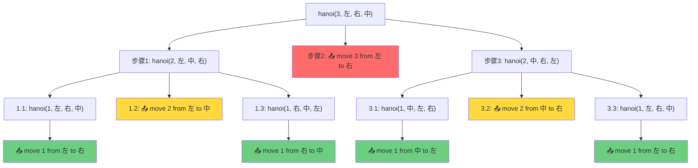

# 递归尝试1，汉诺塔问题

[返回章节](README.md) | [返回分类](../README.md) | [返回总目录](../../README.md)

- 状态：已标记完成
- 所属分类：基础巩固
- 所属章节：12 动态规划
- 原始条目：☒ 递归尝试1，汉诺塔问题

## 一句话结论
汉诺塔是最经典的递归拆分题：把 `N` 层塔从左挪到右，可以拆成“先挪上面 `N-1` 层，再挪最大盘，再挪 `N-1` 层”。
它最适合拿来练“递归函数的职责设计”和“当前层如何由子问题拼回答案”。

## 核心知识点
- 大问题拆成两个同类的 `N-1` 子问题。
- `N == 1` 是天然的 `base case`。
- 当前层真正只做一件业务动作：移动最大盘。
- 递归结构非常对称。

## 图片转写 / 题意还原
原图列出了几类典型递归尝试题，其中第一类就是：

- 打印层汉诺塔从最左边移动到最右边的全部过程

把它补成完整题目说明，就是：

- 有三根柱子，通常记为左、中、右
- 左边柱子上有 `N` 个大小不同的圆盘，小盘在上，大盘在下
- 目标是把这 `N` 个圆盘全部从左柱移动到右柱
- 移动过程中必须始终满足：
  - 一次只能移动最上面的一个盘子
  - 任何时候都不能把大盘压在小盘上面
- 要求打印出完整移动过程，或者说明最优移动步骤该如何递归生成

这题不是让你“随便搬过去”，而是要你给出合法且完整的搬运顺序。
递归里真正要表达的是：当我们说“把 `N` 层从左移到右”时，中柱就是临时中转区。

## 图解
### 核心思想：为什么要先移到中间？

**关键约束**：要移动最底层的最大盘子，必须先清空它上面的所有盘子！

以 `N=3` 为例，目标：**把第3层（最大的）从左柱移到右柱**

```
初始状态：
左柱      中柱      右柱
┌───┐
│ 1 │
├───┤
│ 2 │
├───┤
│ 3 │
└───┘
```

#### 第一步：把上面2层（1和2）从左 → 中

**为什么不能直接去右柱？**
- ❌ 如果1、2先去右柱，那第3层就没地方去了（右柱已有小盘，大盘不能压上去）
- ✅ 只能用中柱作为**临时中转站**

```
执行后：
左柱       中柱      右柱
          ┌───┐
          │ 1 │
          ├───┤
          │ 2 │
          └───┘
┌───┐
│ 3 │  ← 现在第3层露出来了！
└───┘
```

#### 第二步：移动最大盘（第3层）左 → 右

```
执行后：
左柱      中柱       右柱
         ┌───┐      ┌───┐
         │ 1 │      │   │
         ├───┤      │ 3 │  ← 最大盘到位！
         │ 2 │      │   │
         └───┘      └───┘
```

#### 第三步：把中柱的2层（1和2）中 → 右

```
最终状态：
左柱      中柱      右柱
                   ┌───┐
                   │ 1 │
                   ├───┤
                   │ 2 │
                   ├───┤
                   │ 3 │
                   └───┘
```

### 递归展开："把2层从左移到中"是如何实现的？

调用 `hanoi(2, 左, 中, 右)` 表示：**把2层从左柱移到中柱，借助右柱**

根据递归公式拆解（用参数表示，不硬编码）：
```java
hanoi(2, from=左, to=中, other=右) {
    // 步骤1: 先把上面 n-1 层从 from→other（借助 to）
    hanoi(1, from=左, to=右, other=中)
    
    // 步骤2: 移动当前最大盘（第n层）从 from→to
    print("move 2 from " + from + " to " + to)  // 即：左 → 中
    
    // 步骤3: 把那 n-1 层从 other→to（借助 from）
    hanoi(1, from=右, to=中, other=左)
}
```

**关键点**：
- 步骤2 打印的是 `from → to`，而不是固定的柱子名
- 在这个具体调用中，`from=左`、`to=中`，所以实际输出是 "左 → 中"
- 如果调用 `hanoi(2, 中, 右, 左)`，步骤2就会输出 "中 → 右"

### 完整执行流程（N=3）

调用 `hanoi(3, 左, 右, 中)`：**把3层从左柱移到右柱，借助中柱**

#### 第一层递归：hanoi(3, 左, 右, 中)
```
步骤1: hanoi(2, 左, 中, 右)   // 先把上面2层从左→中（借助右）
步骤2: print("move 3 from 左 to 右")  // 移动最大盘
步骤3: hanoi(2, 中, 右, 左)   // 再把那2层从中→右（借助左）
```

#### 展开步骤1：hanoi(2, 左, 中, 右)
```
1.1: hanoi(1, 左, 右, 中)  → 输出：move 1 from 左 to 右
1.2: print("move 2 from 左 to 中")
1.3: hanoi(1, 右, 中, 左)  → 输出：move 1 from 右 to 中
```

#### 展开步骤3：hanoi(2, 中, 右, 左)
```
3.1: hanoi(1, 中, 左, 右)  → 输出：move 1 from 中 to 左
3.2: print("move 2 from 中 to 右")
3.3: hanoi(1, 左, 右, 中)  → 输出：move 1 from 左 to 右
```

#### 最终输出顺序（共7步）
```
第1步: move 1 from 左 to 右     ← 来自 1.1
第2步: move 2 from 左 to 中     ← 来自 1.2
第3步: move 1 from 右 to 中     ← 来自 1.3
-------------------------------------------
第4步: move 3 from 左 to 右     ← 核心动作：移动最大盘！
-------------------------------------------
第5步: move 1 from 中 to 左     ← 来自 3.1
第6步: move 2 from 中 to 右     ← 来自 3.2
第7步: move 1 from 左 to 右     ← 来自 3.3
```

**观察规律**：
- ✅ 第4步（正中间）永远是移动最大盘（第3层）
- ✅ 前3步和后3步是对称的（都是处理2层塔的移动）
- ✅ 总步数 = 2³ - 1 = 7 步

### 递归调用流程图



**图例说明**：
- 🔴 红色节点：移动最大盘（核心动作）
- 🟡 黄色节点：移动第2层盘子
- 🟢 绿色节点：移动第1层盘子（base case）
- 📤 标记：实际输出语句
- 执行顺序：**从上到下、从左到右**深度优先遍历

**最终输出顺序**（按执行先后）：
1. move 1 from 左 to 右
2. move 2 from 左 to 中
3. move 1 from 右 to 中
4. **move 3 from 左 to 右** ← 核心
5. move 1 from 中 to 左
6. move 2 from 中 to 右
7. move 1 from 左 to 右

## 解题思路
定义函数：

```text
move(n, from, to, other)
表示把 n 层盘从 from 挪到 to
```

则：

- 若 `n == 1`，直接打印一步
- 否则：
  1. `move(n-1, from, other, to)`
  2. 打印 `from -> to`
  3. `move(n-1, other, to, from)`

## 复杂度
- 时间复杂度：`O(2^N)`
- 空间复杂度：`O(N)`

## 典型例子
`N = 2`：

```text
左 -> 中
左 -> 右
中 -> 右
```

## 易错点
- 当前层移动的不是任意盘，而是当前这层最大盘。
- 参数 `other` 不能省，它表示中转柱。
- 这个题是打印过程，不是只求步数。

## 代码 / 伪代码
课程标准伪代码：

```java
void hanoi(int n, String from, String to, String other) {
    if (n == 1) {
        print("move 1 from " + from + " to " + to);
        return;
    }
    hanoi(n - 1, from, other, to);
    print("move " + n + " from " + from + " to " + to);
    hanoi(n - 1, other, to, from);
}
```

## 记忆点
- 汉诺塔是递归分治样板题。
- `n-1`、最大盘、`n-1`。
- `n == 1` 是 base case。
- 先想函数职责，再展开过程。
