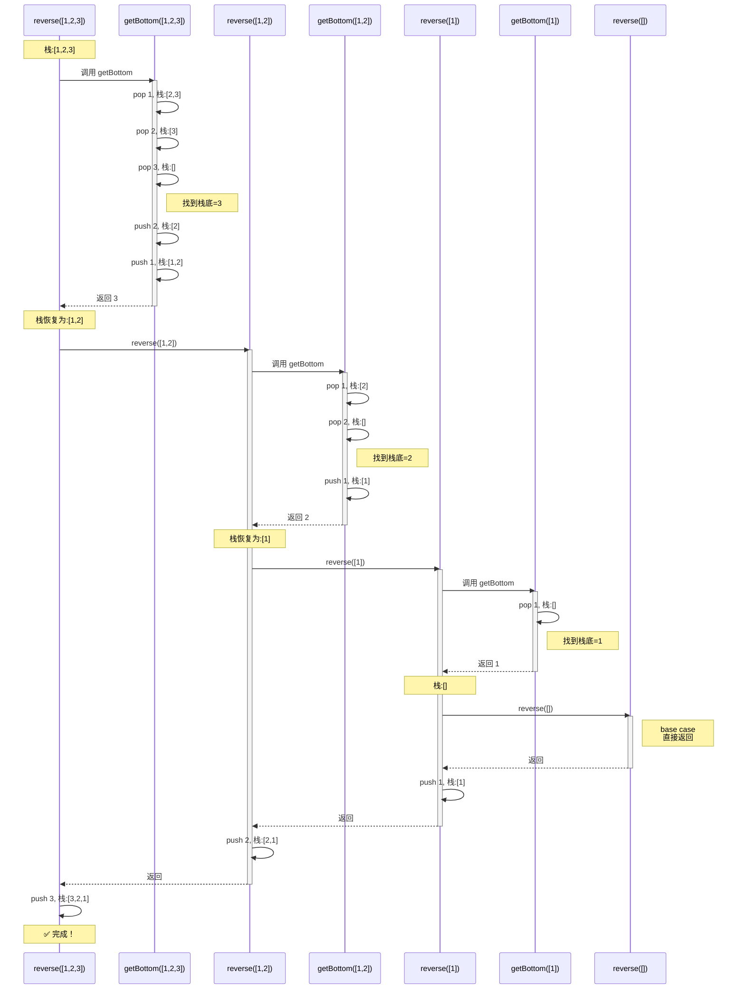

# 逆序栈（递归实现）

[返回章节](README.md) | [返回分类](../README.md) | [返回总目录](../../README.md)

- 状态：已标记完成
- 所属分类：基础巩固
- 所属章节：12 暴力递归到动态规划1-递归尝试
- 原始条目：☒ 逆序一个栈（此题逻辑较难，且偏门，可以先跳过）

## 一句话结论
**只用递归函数、不申请额外数据结构**，把栈原地逆序。核心是设计辅助函数 `getBottom` 取出栈底元素，主函数通过"先逆序剩余部分，再把栈底压回栈顶"完成翻转。

## 理论 / 应用价值

### 为什么值得学

1. **深化递归本质理解**：认识到递归调用栈本身就是数据结构
2. **训练辅助函数设计**：学会拆解问题为主函数+辅助函数
3. **理解回溯机制**：`getBottom` 的"弹出-递归-压回"是回溯思想雏形
4. **面试高频题**：大厂常考此题检验递归理解深度

## 题意还原

**要求**：
- 输入：一个已有元素的栈
- 输出：把整个栈原地逆序
- 约束：**不能**使用额外栈、数组等数据结构，**只能**用递归函数

## 图解

### 核心思路



**时序图说明**：
- ⬇️ **向下箭头**：函数调用（递归深入）
- ⬆️ **向上虚线**：函数返回（回溯阶段）
- 🔵 **activate 框**：函数活跃期（正在执行）
- 📝 **Note**：关键状态变化和 base case
- **执行顺序**：从上到下按时间顺序，清晰展示"调用-执行-返回"的完整生命周期

### 执行示例（栈 [1,2,3]）

```
初始: [1, 2, 3]  (1是栈顶)

reverse([1,2,3]):
  ├─ getBottom → 返回3, 栈变[1,2]
  ├─ reverse([1,2])
  │   ├─ getBottom → 返回2, 栈变[1]
  │   ├─ reverse([1])
  │   │   ├─ getBottom → 返回1, 栈变[]
  │   │   ├─ reverse([]) → base case
  │   │   └─ push 1 → 栈[1]
  │   └─ push 2 → 栈[1,2]
  └─ push 3 → 栈[3,2,1] ✅
```

## 解题思路

### 步骤1：设计 `getBottom` - 取出栈底

```java
int getBottom(Stack<Integer> stack) {
    int top = stack.pop();
    if (stack.isEmpty()) {
        return top;  // base case: 找到栈底
    }
    int last = getBottom(stack);  // 递归找栈底
    stack.push(top);  // 回溯: 恢复其他元素
    return last;
}
```

**关键**：弹出→递归→压回（回溯思想）

### 步骤2：设计 `reverse` - 逆序栈

```java
void reverse(Stack<Integer> stack) {
    if (stack.isEmpty()) {
        return;  // base case: 空栈
    }
    int bottom = getBottom(stack);  // 拿出栈底
    reverse(stack);  // 逆序剩余部分
    stack.push(bottom);  // 原栈底变新栈顶
}
```

**关键**：拿底→逆序剩余→压底

## 复杂度

- **时间复杂度**：`O(N²)` - `reverse` 调用 N 次，每次 `getBottom` 耗时 O(N)
- **空间复杂度**：`O(N)` - 递归调用栈深度

## 易错点

- ❌ `getBottom` 回溯时忘记 `push(top)`，导致栈被破坏
- ❌ 混淆两个函数职责：`getBottom` 拿底，`reverse` 逆序
- ❌ `getBottom` 的 base case 是"弹出后栈空"，不是"栈空"

## 完整代码

```java
import java.util.Stack;

public class ReverseStack {
    public static int getBottom(Stack<Integer> stack) {
        int top = stack.pop();
        if (stack.isEmpty()) {
            return top;
        }
        int last = getBottom(stack);
        stack.push(top);
        return last;
    }
    
    public static void reverse(Stack<Integer> stack) {
        if (stack.isEmpty()) {
            return;
        }
        int bottom = getBottom(stack);
        reverse(stack);
        stack.push(bottom);
    }
}
```

## 记忆点

- 先设计"拿栈底"辅助函数 `getBottom`
- `getBottom`：弹出-递归-压回（回溯）
- `reverse`：拿底-逆序剩余-压底
- 靠的是**系统调用栈**，不是额外数据结构
