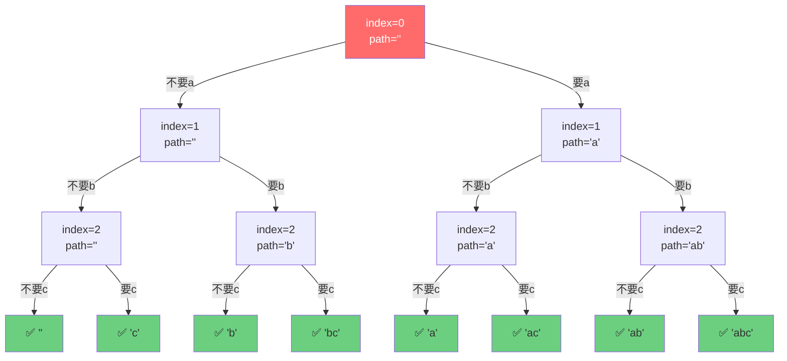

# 打印字符串全部子序列

[返回章节](README.md) | [返回分类](../README.md) | [返回总目录](../../README.md)

- 状态：已标记完成
- 所属分类：基础巩固
- 所属章节：12 暴力递归到动态规划1-递归尝试
- 原始条目：☒ 递归尝试2，打印字符串的全部子序列（也是一个深度优先遍历）

## 一句话结论
打印字符串全部子序列是**最基础的递归树/DFS题**：每个字符只有"要"或"不要"两种选择，形成一棵二叉决策树。这是理解"递归尝试"和"深度优先遍历"的最佳入门题。

## 理论 / 应用价值

### 在知识体系中的位置

```
基础递归（汉诺塔、逆序栈）
  ↓ 理解函数职责、base case
二叉决策树（子序列）
  ↓ 理解"尝试所有可能性"
排列组合、回溯算法
  ↓ 剪枝优化
动态规划
```

### 为什么值得学

1. **理解"尝试法"建模**
   - 每个位置做选择（要/不要），枚举所有可能
   - 这是后续学习排列组合、回溯算法的基础

2. **掌握 DFS 思维**
   - 递归树就是一次深度优先遍历
   - 从根到叶子的每条路径都是一个解

3. **区分"子序列"与"子串"**
   - 子序列：保持相对顺序，可以不连续
   - 子串：必须连续
   - 这个区分在字符串题目中非常重要

### 解决的痛点

- **面试基础题**：大厂常考此类题检验递归基本功
- **理解指数级复杂度**：2^N 个子序列，直观感受指数爆炸
- **为回溯算法铺垫**：本题是回溯算法的最简版本

### 实际应用场景

- 字符串匹配中的子序列判断
- 基因序列分析
- 文本差异比较（LCS 最长公共子序列的基础）

## 核心知识点
- **二叉决策**：每个位置有两种选择（选 / 不选）
- **递归参数**：当前位置 `index` + 当前路径 `path`
- **Base Case**：`index` 走到末尾时，收集当前路径
- **保序性**：子序列保持原字符串的相对顺序
- **去重策略**：无重复用 List，有重复用 Set

## 题意还原

### 版本1：无重复字符（基础版）

**要求**：
- **输入**：一个无重复字符的字符串，例如 `"abc"`
- **输出**：打印它的全部子序列
- **规则**：
  - 子序列保持字符的相对顺序，但可以跳过某些字符
  - 空串 `""` 也算一个合法子序列

**示例**：
```
输入: "abc"
输出: "", "a", "b", "c", "ab", "ac", "bc", "abc"
共 2^3 = 8 个子序列
```

### 版本2：有重复字符（去重版）

**要求**：
- **输入**：一个可能包含重复字符的字符串，如 `"acc"`
- **输出**：打印它的全部**不重复**子序列
- **关键**：输出结果中不能有重复的子序列

**示例**：
```
输入: "acc"

暴力展开会有 2^3 = 8 条路径:
  "", "c", "c", "cc", "a", "ac", "ac", "acc"
  
去重后得到 6 个唯一子序列:
  "", "a", "c", "ac", "cc", "acc"
```

**关键区分：子序列 vs 子串**

### 子序列（Subsequence）的核心定义

**子序列**是从原字符串中删除零个或多个字符（也可以不删除），**保持剩余字符的相对顺序不变**所形成的新字符串。

**关键特征**：
- ✅ **保持相对顺序**：字符在原字符串中的先后关系不能改变
- ✅ **可以不连续**：可以跳过某些字符
- ❌ **不能交换位置**：不能打乱原有顺序

**示例**：原字符串 `"abc"`
```
✅ 合法子序列："", "a", "b", "c", "ab", "ac", "bc", "abc"
❌ 非法（改变了顺序）："ba", "cb", "cba"
```

### 子串（Substring）的定义

**子串**是原字符串中**连续**的一段字符。

**关键特征**：
- ✅ **必须连续**：不能跳过字符
- ✅ **保持顺序**：自然是有序的

**示例**：原字符串 `"abc"`
```
✅ 合法子串："a", "b", "c", "ab", "bc", "abc"
❌ 非法（不连续）："ac" (跳过了b)
```

### 对比总结

| 特性 | 子序列 | 子串 |
|------|--------|------|
| **连续性** | ❌ 不要求连续 | ✅ 必须连续 |
| **相对顺序** | ✅ 必须保持 | ✅ 自然保持 |
| **数量** | 2^N 个 | N*(N+1)/2 个 |
| **示例**（"abc"） | "ac" ✅ | "ac" ❌ |

## 图解

### 基础版：递归决策树（以 `"abc"` 为例）



**图示说明**：
- 🔴 **红色**：起始节点
- 🟢 **绿色**：叶子节点（base case，收集结果）
- **左分支**：不要当前字符
- **右分支**：要当前字符
- **执行顺序**：深度优先，从左到右
- **结果数量**：2^3 = 8 个叶子节点

### 去重版：递归树与去重过程（以 `"acc"` 为例）

```
process("acc", 0, "")
├─ 不要a: process("acc", 1, "")
│   ├─ 不要c1: process("acc", 2, "")
│   │   ├─ 不要c2: → ✅ ""       (加入Set)
│   │   └─ 要c2: → ✅ "c"        (加入Set)
│   └─ 要c1: process("acc", 2, "c")
│       ├─ 不要c2: → ❌ "c"      (重复！Set自动忽略)
│       └─ 要c2: → ✅ "cc"       (加入Set)
└─ 要a: process("acc", 1, "a")
    ├─ 不要c1: process("acc", 2, "a")
    │   ├─ 不要c2: → ✅ "a"      (加入Set)
    │   └─ 要c2: → ✅ "ac"       (加入Set)
    └─ 要c1: process("acc", 2, "ac")
        ├─ 不要c2: → ❌ "ac"     (重复！Set自动忽略)
        └─ 要c2: → ✅ "acc"      (加入Set)

最终 Set 中的结果:
["", "c", "cc", "a", "ac", "acc"]  共6个
```

**关键观察**：
- ❌ **红色标记**：重复的子序列（被 Set 自动过滤）
- ✅ **绿色标记**：唯一的子序列（被保留）
- 📊 **路径数**：仍然有 8 条路径
- 📊 **结果数**：去重后只有 6 个唯一值

## 解题思路

### 核心思想：每个位置做选择

对于字符串的每个位置 `index`，有两种选择：
1. **不要**当前字符：`path` 不变，`index+1`
2. **要**当前字符：`path + str[index]`，`index+1`

当 `index` 走到末尾时，`path` 就是一个完整的子序列。

### 版本1：基础版代码（无重复）

```java
void process(char[] str, int index, String path, List<String> ans) {
    // Base Case: 走到末尾，收集结果
    if (index == str.length) {
        ans.add(path);
        return;
    }
    
    // 选择1: 不要当前字符
    process(str, index + 1, path, ans);
    
    // 选择2: 要当前字符
    process(str, index + 1, path + str[index], ans);
}

// 调用方式
List<String> ans = new ArrayList<>();
process(str.toCharArray(), 0, "", ans);
```

### 版本2：去重版代码（有重复）

```java
void process(char[] str, int index, String path, Set<String> ans) {
    // Base Case: 走到末尾，加入Set（自动去重）
    if (index == str.length) {
        ans.add(path);  // Set自动处理重复
        return;
    }
    
    // 选择1: 不要当前字符
    process(str, index + 1, path, ans);
    
    // 选择2: 要当前字符
    process(str, index + 1, path + str[index], ans);
}

// 调用方式
Set<String> ans = new HashSet<>();
process(str.toCharArray(), 0, "", ans);
```

**关键区别**：只需将 `List<String>` 改为 `Set<String>`，其他完全相同！

### 执行流程（以 `"abc"` 为例）

```
process("abc", 0, "")
├─ 不要a: process("abc", 1, "")
│   ├─ 不要b: process("abc", 2, "")
│   │   ├─ 不要c: process("abc", 3, "") → ✅ ""
│   │   └─ 要c: process("abc", 3, "c") → ✅ "c"
│   └─ 要b: process("abc", 2, "b")
│       ├─ 不要c: process("abc", 3, "b") → ✅ "b"
│       └─ 要c: process("abc", 3, "bc") → ✅ "bc"
└─ 要a: process("abc", 1, "a")
    ├─ 不要b: process("abc", 2, "a")
    │   ├─ 不要c: process("abc", 3, "a") → ✅ "a"
    │   └─ 要c: process("abc", 3, "ac") → ✅ "ac"
    └─ 要b: process("abc", 2, "ab")
        ├─ 不要c: process("abc", 3, "ab") → ✅ "ab"
        └─ 要c: process("abc", 3, "abc") → ✅ "abc"

结果: ["", "c", "b", "bc", "a", "ac", "ab", "abc"]
```

**注意**：实际输出顺序取决于先递归哪个分支。上面是先“不要”后“要”，所以空串在最前。

## 复杂度

### 基础版（无重复）

- **时间复杂度**：`O(N * 2^N)`
  - 共有 2^N 个子序列
  - 每个叶子节点需要 O(N) 时间复制字符串
  
- **空间复杂度**：`O(N)`
  - 递归深度为 N
  - 每层存储一个字符的路径

### 去重版（有重复）

- **时间复杂度**：`O(N * 2^N)`
  - 仍然遍历所有 2^N 条路径
  - 每个叶子节点插入 Set 需要 O(N)（字符串哈希计算）
  
- **空间复杂度**：`O(2^N)`
  - 最坏情况下（无重复字符），Set 存储 2^N 个子序列
  - 每个子序列平均长度 O(N)
  - 递归栈深度 O(N)

## 典型例子

### 基础版：以 `"ab"` 为例

```
process("ab", 0, "")
├─ 不要a: process("ab", 1, "")
│   ├─ 不要b: → ✅ ""
│   └─ 要b: → ✅ "b"
└─ 要a: process("ab", 1, "a")
    ├─ 不要b: → ✅ "a"
    └─ 要b: → ✅ "ab"

结果: ["", "b", "a", "ab"] 共 2^2 = 4 个
```

### 去重版：以 `"aab"` 为例

```
暴力展开 2^3 = 8 条路径:
  "", "b", "a", "ab", "a", "ab", "aa", "aab"
  
去重后得到 6 个唯一子序列:
  "", "a", "b", "aa", "ab", "aab"
```

**注意**：`"a"` 和 `"ab"` 各出现两次，被 Set 自动去重。

## 易错点

- ❌ **混淆子序列和子串**：子序列可以不连续，子串必须连续
- ❌ **忘记空串**：空串也是合法子序列
- ❌ **路径拼接错误**：Java 中 String 是不可变的，`path + str[index]` 会创建新字符串
- ❌ **base case 判断错误**：应该是 `index == str.length`，不是 `index > str.length`
- ❌ **忘记去重**（有重复字符时）：直接用 List 收集，导致结果有重复
- ❌ **误以为递归会减少**：即使去重，仍然要遍历所有 2^N 条路径

## 扩展思考

### 两种去重策略对比

| 策略 | 实现方式 | 优点 | 缺点 |
|------|---------|------|------|
| **结果去重**（本题） | 用 Set 收集 | 简单直观，代码改动小 | 仍然遍历所有路径，效率低 |
| **过程去重**（进阶） | 递归时剪枝 | 减少无效搜索，效率高 | 实现复杂，需排序+判断 |

#### 结果去重 vs 过程去重：详细对比

**1. 结果去重（Set 收集）**

```java
// 无需排序，直接递归
void process(char[] str, int index, String path, Set<String> ans) {
    if (index == str.length) {
        ans.add(path);  // Set自动去重
        return;
    }
    process(str, index + 1, path, ans);
    process(str, index + 1, path + str[index], ans);
}
```

- ✅ **优点**：代码最简单，只需改数据类型
- ✅ **适用**：任何顺序的输入字符串
- ❌ **缺点**：即使有重复，仍遍历所有 2^N 条路径

**2. 过程去重（剪枝优化）**

```java
// 需要先排序
Arrays.sort(str);

void process(char[] str, int index, String path, Set<String> ans) {
    if (index == str.length) {
        ans.add(path);
        return;
    }
    
    // 不要当前字符
    process(str, index + 1, path, ans);
    
    // 要当前字符：如果与前一个相同且前一个没选，则跳过
    if (index == 0 || str[index] != str[index-1]) {
        process(str, index + 1, path + str[index], ans);
    }
}
```

- ✅ **优点**：提前剪枝，减少无效搜索
- ✅ **效率**：对于大量重复字符，性能提升明显
- ❌ **缺点**：需要预排序，改变了原字符串顺序
- ❌ **复杂度**：实现逻辑更复杂，容易出错

#### 性能对比示例

以 `"aaaaa"`（5个相同字符）为例：

| 指标 | 结果去重 | 过程去重 |
|------|---------|----------|
| 遍历路径数 | 2^5 = 32 条 | 6 条（只生成 "", "a", "aa", "aaa", "aaaa", "aaaaa"） |
| Set插入次数 | 32 次 | 6 次 |
| 时间节省 | - | **约 80%** |

**结论**：
- 重复字符越多，过程去重优势越明显
- 无重复字符时，两者性能相近
- 面试中优先写结果去重，有时间再优化为过程去重

### 如果只求数量？

不需要生成所有子序列，直接返回 `2^N` 即可。

### 与排列组合的区别？

- **子序列**：保序，每个位置选/不选 → 2^N
- **全排列**：不保序，交换位置 → N!
- **组合**：从 N 个中选 K 个 → C(N,K)

### 三版本对比总结

| 特性 | 基础版（无重复） | 结果去重（有重复） | 过程去重（优化版） |
|------|-----------------|-------------------|-------------------|
| **数据结构** | `List<String>` | `Set<String>` | `Set<String>` |
| **是否需要排序** | ❌ 否 | ❌ 否 | ✅ 是 |
| **递归结构** | 二叉决策树 | 二叉决策树 | 二叉决策树（带剪枝） |
| **时间复杂度** | O(N * 2^N) | O(N * 2^N) | O(N * K)，K为唯一子序列数 |
| **空间复杂度** | O(N) | O(2^N) | O(K) |
| **遍历路径数** | 2^N | 2^N | ≤ 2^N（剪枝后减少） |
| **结果数量** | 2^N | ≤ 2^N | ≤ 2^N |
| **代码难度** | ⭐ 简单 | ⭐ 简单 | ⭐⭐⭐ 较复杂 |
| **适用场景** | 字符串无重复 | 字符串可能有重复 | 大量重复字符，追求性能 |
| **面试推荐度** | ✅ 首选 | ✅ 首选 | ⚠️ 进阶优化 |

**选择建议**：
1. **无重复字符** → 用基础版（List）
2. **有重复字符** → 优先用结果去重（Set），简单可靠
3. **大量重复 + 性能要求高** → 用过程去重（剪枝优化）
