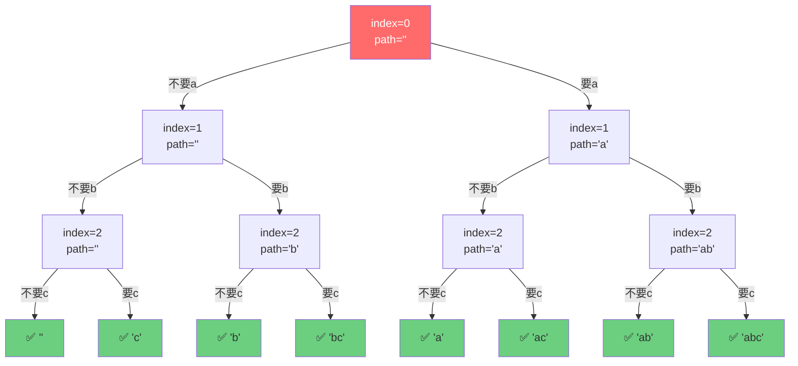

# 打印字符串全部子序列

[返回章节](README.md) | [返回分类](../README.md) | [返回总目录](../../README.md)

- 状态：已标记完成
- 所属分类：基础巩固
- 所属章节：12 暴力递归到动态规划1-递归尝试
- 原始条目：☒ 递归尝试2，打印字符串的全部子序列（也是一个深度优先遍历）

## 一句话结论
打印字符串全部子序列是**最基础的递归树/DFS题**：每个字符只有"要"或"不要"两种选择，形成一棵二叉决策树。这是理解"递归尝试"和"深度优先遍历"的最佳入门题。

## 理论 / 应用价值

### 在知识体系中的位置

```
基础递归（汉诺塔、逆序栈）
  ↓ 理解函数职责、base case
二叉决策树（子序列）
  ↓ 理解"尝试所有可能性"
排列组合、回溯算法
  ↓ 剪枝优化
动态规划
```

### 为什么值得学

1. **理解"尝试法"建模**
   - 每个位置做选择（要/不要），枚举所有可能
   - 这是后续学习排列组合、回溯算法的基础

2. **掌握 DFS 思维**
   - 递归树就是一次深度优先遍历
   - 从根到叶子的每条路径都是一个解

3. **区分"子序列"与"子串"**
   - 子序列：保持相对顺序，可以不连续
   - 子串：必须连续
   - 这个区分在字符串题目中非常重要

### 解决的痛点

- **面试基础题**：大厂常考此类题检验递归基本功
- **理解指数级复杂度**：2^N 个子序列，直观感受指数爆炸
- **为回溯算法铺垫**：本题是回溯算法的最简版本

### 实际应用场景

- 字符串匹配中的子序列判断
- 基因序列分析
- 文本差异比较（LCS 最长公共子序列的基础）

## 核心知识点
- **二叉决策**：每个位置有两种选择（选 / 不选）
- **递归参数**：当前位置 `index` + 当前路径 `path`
- **Base Case**：`index` 走到末尾时，收集当前路径
- **保序性**：子序列保持原字符串的相对顺序

## 题意还原

**要求**：
- **输入**：一个字符串，例如 `"abc"`
- **输出**：打印它的全部子序列
- **规则**：
  - 子序列保持字符的相对顺序，但可以跳过某些字符
  - 空串 `""` 也算一个合法子序列
  - 需要枚举并打印所有可能的子序列

**示例**：
```
输入: "abc"
输出: "", "a", "b", "c", "ab", "ac", "bc", "abc"
共 2^3 = 8 个子序列
```

**关键区分：子序列 vs 子串**
- **子串**：必须连续，如 `"ab"`, `"bc"` ✅；但 `"ac"` ❌
- **子序列**：只需保序，可以不连续，如 `"ac"` ✅

## 图解

### 递归决策树（以 `"abc"` 为例）



**图示说明**：
- 🔴 **红色**：起始节点
- 🟢 **绿色**：叶子节点（base case，收集结果）
- **左分支**：不要当前字符
- **右分支**：要当前字符
- **执行顺序**：深度优先，从左到右
- **结果数量**：2^3 = 8 个叶子节点

## 解题思路

### 核心思想：每个位置做选择

对于字符串的每个位置 `index`，有两种选择：
1. **不要**当前字符：`path` 不变，`index+1`
2. **要**当前字符：`path + str[index]`，`index+1`

当 `index` 走到末尾时，`path` 就是一个完整的子序列。

### 代码实现

```java
void process(char[] str, int index, String path, List<String> ans) {
    // Base Case: 走到末尾，收集结果
    if (index == str.length) {
        ans.add(path);
        return;
    }
    
    // 选择1: 不要当前字符
    process(str, index + 1, path, ans);
    
    // 选择2: 要当前字符
    process(str, index + 1, path + str[index], ans);
}

// 调用方式
List<String> ans = new ArrayList<>();
process(str.toCharArray(), 0, "", ans);
```

### 执行流程（以 `"abc"` 为例）

```
process("abc", 0, "")
├─ 不要a: process("abc", 1, "")
│   ├─ 不要b: process("abc", 2, "")
│   │   ├─ 不要c: process("abc", 3, "") → ✅ ""
│   │   └─ 要c: process("abc", 3, "c") → ✅ "c"
│   └─ 要b: process("abc", 2, "b")
│       ├─ 不要c: process("abc", 3, "b") → ✅ "b"
│       └─ 要c: process("abc", 3, "bc") → ✅ "bc"
└─ 要a: process("abc", 1, "a")
    ├─ 不要b: process("abc", 2, "a")
    │   ├─ 不要c: process("abc", 3, "a") → ✅ "a"
    │   └─ 要c: process("abc", 3, "ac") → ✅ "ac"
    └─ 要b: process("abc", 2, "ab")
        ├─ 不要c: process("abc", 3, "ab") → ✅ "ab"
        └─ 要c: process("abc", 3, "abc") → ✅ "abc"

结果: ["", "c", "b", "bc", "a", "ac", "ab", "abc"]
```

**注意**：实际输出顺序取决于先递归哪个分支。上面是先“不要”后“要”，所以空串在最前。

## 复杂度

- **时间复杂度**：`O(2^N)`
  - 共有 2^N 个子序列
  - 每个叶子节点需要 O(N) 时间复制字符串
  - 总计：O(N * 2^N)
  
- **空间复杂度**：`O(N)`
  - 递归深度为 N
  - 每层存储一个字符的路径

## 典型例子

以 `"ab"` 为例：

```
process("ab", 0, "")
├─ 不要a: process("ab", 1, "")
│   ├─ 不要b: → ✅ ""
│   └─ 要b: → ✅ "b"
└─ 要a: process("ab", 1, "a")
    ├─ 不要b: → ✅ "a"
    └─ 要b: → ✅ "ab"

结果: ["", "b", "a", "ab"] 共 2^2 = 4 个
```

## 易错点

- ❌ **混淆子序列和子串**：子序列可以不连续，子串必须连续
- ❌ **忘记空串**：空串也是合法子序列
- ❌ **路径拼接错误**：Java 中 String 是不可变的，`path + str[index]` 会创建新字符串
- ❌ **base case 判断错误**：应该是 `index == str.length`，不是 `index > str.length`

## 扩展思考

### 如果要求去重？

如果字符串有重复字符（如 `"aab"`），会产生重复子序列。解决方法：
- 用 `Set<String>` 替代 `List<String>`
- 或在递归时跳过相同字符

### 如果只求数量？

不需要生成所有子序列，直接返回 `2^N` 即可。

### 与排列组合的区别？

- **子序列**：保序，每个位置选/不选 → 2^N
- **全排列**：不保序，交换位置 → N!
- **组合**：从 N 个中选 K 个 → C(N,K)
