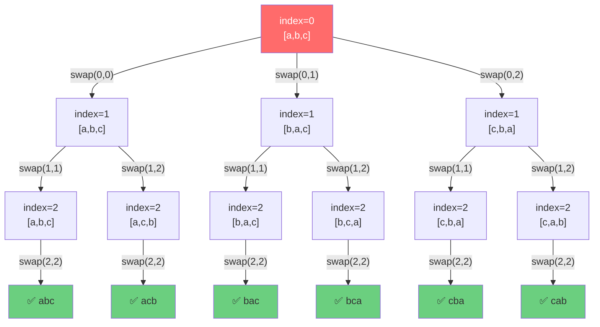

# 打印字符串全排列

[返回章节](README.md) | [返回分类](../README.md) | [返回总目录](../../README.md)

- 状态：已标记完成
- 所属分类：基础巩固
- 所属章节：12 暴力递归到动态规划1-递归尝试
- 原始条目：☒ 递归尝试4，打印字符串的全排列（使用一个数组实现）

## 一句话结论
打印字符串全排列是经典的**回溯算法**题：通过"交换-递归-恢复"的套路，枚举每个位置可以放置的字符。核心思想是**当前位置该放谁**，从剩余字符中依次选择。

## 理论 / 应用价值

### 在知识体系中的位置

```
基础递归（汉诺塔、子序列）
  ↓ 理解函数职责、base case
排列组合（全排列）
  ↓ 学习"交换+回溯"模式
带重复的排列去重
  ↓ 剪枝优化
高级回溯算法（N皇后、数独等）
```

### 为什么值得学

1. **掌握"交换+回溯"经典模式**
   - 这是回溯算法的基础模板之一
   - 学会如何在原数组上操作，避免额外空间

2. **理解"恢复现场"的重要性**
   - 交换后必须恢复，保证下一次尝试的正确性
   - 这是回溯算法的核心思想

3. **区分"排列"与"子序列/组合"**
   - 排列：所有字符都要用，关注顺序
   - 子序列：可以选择部分字符，保持相对顺序
   - 组合：选择部分字符，不关注顺序

### 解决的痛点

- **面试高频题**：大厂必考，检验回溯算法基本功
- **理解阶乘复杂度**：N! 增长极快，感受指数爆炸
- **为复杂回溯打基础**：N皇后、数独等都用到类似思路

### 实际应用场景

- 密码爆破（枚举所有可能组合）
- 任务调度（枚举所有执行顺序）
- 路径规划（枚举所有访问顺序）

## 核心知识点
- **决策方式**：当前位置从剩余字符中选择一个
- **递归参数**：`index` 表示当前要决定第几位
- **交换套路**：交换 → 递归 → 恢复（回溯）
- **全排列数量**：N个不同字符有 N! 种排列

## 题意还原

**要求**：
- **输入**：一个字符串，例如 `"abc"`
- **输出**：打印它的全部排列（所有字符都要用上）
- **规则**：
  - 每种不同的字符顺序算一种排列
  - 所有字符都必须使用，不能遗漏
  - 需要枚举并打印所有可能的排列

**示例**：
```
输入: "abc"
输出: "abc", "acb", "bac", "bca", "cab", "cba"
共 3! = 6 种排列
```

**关键区分：全排列 vs 子序列**

### 全排列（Permutation）
- **必须使用所有字符**
- **关注顺序**：`"abc"` 和 `"acb"` 是不同的排列
- **数量**：N! 种（N为字符数）

### 子序列（Subsequence）
- **可以选择部分字符**
- **保持相对顺序**：不能打乱原有顺序
- **数量**：2^N 种

**对比示例**（原串 `"abc"`）：
```
全排列："abc", "acb", "bac", "bca", "cab", "cba"  (6种)
子序列："", "a", "b", "c", "ab", "ac", "bc", "abc"  (8种)
```

## 图解

### 递归决策树（以 `"abc"` 为例）



**图示说明**：
- 🔴 **红色**：起始状态
- 🟢 **绿色**：叶子节点（base case，收集结果）
- **每层决策**：从当前位置开始，依次与后面的字符交换
- **分支数量**：第0层3个分支，第1层2个分支，第2层1个分支
- **结果数量**：3! = 6 个叶子节点

## 解题思路

### 核心思想：当前位置该放谁

对于位置 `index`，从 `[index...n-1]` 中选择一个字符放到当前位置：
1. **交换**：将选中的字符交换到 `index` 位置
2. **递归**：处理下一个位置 `index+1`
3. **恢复**：交换回来，保证下一次尝试的正确性（回溯）

当 `index == str.length` 时，所有位置都已确定，收集结果。

### 代码实现

```java
void process(char[] str, int index, List<String> ans) {
    // Base Case: 所有位置都已确定
    if (index == str.length) {
        ans.add(String.valueOf(str));
        return;
    }
    
    // 从 index 开始，依次与后面的字符交换
    for (int i = index; i < str.length; i++) {
        swap(str, index, i);           // 1. 交换
        process(str, index + 1, ans);  // 2. 递归
        swap(str, index, i);           // 3. 恢复（回溯）
    }
}

// 辅助函数：交换两个位置
void swap(char[] str, int i, int j) {
    char temp = str[i];
    str[i] = str[j];
    str[j] = temp;
}

// 调用方式
List<String> ans = new ArrayList<>();
process(str.toCharArray(), 0, ans);
```

### 执行流程（以 `"abc"` 为例）

```
process([a,b,c], 0)
├─ i=0: swap(0,0) → [a,b,c]
│   ├─ process([a,b,c], 1)
│   │   ├─ i=1: swap(1,1) → [a,b,c]
│   │   │   └─ process([a,b,c], 2) → ✅ "abc"
│   │   └─ i=2: swap(1,2) → [a,c,b]
│   │       └─ process([a,c,b], 2) → ✅ "acb"
│   │       恢复: swap(1,2) → [a,b,c]
│   恢复: swap(0,0) → [a,b,c]
│
├─ i=1: swap(0,1) → [b,a,c]
│   ├─ process([b,a,c], 1)
│   │   ├─ i=1: swap(1,1) → [b,a,c]
│   │   │   └─ process([b,a,c], 2) → ✅ "bac"
│   │   └─ i=2: swap(1,2) → [b,c,a]
│   │       └─ process([b,c,a], 2) → ✅ "bca"
│   │       恢复: swap(1,2) → [b,a,c]
│   恢复: swap(0,1) → [a,b,c]
│
└─ i=2: swap(0,2) → [c,b,a]
    ├─ process([c,b,a], 1)
    │   ├─ i=1: swap(1,1) → [c,b,a]
    │   │   └─ process([c,b,a], 2) → ✅ "cba"
    │   └─ i=2: swap(1,2) → [c,a,b]
    │       └─ process([c,a,b], 2) → ✅ "cab"
    │       恢复: swap(1,2) → [c,b,a]
    恢复: swap(0,2) → [a,b,c]

结果: ["abc", "acb", "bac", "bca", "cba", "cab"]
```

**关键观察**：
- ✅ 每次交换后都要恢复，保证下一次循环的正确性
- ✅ 第0层有3个分支（a/b/c都可以放第0位）
- ✅ 第1层有2个分支（剩余2个字符选1个）
- ✅ 第2层有1个分支（只剩1个字符）

## 复杂度

- **时间复杂度**：`O(N * N!)`
  - 共有 N! 个排列
  - 每个排列需要 O(N) 时间转换为字符串
  - 总计：O(N * N!)
  
- **空间复杂度**：`O(N)`
  - 递归深度为 N
  - 每层只需要常数级别的额外空间（交换操作）
  - 不包括存储结果的空间

## 典型例子

以 `"ab"` 为例：

```
process([a,b], 0)
├─ i=0: swap(0,0) → [a,b]
│   └─ process([a,b], 1) → ✅ "ab"
└─ i=1: swap(0,1) → [b,a]
    └─ process([b,a], 1) → ✅ "ba"

结果: ["ab", "ba"] 共 2! = 2 种
```

## 易错点

- ❌ **忘记恢复现场**：交换后没有 swap 回来，导致后续排列错误
- ❌ **混淆排列与子序列**：排列必须用所有字符，子序列可以选部分
- ❌ **base case 判断错误**：应该是 `index == str.length`，不是 `index > str.length`
- ❌ **循环起点错误**：应该从 `i = index` 开始，不是 `i = 0`

## 扩展思考

### 如果有重复字符怎么办？

如果字符串有重复字符（如 `"aab"`），会产生重复排列。解决方法：

**方法1：结果去重**
```java
Set<String> ans = new HashSet<>();
// 收集时用 Set 自动去重
```

**方法2：过程去重（剪枝）**
```java
// 在同一层递归中，如果某个字符已经用过，就跳过
boolean[] used = new boolean[256]; // 记录本层已使用的字符
for (int i = index; i < str.length; i++) {
    if (used[str[i]]) continue; // 跳过重复字符
    used[str[i]] = true;
    
    swap(str, index, i);
    process(str, index + 1, ans);
    swap(str, index, i);
}
```

### 与子序列的对比

| 特性 | 全排列 | 子序列 |
|------|--------|--------|
| **字符使用** | 必须全部使用 | 可以选择部分 |
| **顺序要求** | 可以任意顺序 | 必须保持相对顺序 |
| **数量** | N! | 2^N |
| **核心操作** | 交换 + 回溯 | 选/不选 |
| **决策方式** | 当前位置放谁 | 当前字符要不要 |
