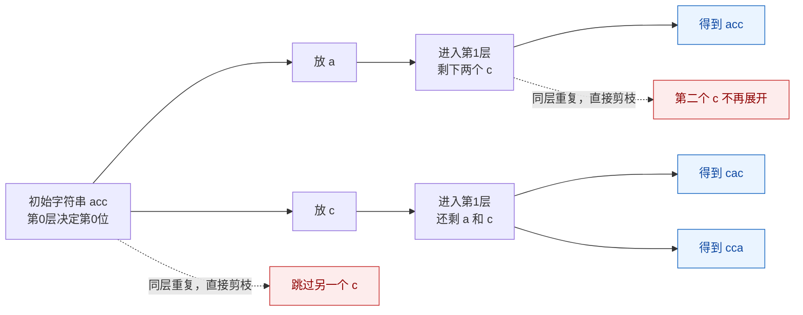

# 打印字符串全排列（去重版-分支限界）

[返回章节](README.md) | [返回分类](../README.md) | [返回总目录](../../README.md)

- 状态：已标记完成
- 所属分类：基础巩固
- 所属章节：12 暴力递归到动态规划1-递归尝试
- 原始条目：☒ 递归尝试5，打印字符串的全排列，且不能重复 （改进版：分支限界）

## 一句话结论
当字符串包含**重复字符**时，普通全排列会生成重复答案。本题采用**分支限界**技术，在递归展开时就剪掉重复分支，保证**同一层相同字符只尝试一次**，从源头避免重复。

## 理论 / 应用价值

### 在知识体系中的位置

```
基础全排列（无重复）
  ↓ 掌握"交换+回溯"模式
去重全排列（有重复字符）
  ↓ 学习"分支限界"技术
高级回溯算法（N皇后、数独等）
  ↓ 复杂剪枝策略
组合优化问题
```

### 为什么值得学

1. **理解"分支限界"思想**
   - 在搜索过程中提前剪枝，避免无效探索
   - 这是回溯算法优化的核心技术

2. **掌握"同层去重"技巧**
   - 区分"同层去重"与"结果去重"
   - 学会如何在递归树的不同层级做决策

3. **性能优化意识**
   - 从 O(N * N!) 降低到实际运行时间
   - 对于大量重复字符，性能提升显著

### 解决的痛点

- **面试进阶题**：在全排列基础上增加去重要求，考察优化能力
- **实际场景需求**：真实数据往往有重复，需要高效去重
- **算法思维提升**：从暴力枚举到智能剪枝的思维跃迁

### 实际应用场景

- 任务调度中避免重复的执行顺序
- 密码生成中去除重复组合
- 排列组合问题中的唯一解生成

## 核心知识点
- **去重时机**：在“同层决策”时去重，而非结果收集时
- **去重策略**：本层用 `boolean[256]` 或 `HashSet` 记录已试过的字符
- **剪枝条件**：同层中相同字符只展开一次分支
- **分支限界**：提前剪掉无效分支，减少搜索空间

## 题意还原

**要求**：
- **输入**：一个可能包含重复字符的字符串，如 `"acc"`
- **输出**：打印它的所有**不重复**排列
- **规则**：
  - 所有字符都必须使用
  - 如果两个排列最终字符串完全一样，只能保留一次
  - **关键**：在递归过程中剪枝，而非生成后去重

**示例**：
```
输入: "acc"

普通交换法会生成（有重复）:
  "acc", "acc", "cac", "cca", "cac", "cca"
  
去重后得到 3 个唯一排列:
  "acc", "cac", "cca"
```

**与上一题的区别**：
- 上一题：假设字符串无重复字符，直接交换即可
- 本题：字符串可能有重复字符，需要在同层剪枝

## 图解

### 分支限界去重过程（以 `"acc"` 为例）



**读图抓手**：
- 实线表示真正进入递归的分支，虚线表示“同层遇到重复字符，直接剪掉”。
- 第 0 层里两个 `c` 是同层重复，所以只保留一个 `c` 分支；这一步砍掉了最上面的重复展开。
- 进入下一层后会重新统计本层用过的字符，所以虽然第 0 层已经选过 `c`，第 1 层依然还能再选一次 `c`，因此可以得到 `cca`。

**对应展开过程**：

```
process([a,c1,c2], 0)
├─ i=0: used['a']=false → ✅ 选择a
│   swap(0,0) → [a,c1,c2]
│   process([a,c1,c2], 1)
│   ├─ i=1: used['c']=false → ✅ 选择c1
│   │   swap(1,1) → [a,c1,c2]
│   │   process([a,c1,c2], 2) → ✅ "acc"
│   │   恢复: swap(1,1) → [a,c1,c2]
│   └─ i=2: used['c']=true → ❌ 跳过c2（同层已试过c）
│   恢复: swap(0,0) → [a,c1,c2]
│
├─ i=1: used['c']=false → ✅ 选择c1
│   swap(0,1) → [c1,a,c2]
│   process([c1,a,c2], 1)
│   ├─ i=1: used['a']=false → ✅ 选择a
│   │   swap(1,1) → [c1,a,c2]
│   │   process([c1,a,c2], 2) → ✅ "cac"
│   │   恢复: swap(1,1) → [c1,a,c2]
│   └─ i=2: used['c']=false → ✅ 选择c2
│       swap(1,2) → [c1,c2,a]
│       process([c1,c2,a], 2) → ✅ "cca"
│       恢复: swap(1,2) → [c1,a,c2]
│   恢复: swap(0,1) → [a,c1,c2]
│
└─ i=2: used['c']=true → ❌ 跳过c2（同层已试过c）

最终结果: ["acc", "cac", "cca"] 共3个
```

**关键观察**：
- ✅ **绿色标记**：有效分支（字符首次出现）
- ❌ **红色标记**：剪枝分支（同层已试过相同字符）
- 📊 **原本路径**：6条（3!）
- 📊 **实际路径**：4条（剪掉2条重复）
- 💡 **used数组**：每层独立，递归返回后自动失效

## 解题思路

### 核心思想：同层去重（分支限界）

在普通全排列的基础上，增加**同层去重**逻辑：
1. **每层开始前**：创建一个 `used` 数组记录本层已试过的字符
2. **循环中判断**：如果当前字符在本层已试过，跳过
3. **首次遇到**：标记为已使用，然后正常交换、递归、恢复

**关键点**：
- `used` 数组是**局部变量**，每层递归独立
- 只影响**同一层**的兄弟节点，不影响子节点
- 回溯时不需要恢复 `used`，因为它是局部的

### 代码实现

```java
void process(char[] str, int index, List<String> ans) {
    // Base Case: 所有位置都已确定
    if (index == str.length) {
        ans.add(String.valueOf(str));
        return;
    }
    
    // 本层去重：记录已试过的字符
    boolean[] used = new boolean[256];
    
    // 从 index 开始，依次与后面的字符交换
    for (int i = index; i < str.length; i++) {
        // 剪枝：同层已试过相同字符，跳过
        if (!used[str[i]]) {
            used[str[i]] = true;  // 标记为已使用
            
            swap(str, index, i);           // 1. 交换
            process(str, index + 1, ans);  // 2. 递归
            swap(str, index, i);           // 3. 恢复
        }
    }
}

// 辅助函数：交换两个位置
void swap(char[] str, int i, int j) {
    char temp = str[i];
    str[i] = str[j];
    str[j] = temp;
}

// 调用方式
List<String> ans = new ArrayList<>();
process(str.toCharArray(), 0, ans);
```

## 复杂度

- **时间复杂度**：`O(N * K)`，K为唯一排列数
  - 最坏情况（无重复字符）：K = N!，退化为 O(N * N!)
  - 最好情况（全部相同）：K = 1，只需 O(N)
  - 实际情况：取决于重复程度，远小于 O(N * N!)
  
- **空间复杂度**：`O(N)`
  - 递归深度为 N
  - 每层的 `used` 数组大小固定为 256
  - 不包括存储结果的空间

## 典型例子

以 `"aab"` 为例：

```
process([a1,a2,b], 0)
├─ i=0: used['a']=false → ✅ 选择a1
│   swap(0,0) → [a1,a2,b]
│   process([a1,a2,b], 1)
│   ├─ i=1: used['a']=false → ✅ 选择a2
│   │   └─ process(..., 2) → ✅ "aab"
│   └─ i=2: used['b']=false → ✅ 选择b
│       └─ process(..., 2) → ✅ "aba"
│
├─ i=1: used['a']=true → ❌ 跳过a2（同层已试过a）
│
└─ i=2: used['b']=false → ✅ 选择b
    swap(0,2) → [b,a2,a1]
    process([b,a2,a1], 1)
    ├─ i=1: used['a']=false → ✅ 选择a2
    │   └─ process(..., 2) → ✅ "baa"
    └─ i=2: used['a']=true → ❌ 跳过a1

最终结果: ["aab", "aba", "baa"] 共3个
```

**对比**：
- 普通全排列：6种（有重复）
- 分支限界：3种（无重复）
- 剪枝效果：减少50%的搜索

## 易错点

- ❌ **used数组位置错误**：应该放在循环外、函数开头，不是循环内
- ❌ **忘记标记used**：判断后必须 `used[str[i]] = true`
- ❌ **误以为需要恢复used**：used是局部变量，不需要回溯恢复
- ❌ **混淆同层与跨层**：used只影响同层兄弟，不影响子节点

## 扩展思考

### 三种去重策略对比

| 策略 | 实现方式 | 优点 | 缺点 |
|------|---------|------|------|
| **结果去重** | Set收集 | 最简单 | 仍然遍历所有N!条路径 |
| **排序+剪枝** | 预排序+判断相邻 | 效率高 | 需要排序，改变原顺序 |
| **分支限界**（本题） | 同层used数组 | 无需排序，效率高 | 需要额外O(256)空间 |

### 为什么分支限界优于结果去重？

以 `"aaaaa"`（5个相同字符）为例：

| 指标 | 结果去重 | 分支限界 |
|------|---------|----------|
| 遍历路径数 | 5! = 120 条 | 1 条 |
| 时间节省 | - | **约 99%** |
| 空间占用 | O(120) 存储结果 | O(1) 唯一结果 |

**结论**：
- 重复字符越多，分支限界优势越明显
- 从源头剪枝，避免无效搜索
- 面试中推荐使用此方法

### 与子序列去重的对比

| 特性 | 子序列去重 | 全排列去重 |
|------|-----------|-----------|
| **去重时机** | 结果收集时（Set） | 同层决策时（used） |
| **是否需要排序** | 否 | 否（分支限界） |
| **核心技巧** | Set自动去重 | 分支限界剪枝 |
| **复杂度优化** | 无（仍遍历2^N） | 有（减少搜索空间） |
