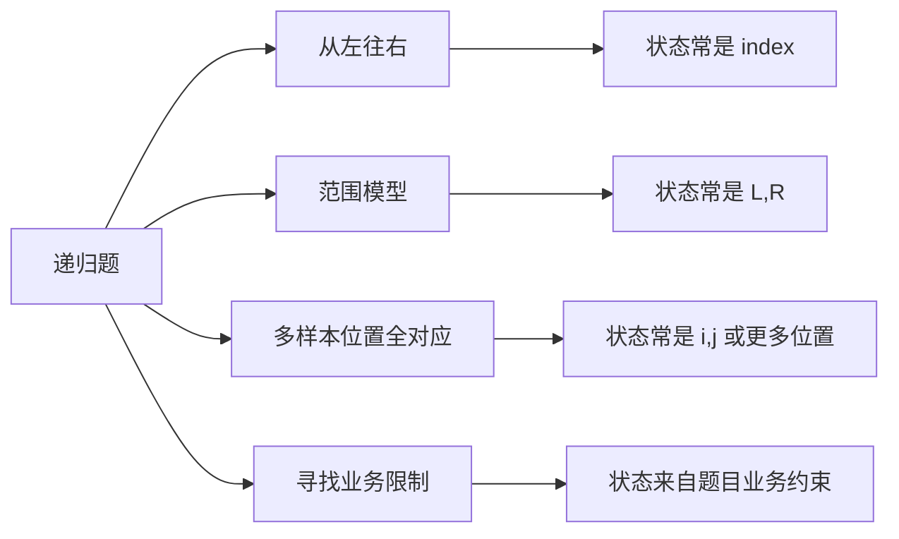
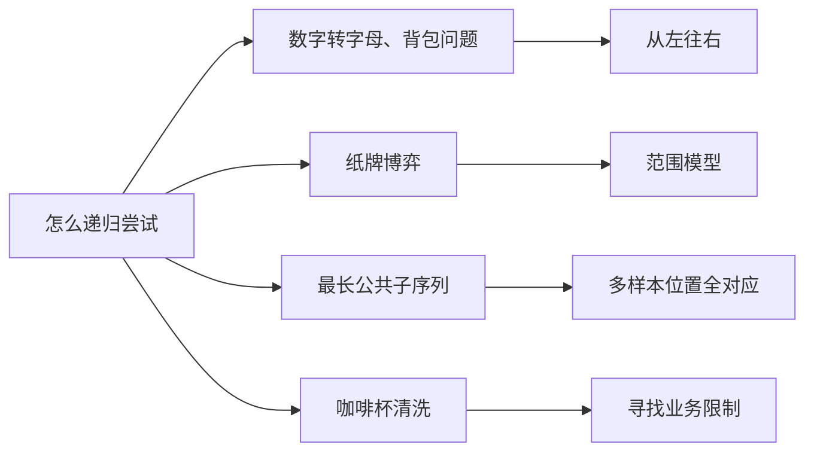

# 怎么递归尝试

[返回章节](README.md) | [返回分类](../README.md) | [返回总目录](../../README.md)

- 状态：已标记完成
- 所属分类：基础巩固
- 所属章节：12 暴力递归到动态规划1-递归尝试
- 原始条目：☒ 怎么暴力递归尝试

## 一句话结论
暴力递归不是“想到哪搜到哪”，而是有稳定起手方法的：先识别问题更像哪种尝试模型，再定义状态、写 base case、列当前层决策。  
这篇最重要的价值，不是给出某一道题的答案，而是建立一套看到陌生递归题时也能下手的分析框架。

## 理论 / 应用价值

### 在知识体系中的位置

```text
暴力递归入门
  -> 先理解递归函数职责
怎么递归尝试
  -> 学会给陌生题建模
四种经典尝试模型
  -> 形成分类框架
记忆化搜索 / 动态规划
  -> 在合法递归基础上再优化
```

### 为什么值得学

1. **它解决的是“不会起手”的问题**
   - 很多人不是不会写代码
   - 而是不知道递归函数到底该怎么定义

2. **它能把“经验”变成“方法论”**
   - 不是靠灵感乱试
   - 而是先判断模型，再写状态

3. **它直接决定后面 DP 能不能做**
   - 动态规划不是凭空发明的
   - 而是先有合法递归，再看是否有重复子问题

### 它解决的核心问题

- 面对陌生题面，怎样把业务描述翻译成递归状态
- 怎样判断一题更像哪一种经典尝试模型
- 怎样从“会做个别题”升级成“会分析一类题”

### 与相邻题型的关系

- 这篇不是单一算法题，而是后面所有递归题的总方法论
- 后面的数字转字母、背包、纸牌博弈，都是这篇四类模型的落地样例
- 再往后的记忆化搜索和动态规划，都是建立在这篇的方法论上

## 核心知识点
- 递归尝试的关键不是代码形式，而是函数含义
- 常见 4 类尝试模型：
  - 从左往右
  - 范围上的尝试
  - 多样本位置全对应
  - 寻找业务限制
- 标准建模顺序：
  - 识别模型
  - 定义状态
  - 设计 base case
  - 列决策分支
  - 整合答案
- 动态规划和暴力递归的关系是：
  - 先写出对的递归
  - 再判断是否值得优化

## 图片转写 / 题意还原
原始内容本质上在讨论下面这几个问题：

1. 有经验，但是没有方法论，怎么办？
2. 怎么判断一个“尝试”是不是合理的尝试？
3. 递归难道只能拼天赋吗？
4. 动态规划和递归尝试到底是什么关系？

课程给出的核心回答，是把大量递归题先归纳成几类典型模型。

### 常见的 4 种尝试模型

1. **从左往右的尝试模型**
   - 例子：数字转字母、背包问题
   - 特征：处理当前位置后，问题交给右边剩余部分

2. **范围上的尝试模型**
   - 例子：纸牌博弈
   - 特征：当前状态是一个区间 `[L, R]`

3. **多样本位置全对应的尝试模型**
   - 例子：最长公共子序列
   - 特征：多个样本都带位置参数，需要同步推进

4. **寻找业务限制的尝试模型**
   - 例子：咖啡杯清洗、某些调度问题
   - 特征：题目不是直接给你状态，而是要从业务约束里反推状态参数

所以这篇如果写成完整题意，更准确地说是在解决：

```text
面对一道还没有现成模板的递归题
怎样从识别模型开始
一步步定义状态、写出递归
并进一步判断它能不能改成动态规划
```

## 图解

### 看到递归题时的推荐起手顺序


**读图抓手**：
- 不要一上来就写递归函数名。
- 先认模型，再定状态，最后才是代码。
- DP 永远是后手动作，不是第一步。

### 四类模型的快速对照



**关键观察**：
- 这四类模型不是死规定，而是高频分析入口。
- 真正的目的不是“给题贴标签”，而是帮助你更快找到状态参数。

### 这几篇笔记在四类模型里的位置



## 解题思路

### 为什么这么做
很多人学递归时最容易陷入两个误区：

- 觉得递归只能靠灵感
- 觉得 DP 和递归没关系

这篇的核心就是把这两个误区拆掉：

- 递归是可以分类建模的
- DP 是递归优化，不是另一种完全无关的东西

### 怎么做：标准分析顺序

#### 1. 先识别模型

看到题先别急着写代码，先问：

- 是沿着一个方向往后处理吗？
- 是在一个区间上决策吗？
- 是多个样本同步推进吗？
- 还是必须先从业务规则里反推状态？

这一步的目的是先确定“状态长什么样”。

#### 2. 定义递归函数含义

递归最重要的不是名字，而是函数语义。

比如：

- `process(index)`：从 `index` 开始怎么做
- `f(L, R)`：在区间 `[L, R]` 上先手能拿多少
- `process(i, j)`：样本 A 来到 `i`、样本 B 来到 `j` 时答案是什么

如果函数含义说不清，代码通常也写不对。

#### 3. 设计 base case

递归一定要回答：

- 最小规模问题是什么
- 这个最小规模的答案是什么

base case 不是“为了停下来硬写一个”，而是整套递归定义的一部分。

#### 4. 列出当前层决策

当前层到底能做哪些选择？

比如：

- 要 / 不要
- 拿左 / 拿右
- 匹配 / 不匹配
- 洗 / 不洗

递归的本质就是把当前层所有合法决策展开成子问题。

#### 5. 整合子问题答案

子问题返回之后，当前层要做什么？

- 求和
- 取最大
- 取最小
- 判断是否存在

这一步其实就是在定义“当前问题的答案类型”。

#### 6. 再判断能不能改 DP

只有当前面五步都成立之后，才值得问：

- 是否有重复子问题
- 状态参数是否有限
- 能不能把递归改成表

### 四种模型怎么快速识别

#### 1. 从左往右

**识别信号**：
- 问题天然沿着数组或字符串推进
- 当前做完决策后，问题交给后面的部分

**常见状态**：
- `index`
- `index + rest`

**典型题**：
- 数字转字母
- 背包问题

#### 2. 范围模型

**识别信号**：
- 每次操作都让区间缩小
- 当前状态最自然地由左右边界描述

**常见状态**：
- `L, R`

**典型题**：
- 纸牌博弈

#### 3. 多样本位置全对应

**识别信号**：
- 不止一个输入样本
- 每个样本都有自己的当前位置
- 决策和多个位置共同有关

**常见状态**：
- `i, j`
- `i, j, k`

**典型题**：
- 最长公共子序列
- 编辑距离类问题

#### 4. 寻找业务限制

**识别信号**：
- 题目没有直接给你明显的状态结构
- 必须先分析业务限制，才能知道该带哪些参数

**常见状态**：
- 取决于题目业务
- 例如时间线、机器可用时刻、剩余资源等

**典型题**：
- 咖啡杯清洗
- 某些调度与最优化问题

### 为什么对
因为大多数递归题，虽然表面题面不同，但底层状态结构并不多。  
把它们先归到几种常见模型里，能显著降低“从零建模”的难度。

也就是说，这篇并不是在说：

```text
所有递归题只有四种
```

而是在说：

```text
很多高频递归题
可以优先从这四种经典结构里找入口
```

## 复杂度
这篇是方法论总结，不是单一算法题，所以没有统一的时间复杂度和空间复杂度。

不过它关心的是另一种“复杂度”：

- **建模复杂度**：你看到陌生题时，能不能快速找到状态
- **优化复杂度**：你写出递归后，能不能判断它是否能改 DP

## 典型例子

### 例子 1：数字转字母

题目是一个数字串，从左往右处理最自然：

```text
来到 index
决定取 1 位还是 2 位
剩下问题交给 index 右边
```

所以它属于“从左往右模型”。

### 例子 2：背包问题

题目是第 `index` 件物品要不要拿：

```text
拿当前物品
或不拿当前物品
剩下问题交给后续物品
```

所以它也属于“从左往右模型”。

### 例子 3：纸牌博弈

题目每次只能拿左右两端：

```text
当前只剩区间 [L, R]
拿左还是拿右
区间收缩
```

所以它属于“范围模型”。

### 例子 4：最长公共子序列

题目里有两个字符串，都有自己的位置：

```text
str1 来到 i
str2 来到 j
答案取决于两个位置共同状态
```

所以它属于“多样本位置全对应模型”。

### 例子 5：咖啡杯清洗

题目里虽然也有杯子下标，但真正限制后续答案的是：

```text
洗杯机下一次什么时候空出来
```

所以状态通常要写成：

```text
process(index, washLine)
```

它属于“寻找业务限制模型”。

## 易错点
- 不要先写代码，再倒推函数含义
- 不要把“递归模型”理解成死模板，它们是分析入口，不是强制分类
- 不要一上来就想 DP，先把递归写对
- base case 不是补丁，而是状态定义的一部分
- 如果一个状态的业务含义说不清，后面的转移通常也会乱

## 代码 / 伪代码
这篇更适合留一份“建模流程伪代码”：

```text
面对一道递归题:
1. 先读清业务规则
2. 判断它更像哪种尝试模型
3. 定义递归状态参数
4. 设计最小规模答案 base case
5. 列出当前层所有合法决策
6. 写出如何根据子问题整合当前答案
7. 再检查是否有重复子问题
8. 有的话，再考虑记忆化搜索或动态规划
```

## 记忆点
- 先认模型，再写递归。
- 递归最关键的是函数含义，不是函数名字。
- DP 是递归优化，不是凭空出现。
- 四类模型的作用是帮你更快找到状态。 
