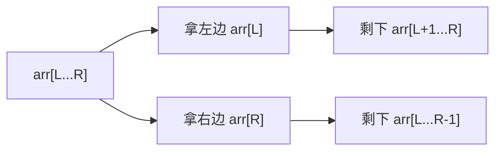
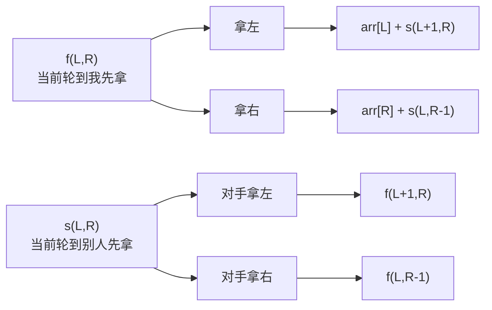

# 从范围上的尝试模型-纸牌博弈

[返回章节](README.md) | [返回分类](../README.md) | [返回总目录](../../README.md)

- 状态：已标记完成
- 所属分类：基础巩固
- 所属章节：12 暴力递归到动态规划1-递归尝试
- 原始条目：☒ 范围上的尝试模型

## 一句话结论
范围模型和“从左往右模型”最大的区别在于：递归状态不再是某个位置，而是当前还剩下哪一段区间 `[L, R]`。  
纸牌博弈是这个模型最经典的代表题，因为当前玩家只能从区间两端拿牌，所以状态天然就是一个范围，而且通常要同时定义“先手函数”和“后手函数”。

## 理论 / 应用价值

### 在知识体系中的位置

```text
暴力递归入门
  -> 学会定义状态和分支
从左往右模型
  -> 状态常是单个位置
范围模型
  -> 状态变成区间 [L, R]
纸牌博弈
  -> 先手 / 后手 + 左右边界收缩
改动态规划
  -> 两张二维表按区间长度填
```

### 为什么值得学

1. **它是“范围模型”的标准样板**
   - 当前问题不是“来到哪”
   - 而是“只剩哪一段”

2. **它训练的是“双函数博弈建模”**
   - 同一个区间上，轮到先手和轮到后手，含义完全不同
   - 所以不能只写一个函数糊过去

3. **它是区间 DP 的高频起点**
   - 后面很多题都会出现 `[L, R]`
   - 例如石子合并、区间博弈、回文相关、矩阵链乘法等

### 它解决的核心问题

- 面对一段数组，两端都能操作时，怎样定义最合适的递归状态
- 面对双方都最优的博弈题，如何把“我拿之后，对方也会最优应对”写进递归
- 为什么有些题必须设计两个函数，而不是一个函数返回所有信息

### 与相邻题型的关系

- 和数字转字母、背包问题不同，这题不是单方向推进，而是两端不断向中间收缩
- 和后面的“扑克牌问题改动态规划”完全一一对应，状态就是 `[L, R]`
- 和简单贪心不同，这题不能只看眼前拿大值，因为对手下一步也会做最优选择

## 核心知识点
- 状态核心：当前只剩区间 `[L, R]`
- 角色核心：
  - `f(L, R)`：当前作为先手，在 `[L, R]` 上最终能拿到的最好分数
  - `s(L, R)`：当前作为后手，在 `[L, R]` 上最终能拿到的最好分数
- 决策核心：当前只能拿左端 `arr[L]` 或右端 `arr[R]`
- 先手取 `max`
- 后手取 `min`

## 图片转写 / 题意还原
这题整理成标准描述，就是：

- 给定一个整型数组 `arr`，每个元素表示一张纸牌上的分数
- 一排纸牌排成一行
- 两个玩家轮流拿牌，A 先手，B 后手
- 每次只能从最左端或最右端拿走一张
- 两个玩家都绝顶聪明，都会做让自己最终得分最优的选择
- 当所有牌都拿完后，比较双方总分
- 返回最终获胜者的分数

**输入**：
- 一个整型数组 `arr`

**输出**：
- 一个整数，表示获胜者的最终分数

**规则 / 边界**：
- 只能拿最左或最右，不能拿中间
- 两个人轮流行动，A 永远先手
- 双方都按最优策略行动，不会犯低级错误
- 如果区间只剩一张牌，当前先手直接拿走它，后手得分为 `0`

**示例**：

```text
arr = [1, 100, 2]

A 如果拿左边 1:
  剩下 [100, 2] 给 B 先手
  B 会拿 100
  A 最终最多只能拿到 1 + 2 = 3

A 如果拿右边 2:
  剩下 [1, 100] 给 B 先手
  B 会拿 100
  A 最终最多只能拿到 2 + 1 = 3

所以赢家分数是 100
```

## 图解

### 为什么状态是区间 `[L, R]`



**读图抓手**：
- 每做一次决策，问题规模不是“位置 +1”，而是区间缩小一格。
- 因为只能从两端拿，所以区间的左右边界就是最自然的状态。
- 这就是“范围模型”的典型长相。

### 为什么要有先手函数和后手函数



**关键观察**：
- `f(L, R)` 关注的是“轮到我先拿时，我最多能拿多少”，所以我要选更大的那条路。
- `s(L, R)` 关注的是“轮到我后拿时，我最终能拿多少”，此时真正做选择的是对手。
- 对手也很聪明，他会把我送进更差的局面，所以 `s(L, R)` 要取 `min`。

## 解题思路

### 为什么这么做
因为这题不是单人拿牌，而是双方轮流在同一个区间上博弈。  
如果只写一个函数，很容易混淆“当前轮到谁拿”这个关键信息，所以最自然的方式是拆成两个角色函数：

- 先手函数 `f`
- 后手函数 `s`

这样每个函数的职责都很清楚。

### 怎么做

定义：

```text
f(L, R) = 当前轮到先手，在 arr[L...R] 上最终能拿到的最好分数
s(L, R) = 当前轮到后手，在 arr[L...R] 上最终能拿到的最好分数
```

#### 1. 先手函数 `f(L, R)`

先手有两种选择：

- 拿左边：得到 `arr[L]`，接下来自己变成后手，面对区间 `[L+1, R]`
- 拿右边：得到 `arr[R]`，接下来自己变成后手，面对区间 `[L, R-1]`

所以：

```text
f(L, R) = max(
    arr[L] + s(L + 1, R),
    arr[R] + s(L, R - 1)
)
```

#### 2. 后手函数 `s(L, R)`

后手当前不能决定拿哪张，因为这一步是对手在拿。  
对手拿完之后，会把你留在两个可能局面之一：

- 对手拿左边，留给你 `f(L+1, R)`
- 对手拿右边，留给你 `f(L, R-1)`

由于对手也最优，他会故意把你送进更差的那种局面，所以：

```text
s(L, R) = min(
    f(L + 1, R),
    f(L, R - 1)
)
```

#### 3. base case

如果只剩一张牌，也就是 `L == R`：

- 先手直接拿走这张牌：`f(L, R) = arr[L]`
- 后手什么也拿不到：`s(L, R) = 0`

#### 4. 最终答案

整场游戏开始时，A 是先手，所以：

```text
先手分数 = f(0, N-1)
后手分数 = s(0, N-1)
答案 = max(f(0, N-1), s(0, N-1))
```

### 为什么对
因为任意一个区间 `[L, R]` 上的最优博弈，当前局面只会是两种角色之一：

- 轮到当前玩家先拿
- 轮到当前玩家后拿

而每种角色下的可选后继局面，也都只有“左端被拿掉”或“右端被拿掉”这两种。  
于是：

- `f` 完整枚举了先手的所有合法选择
- `s` 完整枚举了对手给你制造的所有合法局面

两者合起来正好覆盖整个博弈过程，所以递归定义是完备的。

## 复杂度
- **时间复杂度**：暴力递归约为 `O(2^N)`
  - 大量区间状态会被重复计算
- **空间复杂度**：`O(N)`
  - 主要来自递归深度

## 典型例子

以 `arr = [4, 7, 9, 5]` 为例：

### 第一步看整段 `[0, 3]`

```text
f(0, 3)
= max(
    4 + s(1, 3),
    5 + s(0, 2)
)
```

意思是：

- 如果先手拿左边 `4`，后面能拿多少，取决于 `s(1,3)`
- 如果先手拿右边 `5`，后面能拿多少，取决于 `s(0,2)`

### 再看一个后手状态

```text
s(1, 3)
= min(
    f(2, 3),
    f(1, 2)
)
```

这里为什么是 `min`：

- 因为当前是后手，对手会先拿
- 对手会让你进入更差的那个先手局面

### 继续拆到最小区间

```text
f(2, 2) = 9
s(2, 2) = 0

f(3, 3) = 5
s(3, 3) = 0
```

再往上合并：

```text
f(2, 3) = max(9 + 0, 5 + 0) = 9
s(2, 3) = min(5, 9) = 5
```

完整算完后可得：

```text
f(0, 3) = 13
s(0, 3) = 12
答案 = 13
```

对应的一条最优过程可以理解为：

- A 先拿左边 `4`
- 剩下 `[7, 9, 5]`，B 无论拿 `7` 还是 `5`
- 都会把 `[9]` 这张高分牌留到后面让 A 拿到
- 所以 A 最终可以保证自己拿到 `4 + 9 = 13`

最终：

- A 可以保证 `13`
- B 最多拿到 `12`
- 因此赢家分数是 `13`

## 易错点
- 不要把这题写成只用一个函数，先手和后手的含义不同
- `s(L, R)` 不是“后手随便拿最小值”，而是“对手会让我变差，所以我只能得到较小结果”
- `L == R` 时，`f(L, R) = arr[L]`，`s(L, R) = 0`
- 返回值是“最终获胜者分数”，不是“先手一定赢”
- 这题不能贪心地只拿大的一端，因为对手下一步也会最优反击

## 代码 / 伪代码

```java
int win(int[] arr) {
    if (arr == null || arr.length == 0) {
        return 0;
    }
    int first = f(arr, 0, arr.length - 1);
    int second = s(arr, 0, arr.length - 1);
    return Math.max(first, second);
}

int f(int[] arr, int L, int R) {
    if (L == R) {
        return arr[L];
    }
    return Math.max(
        arr[L] + s(arr, L + 1, R),
        arr[R] + s(arr, L, R - 1)
    );
}

int s(int[] arr, int L, int R) {
    if (L == R) {
        return 0;
    }
    return Math.min(
        f(arr, L + 1, R),
        f(arr, L, R - 1)
    );
}
```

## 记忆点
- 范围模型先看状态是不是一个区间 `[L, R]`。
- 纸牌博弈要分清“当前先手”和“当前后手”两个角色。
- `f` 取 `max`，`s` 取 `min`。
- 后续改动态规划时，通常就是两张二维表：`fdp[L][R]` 和 `sdp[L][R]`。
