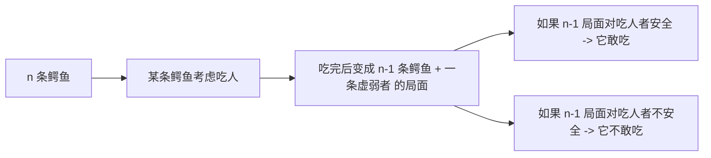
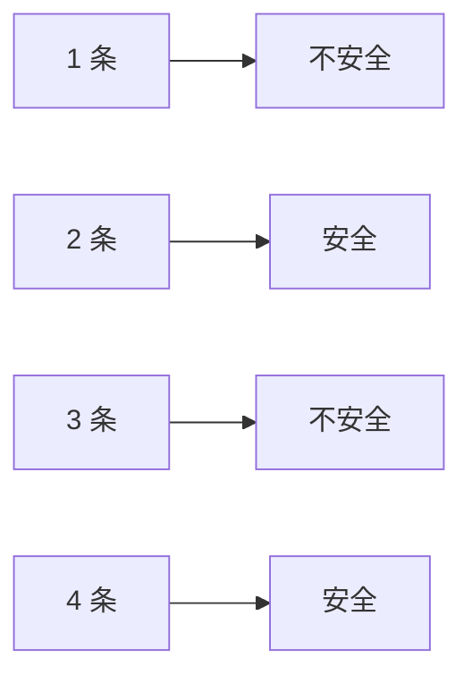

# 课前小练-鳄鱼吃人问题

[返回章节](README.md) | [返回分类](../README.md) | [返回总目录](../../README.md)

- 状态：已标记完成
- 所属分类：基础巩固
- 所属章节：12 暴力递归到动态规划1-递归尝试
- 原始条目：☒ 课前小练-鳄鱼吃人

## 一句话结论
这题本质是一个“安全 / 不安全”状态递推题。  
按最常见经典题面整理后，结论是：**鳄鱼数量为偶数时，人安全；为奇数时，人不安全**。

## 理论 / 应用价值
- 这题不靠模板，而是训练“小样本 + 递推归纳”的能力。
- 它的关键不在写代码，而在把“鳄鱼会不会吃人”翻译成“吃完后自己会不会更危险”。
- 这类题和很多博弈、找规律题一样，先要看清状态转移，再谈公式。

## 核心知识点
- 当前局面只有两种状态：`安全` / `不安全`
- 一条鳄鱼会不会吃人，取决于“吃完后它自己会不会变成被吃对象”
- 递推关系是：`f(n) = !f(n - 1)`
- 结论呈现奇偶交替

## 图片转写 / 题意还原
本笔记按最常见的经典表述整理题意：

- 河里有 `n` 条鳄鱼
- 每条鳄鱼都能单独吃掉过河的人
- 但任何一条鳄鱼吃掉人之后，自己会变虚弱，可能被其他鳄鱼吃掉
- 鳄鱼都绝顶聪明，不会做让自己送命的事
- 问：人在什么情况下能安全过河？

用更抽象的话说，这题实际在问：

```text
如果当前有 n 条鳄鱼
这个局面是“人安全”还是“人不安全”
```

## 图解

### 状态递推关系



### 小样本观察



## 解题思路

### 为什么这么做
这题的难点不在“河”或“鳄鱼”，而在于：

- 鳄鱼不是无脑吃
- 它会先判断吃完后自己安不安全

所以最自然的做法，是把问题定义成一个布尔状态：

```text
f(n) = 有 n 条鳄鱼时，人是否安全
```

### 怎么做

#### base case

- `f(1) = false`
  只有 1 条鳄鱼时，它吃掉人后不会再被别的鳄鱼吃，所以人不安全。

- `f(2) = true`
  2 条鳄鱼时，任意一条吃掉人后都会变虚弱，被另一条吃掉，所以它们都不敢吃，人安全。

#### 递推关系

考虑 `n` 条鳄鱼时：

- 如果 `f(n - 1)` 是安全局面
  说明一条鳄鱼吃掉人后，自己落入 `n - 1` 的“安全”结构里，它就敢吃
  于是人不安全

- 如果 `f(n - 1)` 是不安全局面
  说明一条鳄鱼吃掉人后，自己会陷入危险，它就不敢吃
  于是人安全

所以：

```text
f(n) = !f(n - 1)
```

#### 最终结论

从 `f(1)=false` 开始交替：

- 奇数：不安全
- 偶数：安全

### 为什么对
因为每条鳄鱼的决策完全由“吃完后自己是否安全”决定，而这个后继状态恰好就是 `n-1` 的同类问题。  
所以这题天然满足递推结构，并且只有两个状态在来回翻转。

## 复杂度
- 暴力递推写法：`O(n)`
- 观察出奇偶规律后：`O(1)`
- 空间复杂度：`O(1)`

## 典型例子

### `n = 3`

- 如果某条鳄鱼吃掉人
- 它接下来面对的是“2 条别的鳄鱼”
- 而 `n = 2` 时，人对应的是安全局面，说明吃人者自己会危险
- 所以它不敢吃？这里要小心：对吃人者而言，留下的两条鳄鱼不会主动互吃，它处在一个“自己可能被吃”的危险局面
- 因而 3 条时，人最终不安全

更容易记的方式是直接按交替看：

```text
1 不安全
2 安全
3 不安全
4 安全
...
```

## 易错点
- 不要被“过河”表面情境带偏，核心是状态递推
- 不要把原来的那页旧结论“奇数安全”记反；按经典题面应是“偶数安全”
- 这题不是在问“有没有某条鳄鱼会吃”，而是在问“理性鳄鱼会不会吃”

## 代码 / 伪代码

```java
boolean safe(int n) {
    return (n % 2 == 0);
}
```

如果按递推写：

```java
boolean safe(int n) {
    if (n == 1) return false;
    return !safe(n - 1);
}
```

## 记忆点
- 先看 `n-1`，再推 `n`
- `f(n) = !f(n-1)`
- 偶数安全，奇数不安全
