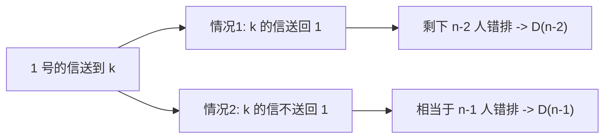

# 课前小练-村民寄信问题

[返回章节](README.md) | [返回分类](../README.md) | [返回总目录](../../README.md)

- 状态：已标记完成
- 所属分类：基础巩固
- 所属章节：12 暴力递归到动态规划1-递归尝试
- 原始条目：☒ 课前小练-村民寄信

## 一句话结论
村民寄信问题本质上就是经典**错排问题**。  
如果有 `n` 个村民互寄信，并且每个人都不能收到自己的信，那么方案数记为 `D(n)`，满足递推：

```text
D(n) = (n - 1) * (D(n - 1) + D(n - 2))
```

## 理论 / 应用价值
- 这是组合计数中的经典模型。
- 它训练的核心是：先把“故事题面”翻成“限制排列问题”。
- 错排既能用递推理解，也能往容斥方向延伸，是很好的计数入门题。

## 核心知识点
- “每个人都不能收到自己的信”就是错排定义
- 记号通常写作 `D(n)` 或 `!n`
- base case：
  - `D(1)=0`
  - `D(2)=1`
- 递推：
  - `D(n)=(n-1)(D(n-1)+D(n-2))`

## 图片转写 / 题意还原
本笔记按最常见经典表述整理题意：

- 有 `n` 个村民
- 每个人都写了一封信
- 这些信会随机分发给这 `n` 个人
- 要求没有任何一个人收到自己的信
- 问一共有多少种不同的寄信方案

更抽象地说：

```text
把 n 个元素做一个排列
要求每个元素都不在原位置
```

这就是错排问题。

## 图解

### 先固定 1 号村民的去向


### 两种分类



## 解题思路

### 为什么这么做
这题直接数全部合法方案比较难，但如果先盯住“1 号信寄给谁”，后面的结构就会变清楚。

### 怎么做

设 `D(n)` 表示 `n` 个人都不收到自己信的方案数。

#### base case

- `D(1)=0`
  只有 1 个人，不可能寄错。

- `D(2)=1`
  两个人交换即可。

#### 递推推导

先看 1 号的信：

- 它不能寄给自己
- 所以只能寄给剩下 `n-1` 个人中的某个 `k`

于是第一步有：

```text
n - 1
```

种选择。

接下来分两类：

##### 情况 1：`k` 的信寄回给 1 号

这样 `1` 和 `k` 形成一对交换，剩下 `n-2` 个人继续错排：

```text
D(n - 2)
```

##### 情况 2：`k` 的信不寄回给 1 号

这时可以把问题压缩理解成“除 1 号外的 `n-1` 个人继续形成一个错排结构”，方案数是：

```text
D(n - 1)
```

于是总递推为：

```text
D(n) = (n - 1) * (D(n - 1) + D(n - 2))
```

### 为什么对
因为 1 号的信必须先选一个非自己的人去寄，而后续局面一定且只会落入上面两种情况之一：

- 要么和对方形成二元交换
- 要么不形成交换，压缩成规模 `n-1` 的错排

两类互斥且覆盖所有可能，所以递推成立。

## 复杂度
- 纯递归直接算：指数级
- 用 DP 按递推表求：`O(n)`
- 空间复杂度：
  - 全表 `O(n)`
  - 滚动优化可到 `O(1)`

## 典型例子

### `n = 3`

三个人 `A,B,C`，合法寄法只有两种：

```text
A -> B, B -> C, C -> A
A -> C, B -> A, C -> B
```

所以：

```text
D(3) = 2
```

代入递推也成立：

```text
D(3) = 2 * (D(2) + D(1))
     = 2 * (1 + 0)
     = 2
```

### `n = 4`

```text
D(4) = 3 * (D(3) + D(2))
     = 3 * (2 + 1)
     = 9
```

## 易错点
- 这题不是普通排列，是“每个人都不能回自己位置”的受限排列
- `D(1)=0` 容易写错成 `1`
- 推导时不要忘记前面还有 `(n-1)` 个首步选择
- `D(n-1)` 不是凭空来的，它来自“1 号和 k 没有直接交换”的压缩结构

## 代码 / 伪代码

### 递推版

```java
int derangement(int n) {
    if (n == 1) return 0;
    if (n == 2) return 1;
    int a = 0; // D(1)
    int b = 1; // D(2)
    for (int i = 3; i <= n; i++) {
        int cur = (i - 1) * (a + b);
        a = b;
        b = cur;
    }
    return b;
}
```

### 直接递归版

```java
int D(int n) {
    if (n == 1) return 0;
    if (n == 2) return 1;
    return (n - 1) * (D(n - 1) + D(n - 2));
}
```

## 记忆点
- 村民寄信 = 错排
- `D(1)=0, D(2)=1`
- `D(n)=(n-1)(D(n-1)+D(n-2))`
